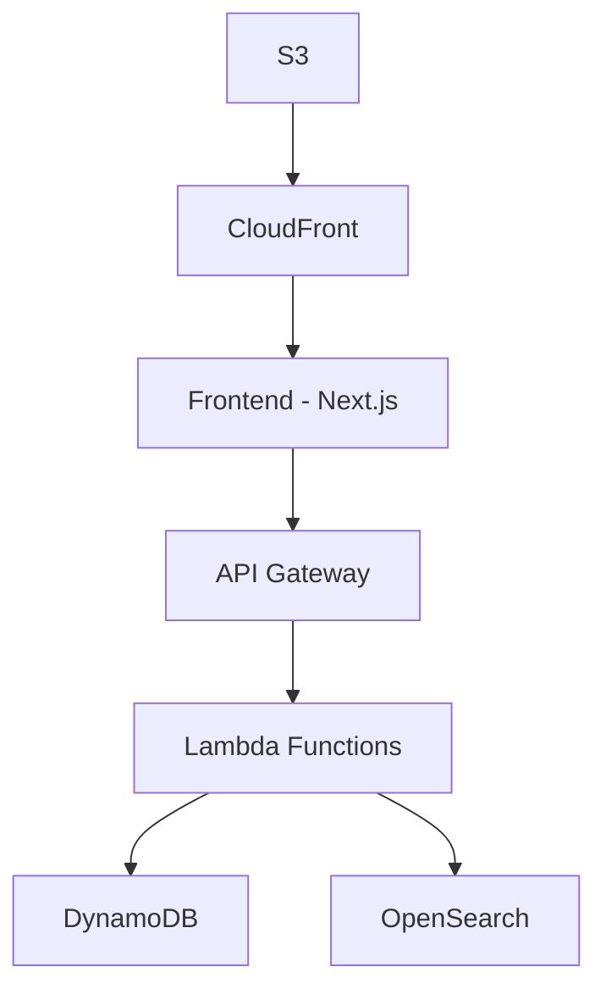

# 🚀 Quick Start Guide

Get tattoo-directory-mvp running in 5 minutes or less.

## 📋 Table of Contents

- [Overview](#overview)
- [Features](#features)
- [Architecture](#architecture)
- [Setup](#setup)
- [What You Get](#what-you-get)
- [Essential Commands](#essential-commands)
- [Quick Fixes](#quick-fixes)
- [Next Steps](#next-steps)

## Overview

A serverless tattoo artist directory built with Next.js, AWS Lambda, and DynamoDB. This MVP provides a comprehensive platform for discovering tattoo artists and studios across the UK.

### Key Features

- **Artist Search**: Location-based search with style filtering and keyword matching
- **Studio Profiles**: Comprehensive studio information with portfolio galleries
- **Performance Optimized**: Sub-500ms API responses with 90+ Lighthouse scores
- **Mobile First**: Responsive design optimized for mobile devices

### Technology Stack

- **Frontend**: Next.js 14+, shadcn/ui, Tailwind CSS, React Query
- **Backend**: AWS Lambda, API Gateway, DynamoDB, OpenSearch
- **Infrastructure**: Terraform, AWS CloudFront, S3, Step Functions
- **Development**: Docker, LocalStack, Jest, Playwright

## Architecture

The system follows a serverless architecture pattern with clear separation between frontend (Next.js), backend (AWS Lambda), and infrastructure (Terraform). All components are designed for scalability and performance.



# Setup

## Prerequisites

JavaScript runtime for development - **Node.js 18+** - [Download here](https://nodejs.org/)
Docker Desktop - **Docker Desktop** - [Download here](https://www.docker.com/products/docker-desktop/)
Git - **Git** - [Download here](https://git-scm.com/)

## System Requirements

- **RAM**: 8GB minimum (16GB recommended)
- **Storage**: 10GB free space
- **Network**: Internet connection for initial setup

## Step 1: Clone and Install

```bash
# Clone the repository
git clone https://github.com/your-org/tattoo-directory-mvp.git
cd tattoo-directory-mvp

# Install dependencies
npm install
```

## Step 2: Environment Setup

```bash
# Copy environment template
cp .env.example .env.local

# Configure environment variables
Edit .env.local with your configuration
```

## Step 3: Set Up Test Data

```bash
cd scripts
npm install
npm run setup-data
cd ..
```

This uploads realistic tattoo images to LocalStack S3 and creates test data for 10 artists across 22 tattoo styles.

## Step 4a: Full Development Environment

Complete setup with all services running locally

```bash
npm run local:start
```

This command will:

- Start LocalStack (AWS services emulation)
- Initialize DynamoDB tables and OpenSearch indices
- Start the backend API server
- Start the frontend development server

Wait for all services to start (usually 30-60 seconds).

## Step 4b: Frontend Only Development Environment

Frontend development with mock data

```bash
npm run dev:frontend
npm run setup-data:frontend-only
```

## Step 5: Verify Installation

```bash
# Check services are running
npm run local:health

You should see:
- ✅ LocalStack services running
- ✅ DynamoDB tables created
- ✅ OpenSearch indices ready
- ✅ Test data loaded
- ✅ Frontend accessible

# Run basic tests
npm run test:integration
```

## Step 6: Access the Application

- **Frontend**: http://localhost:3000
- **API Docs**: http://localhost:8080
- **LocalStack**: http://localhost:4566/
- **API**: http://localhost:3000/api
- **Swagger UI**: http://localhost:8080

# What You Get

## Summary

- **10 Realistic Artists** with professional avatars and portfolios
- **3 Studios** across London, Manchester, and Birmingham
- **17 Tattoo Styles** with actual tattoo images
- **Full Search Functionality** with location and style filtering
- **Complete API** with Swagger documentation

## Complete Development Environment

- **Full-stack application** running locally
- **AWS services emulation** with LocalStack
- **Hot reload** for frontend and backend development
- **API documentation** with Swagger UI
- **Monitoring dashboard** for service health

## Realistic Test Data

- **10 Professional Artists**:

  - Complete portfolios with 5-15 images each
  - Diverse tattoo styles and specializations
  - Realistic contact information and availability
  - Professional headshots and studio affiliations

- **3 Tattoo Studios**:

  - London: "Ink & Iron Tattoo Studio"
  - Manchester: "Northern Ink Collective"
  - Birmingham: "Midlands Tattoo House"
  - Complete address and contact details

- **17 Tattoo Styles**:
  - Traditional, Neo-Traditional, Realism
  - Japanese, Blackwork, Geometric
  - Watercolor, Minimalist, Portrait
  - And 8 more popular styles

## Search Functionality

- **Location-based search** with radius filtering
- **Style filtering** with multiple selections
- **Artist availability** and booking status
- **Portfolio browsing** with image galleries
- **Studio information** and directions

# Essential Commands

## Daily Development

```bash
# Start development environment
npm run local:start

# View all service logs
npm run local:logs

# Check service health
npm run local:health

# Stop all services
npm run local:stop

# Restart everything
npm run local:restart

# Check what's running
npm run local:status

# Clean reset
npm run local:reset
```

## Data Management

```bash
# Reset to clean state
npm run local:reset

# Load specific test scenarios
npm run seed-scenario:london-artists
npm run seed-scenario:high-rated

# Validate data integrity
npm run validate-data
```

## Frontend Development

```bash
# Start frontend only (with mock data)
npm run setup-data:frontend-only
npm run dev:frontend

# Access frontend at http://localhost:3000
```

## Backend Development

```bash
# Start backend services only
npm run dev:backend

# Test API endpoints
npm run local:test-api

# View backend logs
npm run local:logs:backend
```

## Full-Stack Development

Complete environment for API and frontend integration:

```bash
# Complete setup
npm run local:start
npm run setup-data
```

## API Development

Focus on backend services and API endpoints:

```bash
# Start LocalStack and backend
npm run dev:backend
npm run setup-data:images-only
```

# Quick Fixes

## Services Won't Start

```bash
# Check Docker is running
docker info

# Clean restart
npm run local:reset
```

## Port Conflicts

```bash
# Check what's using ports
netstat -tulpn | grep :3000
netstat -tulpn | grep :4566

# Stop conflicting services
sudo systemctl stop apache2  # Linux
brew services stop nginx     # macOS
```

## Memory Issues

```bash
# Check Docker memory allocation
docker stats

# Increase Docker memory in Docker Desktop settings
# Recommended: 8GB minimum, 16GB optimal
```

## LocalStack Not Starting

```bash
# Check LocalStack health
curl http://localhost:4566/_localstack/health

# Reset LocalStack data
npm run local:clean

# Check logs for errors
npm run local:logs:localstack
```

## Frontend Build Errors

```bash
# Clear Next.js cache
rm -rf frontend/.next

# Reinstall dependencies
rm -rf node_modules package-lock.json
npm install
```

## Database Connection Issues

```bash
# Verify DynamoDB tables
aws --endpoint-url=http://localhost:4566 dynamodb list-tables

# Reset database
npm run local:reset
```

# Platform-Specific Issues

## Windows

- Ensure WSL 2 is enabled for Docker Desktop
- Use PowerShell or WSL bash for commands
- Check Windows Defender isn't blocking Docker

## macOS

- Increase Docker Desktop memory allocation
- For M1 Macs, ensure Docker Desktop supports ARM64
- Check file permissions for volume mounts

## Linux

- Add user to docker group: `sudo usermod -aG docker $USER`
- Ensure Docker daemon is running: `sudo systemctl start docker`
- Check firewall settings for port access

# Next Steps

## Explore the Application

1. **Browse Artists**: Visit http://localhost:3000 and explore artist profiles
2. **Test Search**: Try location-based and style filtering
3. **View Portfolios**: Click through artist galleries
4. **API Testing**: Use http://localhost:8080 for API documentation

## Development Guides

- **[Local Development Guide](setup/local-development.md)**: Comprehensive development setup
- **[Frontend Development](setup/frontend-only.md)**: Frontend-specific development
- **[Docker Setup](setup/docker-setup.md)**: Docker configuration details
- **[Dependencies](setup/dependencies.md)**: Project dependencies overview

## Advanced Features

- **[Testing Strategies](workflows/testing-strategies.md)**: Unit, integration, and E2E testing
- **[Data Management](workflows/testing-strategies.md)**: Advanced data seeding and management
- **[Monitoring](workflows/testing-strategies.md)**: Performance monitoring and debugging
- **[Deployment](workflows/testing-strategies.md)**: Production deployment guides

## Support

### Getting Help

- **Documentation**: Check the `docs/` directory for detailed guides
- **Logs**: Use `npm run local:logs` to diagnose issues
- **Health Checks**: Run `npm run local:health` to verify service status
- **Ask in** [Discussions](https://github.com/your-org/tattoo-directory-mvp/discussions)
- **Report** [Issues](https://github.com/your-org/tattoo-directory-mvp/issues)

### Emergency Commands

```bash
# Complete environment reset
npm run local:emergency-stop
npm run local:reset

# Force cleanup and restart
docker system prune -f
npm run local:start
```

## Contributing

Please read our contributing guidelines before submitting pull requests.

### Development Workflow

1. Fork the repository
2. Create a feature branch
3. Make your changes
4. Run tests: `npm run test:integration`
5. Submit a pull request

### Code Standards

We use ESLint and Prettier for code formatting. TypeScript strict mode is enabled.

## Documentation

### 📚 Core Documentation

- [Development Guide](docs/workflows/DEVELOPMENT_GUIDE.md) - Comprehensive development setup
- [API Reference](reference/api_reference.md) - Complete API documentation
- [Troubleshooting](troubleshooting/TROUBLESHOOTING_GUIDE.md) - Common issues and solutions

### 🔧 Setup & Configuration

- [Local Development](docs/setup/local-development.md) - Full development environment
- [Frontend Only](.setup/frontend-only.md) - Frontend-only development
- [Docker Setup](docs/setup/docker-setup.md) - Docker configuration
- [Dependencies](docs/setup/dependencies.md) - Project dependencies

### 🏗️ Components

- [Frontend](.components/frontend/) - React/Next.js components
- [Backend](.components/backend/) - API handlers and services
- [Infrastructure](.components/infrastructure/) - Terraform modules
- [Scripts](.components/scripts/) - Utility scripts

### 🔄 Workflows

- [Data Management](docs/workflows/data-management.md) - Data operations
- [Testing Strategies](docs/workflows/testing-strategies.md) - Testing approaches
- [Deployment Process](docs/workflows/deployment-process.md) - Deployment workflows
- [Monitoring](docs/workflows/monitoring.md) - System monitoring

### 📖 Reference

- [Command Reference](docs/reference/command-reference.md) - All available commands
- [Configuration](.reference/configuration.md) - Configuration options
- [Environment Variables](.reference/environment-variables.md) - Environment setup
- [npm Scripts](.reference/npm-scripts.md) - Package.json scripts

### 🏛️ Architecture

- [System Overview](.docs/docs/architecture/system-overview.md) - High-level architecture
- [Data Models](.docs/docs/architecture/data-models.md) - Data structure documentation
- [API Design](.docs/docs/architecture/api-design.md) - API architecture patterns

## License

This project is licensed under the MIT License.

---

**Last Updated**: 2025-09-28
**Version**: 1.0.0
