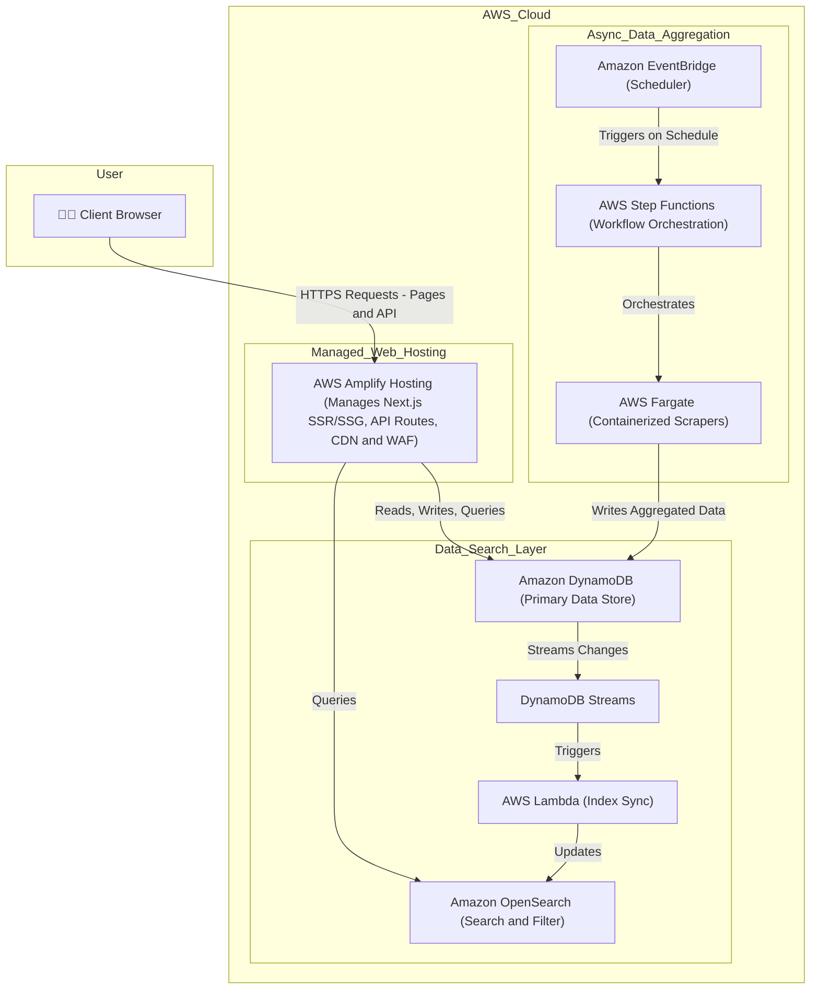

### **AWS Amplify Architecture**

```mermaid
graph TD
    subgraph User
        U[👩‍🎨 Client Browser]
    end

    subgraph AWS_Cloud
        subgraph Managed_Web_Hosting
            Amplify["AWS Amplify Hosting (Manages Next.js SSR/SSG, API Routes, CDN and WAF)"]
        end
        
        subgraph Data_Search_Layer
            DynamoDB["Amazon DynamoDB (Primary Data Store)"]
            DDBStream[DynamoDB Streams]
            LambdaSync["AWS Lambda (Index Sync)"]
            OpenSearch["Amazon OpenSearch (Search and Filter)"]
        end

        subgraph Async_Data_Aggregation
            EventBridge["Amazon EventBridge (Scheduler)"]
            StepFunctions["AWS Step Functions (Workflow Orchestration)"]
            Fargate["AWS Fargate (Containerized Scrapers)"]
        end
    end

    U -- "HTTPS Requests - Pages and API" --> Amplify
    Amplify -- "Reads, Writes, Queries" --> DynamoDB
    Amplify -- "Queries" --> OpenSearch
    DynamoDB -- "Streams Changes" --> DDBStream
    DDBStream -- "Triggers" --> LambdaSync
    LambdaSync -- "Updates" --> OpenSearch
    EventBridge -- "Triggers on Schedule" --> StepFunctions
    StepFunctions -- "Orchestrates" --> Fargate
    Fargate -- "Writes Aggregated Data" --> DynamoDB
```