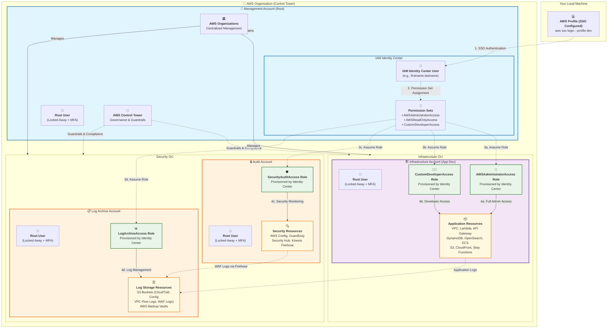

### **AWS Configured Access**

```mermaid
flowchart TD
    subgraph LocalMachine["Your Local Machine"]
        direction LR
        AwsProfile["💻<br><b>AWS Profile (SSO Configured)</b><br>aws sso login --profile dev"]
    end

    subgraph AwsOrganization["🏢 AWS Organization (Control Tower)"]
        direction TB
        
        subgraph ManagementAccount["🏢 Management Account (Root)"]
            direction TB
            RootUser["👑<br><b>Root User</b><br>(Locked Away + MFA)"]
            
            subgraph IdentityCenter["IAM Identity Center"]
                IamUser["👤<br><b>IAM Identity Center User</b><br>(e.g., firstname.lastname)"]
                PermissionSets["🎫<br><b>Permission Sets</b><br>• AWSAdministratorAccess<br>• AWSReadOnlyAccess<br>• CustomDeveloperAccess"]
            end
            
            Organizations["🏛️<br><b>AWS Organizations</b><br>Centralized Management"]
            ControlTower["🗼<br><b>AWS Control Tower</b><br>Governance & Guardrails"]
        end
        
        subgraph InfrastructureOU["Infrastructure OU"]
            subgraph InfrastructureAccount["🏗️ Infrastructure Account (App-Dev)"]
                InfraRootUser["👑<br><b>Root User</b><br>(Locked Away + MFA)"]
                AdminRole["🎩<br><b>AWSAdministratorAccess Role</b><br>Provisioned by Identity Center"]
                DevRole["👨‍💻<br><b>CustomDeveloperAccess Role</b><br>Provisioned by Identity Center"]
                AppResources["📦<br><b>Application Resources</b><br>VPC, Lambda, API Gateway<br>DynamoDB, OpenSearch, ECS<br>S3, CloudFront, Step Functions"]
            end
        end
        
        subgraph SecurityOU["Security OU"]
            subgraph AuditAccount["🔒 Audit Account"]
                AuditRootUser["👑<br><b>Root User</b><br>(Locked Away + MFA)"]
                SecurityRole["🛡️<br><b>SecurityAuditAccess Role</b><br>Provisioned by Identity Center"]
                SecurityResources["🔍<br><b>Security Resources</b><br>AWS Config, GuardDuty<br>Security Hub, Kinesis Firehose"]
            end
            
            subgraph LogArchiveAccount["📋 Log Archive Account"]
                LogRootUser["👑<br><b>Root User</b><br>(Locked Away + MFA)"]
                LogRole["📊<br><b>LogArchiveAccess Role</b><br>Provisioned by Identity Center"]
                LogResources["🗄️<br><b>Log Storage Resources</b><br>S3 Buckets (CloudTrail, Config<br>VPC Flow Logs, WAF Logs)<br>AWS Backup Vaults"]
            end
        end
    end

    %% Authentication Flow
    AwsProfile -.->|"1. SSO Authentication"| IamUser
    IamUser -.->|"2. Permission Set Assignment"| PermissionSets
    
    %% Cross-Account Role Assumptions
    PermissionSets -.->|"3a. Assume Role"| AdminRole
    PermissionSets -.->|"3b. Assume Role"| DevRole
    PermissionSets -.->|"3c. Assume Role"| SecurityRole
    PermissionSets -.->|"3d. Assume Role"| LogRole
    
    %% Resource Management
    AdminRole -->|"4a. Full Admin Access"| AppResources
    DevRole -->|"4b. Developer Access"| AppResources
    SecurityRole -->|"4c. Security Monitoring"| SecurityResources
    LogRole -->|"4d. Log Management"| LogResources
    
    %% Cross-Account Data Flows
    SecurityResources -.->|"WAF Logs via Firehose"| LogResources
    AppResources -.->|"Application Logs"| LogResources
    
    %% Control Tower Governance
    ControlTower -.->|"Guardrails & Compliance"| InfrastructureOU
    ControlTower -.->|"Guardrails & Compliance"| SecurityOU
    
    %% Organization Structure
    Organizations -->|"Contains"| ManagementAccount
    Organizations -->|"Manages"| InfrastructureOU
    Organizations -->|"Manages"| SecurityOU

    classDef managementStyle fill:#e1f5fe,stroke:#01579b,stroke-width:2px
    classDef infraStyle fill:#f3e5f5,stroke:#4a148c,stroke-width:2px
    classDef securityStyle fill:#fff3e0,stroke:#e65100,stroke-width:2px
    classDef roleStyle fill:#e8f5e8,stroke:#2e7d32,stroke-width:2px
    classDef resourceStyle fill:#fff8e1,stroke:#f57f17,stroke-width:2px
    
    class ManagementAccount,IdentityCenter managementStyle
    class InfrastructureAccount infraStyle
    class AuditAccount,LogArchiveAccount securityStyle
    class AdminRole,DevRole,SecurityRole,LogRole roleStyle
    class AppResources,SecurityResources,LogResources resourceStyle
```