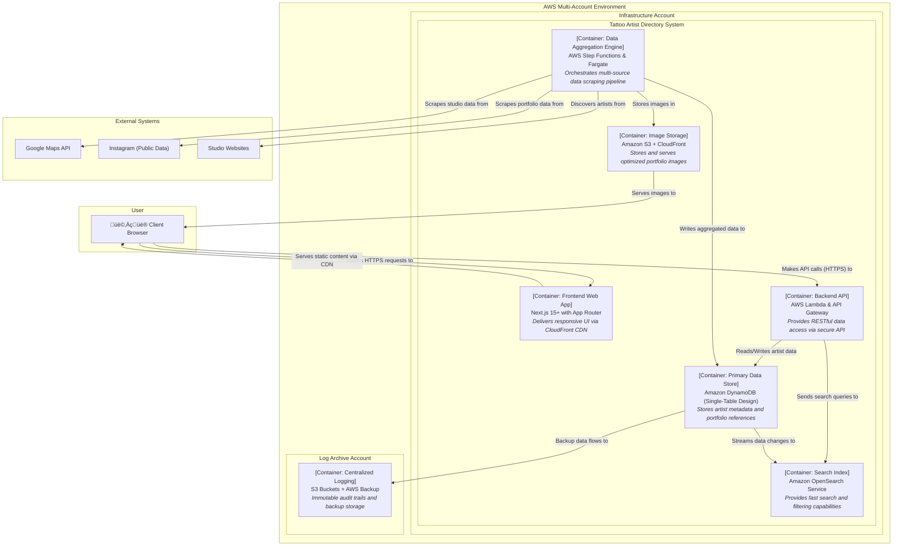

### **C4 Model: Level 2 \- Containers**

```mermaid
graph TD
    subgraph "User"
        ClientBrowser["üë©‚Äçüé® Client Browser"]
    end

    subgraph "AWS Multi-Account Environment"
        subgraph "Infrastructure Account"
            subgraph "Tattoo Artist Directory System"
                WebApp["[Container: Frontend Web App]<br>Next.js 15+ with App Router<br><i>Delivers responsive UI via CloudFront CDN</i>"]
                BackendAPI["[Container: Backend API]<br>AWS Lambda & API Gateway<br><i>Provides RESTful data access via secure API</i>"]
                DataAggregator["[Container: Data Aggregation Engine]<br>AWS Step Functions & Fargate<br><i>Orchestrates multi-source data scraping pipeline</i>"]
                DataStore["[Container: Primary Data Store]<br>Amazon DynamoDB (Single-Table Design)<br><i>Stores artist metadata and portfolio references</i>"]
                SearchIndex["[Container: Search Index]<br>Amazon OpenSearch Service<br><i>Provides fast search and filtering capabilities</i>"]
                ImageStorage["[Container: Image Storage]<br>Amazon S3 + CloudFront<br><i>Stores and serves optimized portfolio images</i>"]
            end
        end
        
        subgraph "Log Archive Account"
            LogStorage["[Container: Centralized Logging]<br>S3 Buckets + AWS Backup<br><i>Immutable audit trails and backup storage</i>"]
        end
    end

    subgraph "External Systems"
        GoogleMaps["Google Maps API"]
        Instagram["Instagram (Public Data)"]
        StudioWebsites["Studio Websites"]
    end

    ClientBrowser -- "Makes HTTPS requests to" --> WebApp
    ClientBrowser -- "Makes API calls (HTTPS) to" --> BackendAPI
    WebApp -- "Serves static content via CDN" --> ClientBrowser
    BackendAPI -- "Reads/Writes artist data" --> DataStore
    BackendAPI -- "Sends search queries to" --> SearchIndex
    DataAggregator -- "Writes aggregated data to" --> DataStore
    DataAggregator -- "Stores images in" --> ImageStorage
    DataAggregator -- "Scrapes studio data from" --> GoogleMaps
    DataAggregator -- "Scrapes portfolio data from" --> Instagram
    DataAggregator -- "Discovers artists from" --> StudioWebsites
    DataStore -- "Streams data changes to" --> SearchIndex
    DataStore -- "Backup data flows to" --> LogStorage
    ImageStorage -- "Serves images to" --> ClientBrowser
```