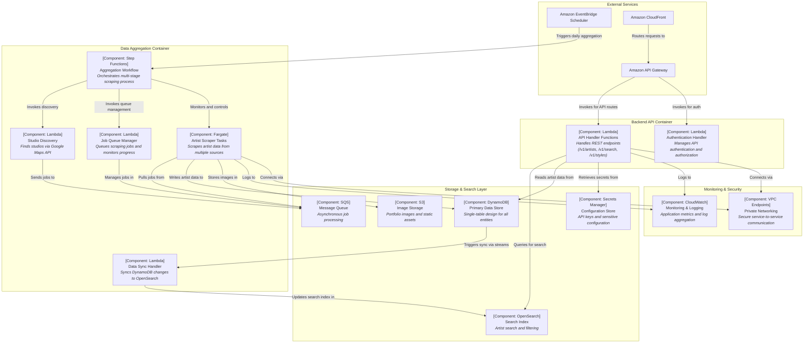

### **C4 Model: Level 3 \- Components**

```mermaid
flowchart TD
    subgraph External["External Services"]
            APIGW["Amazon API Gateway"]
            EventBridge["Amazon EventBridge Scheduler"]
            CloudFront["Amazon CloudFront"]
    end
    
	subgraph subGraph1["Backend API Container"]
            ApiHandlerLambda["[Component: Lambda]<br>API Handler Functions<br><i>Handles REST endpoints<br>(/v1/artists, /v1/search, /v1/styles)</i>"]
            AuthLambda["[Component: Lambda]<br>Authentication Handler<br><i>Manages API authentication and authorization</i>"]
    end
    
	subgraph subGraph2["Data Aggregation Container"]
            StepFunctions["[Component: Step Functions]<br>Aggregation Workflow<br><i>Orchestrates multi-stage scraping process</i>"]
            DiscoverLambda["[Component: Lambda]<br>Studio Discovery<br><i>Finds studios via Google Maps API</i>"]
            QueueLambda["[Component: Lambda]<br>Job Queue Manager<br><i>Queues scraping jobs and monitors progress</i>"]
            FargateScraper["[Component: Fargate]<br>Artist Scraper Tasks<br><i>Scrapes artist data from multiple sources</i>"]
            SyncLambda["[Component: Lambda]<br>Data Sync Handler<br><i>Syncs DynamoDB changes to OpenSearch</i>"]
    end
    
	subgraph subGraph3["Storage & Search Layer"]
            OpenSearch["[Component: OpenSearch]<br>Search Index<br><i>Artist search and filtering</i>"]
            DynamoDB["[Component: DynamoDB]<br>Primary Data Store<br><i>Single-table design for all entities</i>"]
            S3["[Component: S3]<br>Image Storage<br><i>Portfolio images and static assets</i>"]
            SQS["[Component: SQS]<br>Message Queue<br><i>Asynchronous job processing</i>"]
            Secrets["[Component: Secrets Manager]<br>Configuration Store<br><i>API keys and sensitive configuration</i>"]
    end

    subgraph subGraph4["Monitoring & Security"]
            CloudWatch["[Component: CloudWatch]<br>Monitoring & Logging<br><i>Application metrics and log aggregation</i>"]
            VPCEndpoints["[Component: VPC Endpoints]<br>Private Networking<br><i>Secure service-to-service communication</i>"]
    end
	
        CloudFront -- "Routes requests to" --> APIGW
        APIGW -- "Invokes for API routes" --> ApiHandlerLambda
        APIGW -- "Invokes for auth" --> AuthLambda
        EventBridge -- "Triggers daily aggregation" --> StepFunctions
        
        ApiHandlerLambda -- "Queries for search" --> OpenSearch
        ApiHandlerLambda -- "Reads artist data from" --> DynamoDB
        ApiHandlerLambda -- "Retrieves secrets from" --> Secrets
        
        StepFunctions -- "Invokes discovery" --> DiscoverLambda
        StepFunctions -- "Invokes queue management" --> QueueLambda
        StepFunctions -- "Monitors and controls" --> FargateScraper
        
        DiscoverLambda -- "Sends jobs to" --> SQS
        QueueLambda -- "Manages jobs in" --> SQS
        FargateScraper -- "Pulls jobs from" --> SQS
        FargateScraper -- "Writes artist data to" --> DynamoDB
        FargateScraper -- "Stores images in" --> S3
        
        DynamoDB -- "Triggers sync via streams" --> SyncLambda
        SyncLambda -- "Updates search index in" --> OpenSearch
        
        ApiHandlerLambda -- "Logs to" --> CloudWatch
        FargateScraper -- "Logs to" --> CloudWatch
        
        ApiHandlerLambda -- "Connects via" --> VPCEndpoints
        FargateScraper -- "Connects via" --> VPCEndpoints
```