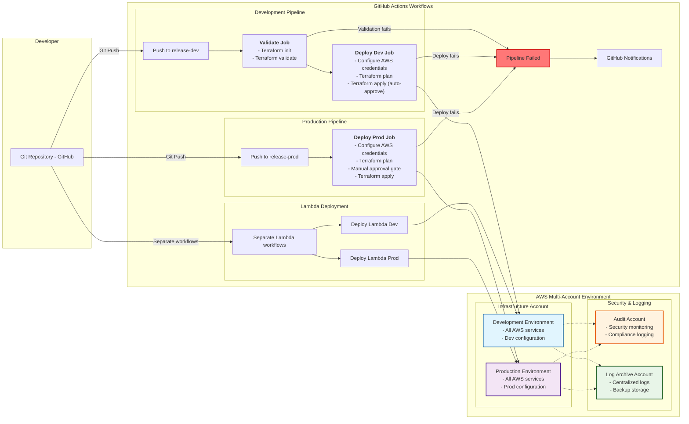

### **CI/CD Pipeline Diagram**

```mermaid
graph LR
    subgraph Developer
        Code["Git Repository - GitHub"]
    end

    subgraph "GitHub Actions Workflows"
        subgraph "Development Pipeline"
            TriggerDev["Push to release-dev"]
            ValidateDev["<b>Validate Job</b><br>- Terraform init<br>- Terraform validate"]
            DeployDev["<b>Deploy Dev Job</b><br>- Configure AWS credentials<br>- Terraform plan<br>- Terraform apply (auto-approve)"]
        end
        
        subgraph "Production Pipeline"
            TriggerProd["Push to release-prod"]
            DeployProd["<b>Deploy Prod Job</b><br>- Configure AWS credentials<br>- Terraform plan<br>- Manual approval gate<br>- Terraform apply"]
        end
        
        subgraph "Lambda Deployment"
            TriggerLambda["Separate Lambda workflows"]
            DeployLambdaDev["Deploy Lambda Dev"]
            DeployLambdaProd["Deploy Lambda Prod"]
        end
        
        PipelineFailed[Pipeline Failed]
        NotifyTeam["GitHub Notifications"]
    end

    subgraph "AWS Multi-Account Environment"
        subgraph "Infrastructure Account"
            DevEnv["Development Environment<br>- All AWS services<br>- Dev configuration"]
            ProdEnv["Production Environment<br>- All AWS services<br>- Prod configuration"]
        end
        
        subgraph "Security & Logging"
            AuditAccount["Audit Account<br>- Security monitoring<br>- Compliance logging"]
            LogArchive["Log Archive Account<br>- Centralized logs<br>- Backup storage"]
        end
    end

    %% --- Development Flow ---
    Code -- "Git Push" --> TriggerDev
    TriggerDev --> ValidateDev
    ValidateDev --> DeployDev
    DeployDev --> DevEnv
    
    %% --- Production Flow ---
    Code -- "Git Push" --> TriggerProd
    TriggerProd --> DeployProd
    DeployProd --> ProdEnv
    
    %% --- Lambda Flows ---
    Code -- "Separate workflows" --> TriggerLambda
    TriggerLambda --> DeployLambdaDev
    TriggerLambda --> DeployLambdaProd
    DeployLambdaDev --> DevEnv
    DeployLambdaProd --> ProdEnv

    %% --- Cross-Account Monitoring ---
    DevEnv -.-> AuditAccount
    ProdEnv -.-> AuditAccount
    DevEnv -.-> LogArchive
    ProdEnv -.-> LogArchive

    %% --- Failure Paths ---
    ValidateDev -- "Validation fails" --> PipelineFailed
    DeployDev -- "Deploy fails" --> PipelineFailed
    DeployProd -- "Deploy fails" --> PipelineFailed
    PipelineFailed --> NotifyTeam

    %% --- Styling ---
    style PipelineFailed fill:#f77,stroke:#c00,stroke-width:2px
    style DevEnv fill:#e1f5fe,stroke:#01579b,stroke-width:2px
    style ProdEnv fill:#f3e5f5,stroke:#4a148c,stroke-width:2px
    style AuditAccount fill:#fff3e0,stroke:#e65100,stroke-width:2px
    style LogArchive fill:#e8f5e8,stroke:#1b5e20,stroke-width:2px
```