### **High-Level Overview**

This diagram shows the complete multi-account architecture for the Tattoo Artist Directory platform, including all AWS services, cross-account data flows, and security boundaries. The architecture follows AWS Control Tower best practices with four distinct accounts for security, compliance, and operational separation.

## Architecture Overview

### Multi-Account Structure
The platform is deployed across four AWS accounts managed by AWS Control Tower:

1. **Management Account**: Organization governance, IAM Identity Center, and billing consolidation
2. **Infrastructure Account (App-Dev)**: All application workloads and user-facing services
3. **Audit Account**: Security monitoring, compliance tools, and log processing
4. **Log Archive Account**: Centralized immutable log storage and backup management

### Key Architectural Components

#### Infrastructure Account (Primary Application)
- **Edge Services**: CloudFront CDN with S3 static hosting and AWS WAF protection
- **API Layer**: API Gateway with Lambda functions for backend logic
- **Data Layer**: DynamoDB primary storage with OpenSearch for search capabilities
- **Processing Layer**: Step Functions orchestrating Fargate-based data aggregation
- **Network Layer**: VPC with comprehensive VPC endpoints for private AWS service access
- **Security**: Secrets Manager and KMS for encryption and secret management

#### Cross-Account Security Pipeline
- **WAF Logs**: Stream from Infrastructure Account through Kinesis Firehose in Audit Account to S3 in Log Archive Account
- **VPC Flow Logs**: Direct delivery from Infrastructure Account VPC to Log Archive Account S3
- **API Access Logs**: API Gateway logs delivered to centralized S3 buckets
- **Backup Data**: DynamoDB and Lambda configurations backed up to AWS Backup vaults

#### Complete Service Inventory
All 19 Terraform modules are represented, including:
- **VPC Endpoints**: S3, DynamoDB (Gateway), SQS, ECR, Secrets Manager, CloudWatch Logs, Step Functions, OpenSearch (Interface)
- **Kinesis Firehose**: Real-time WAF log streaming to centralized storage
- **AWS Backup**: Automated backup of DynamoDB tables and ECS configurations
- **Cross-Region Replication**: Disaster recovery for production environments
- **Security Monitoring**: GuardDuty, Config, Security Hub, Inspector, and Macie
- **Centralized Logging**: Separate S3 buckets for different log types with lifecycle management

```mermaid  
graph TD
    subgraph User_Layer["👥 User Layer"]
        U[👩‍🎨 Client Browser]
    end

    subgraph AWS_Organization["🏢 AWS Organization"]
        subgraph Management_Account["🏛️ Management Account"]
            IAM_IC["🔐 IAM Identity Center"]
            ControlTower["🏗️ AWS Control Tower"]
        end
        
        subgraph Infrastructure_Account["🏗️ Infrastructure Account (App-Dev)<br/>ID: 773595699997"]
            subgraph Edge_Services["🌐 Edge & Content Delivery"]
                CF[☁️ Amazon CloudFront]
                S3_Static["🪣 S3 Static Hosting"]
                WAF["🛡️ AWS WAF"]
            end

            subgraph API_Layer["🚪 API Layer"]
                APIGW[🚪 Amazon API Gateway]
                LambdaAPI["⚡ Lambda (API Functions)"]
            end

            subgraph Data_Layer["💾 Data & Search Layer"]
                DynamoDB["📊 Amazon DynamoDB"]
                DDBStream[📊 DynamoDB Streams]
                LambdaSync["⚡ Lambda (Index Sync)"]
                OpenSearch["🔍 Amazon OpenSearch"]
            end

            subgraph Processing_Layer["🔄 Data Processing"]
                EventBridge["📅 Amazon EventBridge"]
                StepFunctions["🔄 AWS Step Functions"]
                SQS["📬 Amazon SQS"]
                Fargate["🐳 AWS Fargate"]
            end
            
            subgraph Network_Layer["🌐 Networking"]
                VPC["🏠 VPC"]
                VPCEndpoints["🔗 VPC Endpoints<br/>(S3, DynamoDB, SQS,<br/>ECR, Secrets Manager,<br/>CloudWatch Logs,<br/>Step Functions, OpenSearch)"]
                NATGateway["🌉 NAT Gateway"]
            end
            
            subgraph Monitoring_Infra["📊 Infrastructure Monitoring"]
                CloudWatch_Infra["📈 CloudWatch"]
                XRay["🔍 X-Ray Tracing"]
            end
            
            subgraph Security_Infra["🔒 Infrastructure Security"]
                SecretsManager["🔐 Secrets Manager"]
                KMS_Infra["🔑 KMS Keys"]
            end
        end
        
        subgraph Audit_Account["🔍 Audit Account<br/>ID: 098819594789"]
            subgraph Security_Monitoring["🛡️ Security Monitoring"]
                Config["⚙️ AWS Config"]
                GuardDuty["👮 GuardDuty"]
                SecurityHub["🛡️ Security Hub"]
            end
            
            subgraph Log_Processing["📊 Log Processing"]
                Firehose["🌊 Kinesis Firehose<br/>(WAF Logs)"]
                CloudWatch_Security["📈 CloudWatch<br/>(Security Logs)"]
            end
            
            subgraph Compliance_Tools["📋 Compliance"]
                Inspector["🔍 Inspector"]
                Macie["🔒 Macie"]
            end
        end
        
        subgraph Log_Archive_Account["📋 Log Archive Account<br/>ID: 224425919836"]
            subgraph Log_Storage["🗄️ Centralized Log Storage"]
                S3_CloudTrail["🪣 CloudTrail Logs"]
                S3_Config["🪣 Config Logs"]
                S3_VPCFlow["🪣 VPC Flow Logs"]
                S3_WAF["🪣 WAF Logs"]
                S3_AccessLogs["🪣 Access Logs"]
            end
            
            subgraph Backup_Services["💾 Backup & DR"]
                BackupVaults["🏦 AWS Backup Vaults"]
                CrossRegionReplication["🌍 Cross-Region Replication"]
            end
            
            subgraph Archive_Management["♻️ Archive Management"]
                S3_Lifecycle["📅 S3 Lifecycle Policies"]
                KMS_Archive["🔑 KMS Keys (Archive)"]
            end
        end
    end

    %% User Interactions
    U -->|"HTTPS Requests"| CF
    CF -->|"Serves Static Content"| S3_Static
    CF -->|"API Requests"| WAF
    WAF -->|"Filtered Traffic"| APIGW

    %% API Processing Flow
    APIGW -->|"Invokes"| LambdaAPI
    LambdaAPI -->|"Queries"| OpenSearch
    LambdaAPI -->|"Reads/Writes"| DynamoDB
    LambdaAPI -->|"Via VPC Endpoints"| VPCEndpoints

    %% Data Synchronization
    DynamoDB -->|"Streams Changes"| DDBStream
    DDBStream -->|"Triggers"| LambdaSync
    LambdaSync -->|"Updates Index"| OpenSearch

    %% Data Aggregation Pipeline
    EventBridge -->|"Scheduled Triggers"| StepFunctions
    StepFunctions -->|"Orchestrates Jobs"| SQS
    SQS -->|"Triggers Scaling"| Fargate
    Fargate -->|"Writes Data"| DynamoDB
    Fargate -->|"Via VPC Endpoints"| VPCEndpoints

    %% Cross-Account Security Flows
    WAF -.->|"WAF Logs"| Firehose
    Firehose -.->|"Streaming"| S3_WAF
    VPC -.->|"VPC Flow Logs"| S3_VPCFlow
    APIGW -.->|"Access Logs"| S3_AccessLogs

    %% Cross-Account Monitoring
    Config -.->|"Compliance Data"| S3_Config
    GuardDuty -->|"Security Findings"| SecurityHub
    Inspector -->|"Vulnerability Reports"| SecurityHub

    %% Backup Flows
    DynamoDB -.->|"Automated Backups"| BackupVaults
    LambdaAPI -.->|"Configuration Backups"| BackupVaults

    %% Control Tower Governance
    ControlTower -.->|"CloudTrail (All Accounts)"| S3_CloudTrail
    ControlTower -.->|"Guardrails"| Infrastructure_Account
    ControlTower -.->|"Guardrails"| Audit_Account
    ControlTower -.->|"Guardrails"| Log_Archive_Account

    %% Cross-Account IAM
    IAM_IC -.->|"Permission Sets"| Infrastructure_Account
    IAM_IC -.->|"Permission Sets"| Audit_Account
    IAM_IC -.->|"Permission Sets"| Log_Archive_Account

    %% Cross-Region Replication (Production)
    S3_CloudTrail -.->|"Replication"| CrossRegionReplication
    S3_WAF -.->|"Replication"| CrossRegionReplication

    %% Monitoring and Observability
    CloudWatch_Infra -->|"Metrics & Logs"| CloudWatch_Security
    XRay -->|"Trace Data"| CloudWatch_Infra

    %% Network Security
    VPCEndpoints -->|"Private Connectivity"| DynamoDB
    VPCEndpoints -->|"Private Connectivity"| S3_Static
    VPCEndpoints -->|"Private Connectivity"| SQS
    VPCEndpoints -->|"Private Connectivity"| SecretsManager

    %% Styling
    classDef userLayer fill:#e3f2fd,stroke:#1976d2,stroke-width:2px
    classDef managementAccount fill:#e1f5fe,stroke:#01579b,stroke-width:3px
    classDef infraAccount fill:#f3e5f5,stroke:#4a148c,stroke-width:2px
    classDef auditAccount fill:#fff3e0,stroke:#e65100,stroke-width:2px
    classDef logArchiveAccount fill:#e8f5e8,stroke:#1b5e20,stroke-width:2px
    classDef serviceGroup fill:#fafafa,stroke:#424242,stroke-width:1px
    
    class User_Layer userLayer
    class Management_Account managementAccount
    class Infrastructure_Account infraAccount
    class Audit_Account auditAccount
    class Log_Archive_Account logArchiveAccount
    class Edge_Services,API_Layer,Data_Layer,Processing_Layer,Network_Layer,Monitoring_Infra,Security_Infra,Security_Monitoring,Log_Processing,Compliance_Tools,Log_Storage,Backup_Services,Archive_Management serviceGroup
```

##
 Data Flow Descriptions

### User Request Flow
1. **Client Browser** → **CloudFront** (HTTPS): User requests served through CDN
2. **CloudFront** → **S3 Static Hosting**: Static assets (HTML, CSS, JS) served from S3
3. **CloudFront** → **AWS WAF** → **API Gateway**: API requests filtered and routed
4. **API Gateway** → **Lambda Functions**: Backend logic execution
5. **Lambda** → **OpenSearch/DynamoDB**: Data queries and storage operations

### Data Processing Pipeline
1. **EventBridge** → **Step Functions**: Scheduled data aggregation workflows
2. **Step Functions** → **SQS**: Job distribution to processing queue
3. **SQS** → **Fargate**: Auto-scaling containerized scrapers
4. **Fargate** → **DynamoDB**: Aggregated data storage
5. **DynamoDB Streams** → **Lambda Sync** → **OpenSearch**: Real-time search index updates

### Cross-Account Security Flows
1. **WAF Logs**: Infrastructure Account → Kinesis Firehose (Audit Account) → S3 WAF Logs (Log Archive Account)
2. **VPC Flow Logs**: Infrastructure Account VPC → S3 VPC Flow Logs (Log Archive Account)
3. **API Access Logs**: API Gateway (Infrastructure Account) → S3 Access Logs (Log Archive Account)
4. **CloudTrail**: All accounts → S3 CloudTrail (Log Archive Account) via Control Tower
5. **Config Data**: Audit Account → S3 Config Logs (Log Archive Account)

### Backup and Disaster Recovery
1. **DynamoDB Backups**: Infrastructure Account → AWS Backup Vaults (Log Archive Account)
2. **Lambda Configuration Backups**: Infrastructure Account → AWS Backup Vaults (Log Archive Account)
3. **Cross-Region Replication**: Critical logs replicated to secondary region for DR
4. **S3 Lifecycle Policies**: Automated transition to cost-effective storage classes

### Network Security and Private Connectivity
1. **VPC Endpoints**: Private connectivity to AWS services without internet routing
   - **Gateway Endpoints**: S3 and DynamoDB for high-throughput data access
   - **Interface Endpoints**: SQS, ECR, Secrets Manager, CloudWatch Logs, Step Functions, OpenSearch
2. **NAT Gateway**: Controlled internet access for Fargate tasks and Lambda functions
3. **Security Groups**: Fine-grained network access control between services

### Monitoring and Observability
1. **CloudWatch**: Infrastructure metrics and application logs
2. **X-Ray**: Distributed tracing for performance monitoring
3. **Security Hub**: Centralized security findings from GuardDuty, Config, and Inspector
4. **Cross-Account Monitoring**: Security events aggregated in Audit Account

## Security and Compliance Features

### Multi-Account Isolation
- **Account Boundaries**: Complete isolation between application, security, and logging functions
- **Cross-Account IAM Roles**: Minimal required permissions for cross-account access
- **Control Tower Guardrails**: Automated governance and compliance enforcement

### Encryption and Key Management
- **KMS Keys**: Account-specific encryption keys with cross-account access policies
- **Secrets Manager**: Centralized secret storage with automatic rotation
- **Encryption at Rest**: All data encrypted using customer-managed KMS keys

### Audit and Compliance
- **Immutable Logs**: S3 Object Lock prevents log tampering in Log Archive Account
- **Compliance Monitoring**: Continuous compliance checking via AWS Config
- **Security Monitoring**: Real-time threat detection with GuardDuty and Security Hub

This architecture provides a comprehensive, secure, and scalable foundation for the Tattoo Artist Directory platform while demonstrating AWS multi-account best practices and complete service integration.