# Multi-Account Architecture Diagram

## Overview

This diagram illustrates the AWS Control Tower four-account structure for the Tattoo Artist Directory platform, showing the organizational units, cross-account relationships, and governance framework.

## Architecture Diagram

```mermaid
graph TB
    subgraph AWS_Organization["🏢 AWS Organization"]
        subgraph Management_Account["🏛️ Management Account (Root)"]
            direction TB
            IAM_IC["🔐 IAM Identity Center<br/>(AWS SSO)"]
            Organizations["🏢 AWS Organizations"]
            ControlTower["🏗️ AWS Control Tower"]
            Billing["💰 Consolidated Billing"]
            
            IAM_IC -.-> Organizations
            Organizations -.-> ControlTower
            ControlTower -.-> Billing
        end
        
        subgraph Infrastructure_OU["📁 Infrastructure OU"]
            subgraph Infrastructure_Account["🏗️ Infrastructure Account (App-Dev)<br/>ID: 773595699997"]
                direction TB
                
                subgraph Compute_Services["💻 Compute Services"]
                    Lambda["⚡ Lambda Functions"]
                    Fargate["🐳 Fargate Tasks"]
                    StepFunctions["🔄 Step Functions"]
                end
                
                subgraph API_Services["🌐 API Services"]
                    APIGateway["🚪 API Gateway"]
                    WAF["🛡️ AWS WAF"]
                end
                
                subgraph Data_Services["💾 Data Services"]
                    DynamoDB["📊 DynamoDB"]
                    OpenSearch["🔍 OpenSearch"]
                    S3_App["🪣 S3 Buckets<br/>(Application Data)"]
                end
                
                subgraph Network_Services["🌐 Network Services"]
                    VPC["🏠 VPC"]
                    VPCEndpoints["🔗 VPC Endpoints"]
                    NATGateway["🌉 NAT Gateway"]
                end
                
                subgraph Monitoring_Infra["📊 Infrastructure Monitoring"]
                    CloudWatch_Infra["📈 CloudWatch"]
                    XRay["🔍 X-Ray"]
                end
            end
        end
        
        subgraph Security_OU["🔒 Security OU"]
            subgraph Audit_Account["🔍 Audit Account<br/>ID: 098819594789"]
                direction TB
                
                subgraph Security_Monitoring["🛡️ Security Monitoring"]
                    Config["⚙️ AWS Config"]
                    GuardDuty["👮 GuardDuty"]
                    SecurityHub["🛡️ Security Hub"]
                end
                
                subgraph Compliance_Tools["📋 Compliance Tools"]
                    Inspector["🔍 Inspector"]
                    Macie["🔒 Macie"]
                end
                
                subgraph Log_Processing["📊 Log Processing"]
                    Firehose["🌊 Kinesis Firehose<br/>(WAF Logs)"]
                    CloudWatch_Security["📈 CloudWatch<br/>(Security Logs)"]
                end
            end
            
            subgraph Log_Archive_Account["📋 Log Archive Account<br/>ID: 224425919836"]
                direction TB
                
                subgraph Log_Storage["🗄️ Centralized Log Storage"]
                    S3_CloudTrail["🪣 CloudTrail Logs<br/>(Immutable)"]
                    S3_Config["🪣 Config Logs<br/>(Compliance)"]
                    S3_VPCFlow["🪣 VPC Flow Logs<br/>(Network)"]
                    S3_WAF["🪣 WAF Logs<br/>(Security)"]
                    S3_AccessLogs["🪣 Access Logs<br/>(Audit Trail)"]
                end
                
                subgraph Backup_Services["💾 Backup & DR"]
                    BackupVaults["🏦 AWS Backup Vaults"]
                    CrossRegionReplication["🌍 Cross-Region<br/>Replication"]
                end
                
                subgraph Lifecycle_Management["♻️ Lifecycle Management"]
                    S3_Lifecycle["📅 S3 Lifecycle Policies"]
                    Glacier["🧊 Glacier Archive"]
                end
            end
        end
    end
    
    %% Cross-Account Data Flows
    WAF -.->|"WAF Logs"| Firehose
    Firehose -.->|"Streaming"| S3_WAF
    
    VPC -.->|"VPC Flow Logs"| S3_VPCFlow
    APIGateway -.->|"Access Logs"| S3_AccessLogs
    
    Config -.->|"Compliance Data"| S3_Config
    
    %% Control Tower Managed Flows
    ControlTower -.->|"CloudTrail (All Accounts)"| S3_CloudTrail
    ControlTower -.->|"Guardrails"| Infrastructure_Account
    ControlTower -.->|"Guardrails"| Audit_Account
    ControlTower -.->|"Guardrails"| Log_Archive_Account
    
    %% Cross-Account IAM Roles
    IAM_IC -.->|"Permission Sets"| Infrastructure_Account
    IAM_IC -.->|"Permission Sets"| Audit_Account
    IAM_IC -.->|"Permission Sets"| Log_Archive_Account
    
    %% Backup Flows
    DynamoDB -.->|"Backup"| BackupVaults
    Lambda -.->|"Configuration Backup"| BackupVaults
    
    %% Cross-Region Replication (Production)
    S3_CloudTrail -.->|"Replication"| CrossRegionReplication
    S3_WAF -.->|"Replication"| CrossRegionReplication
    
    %% Security Monitoring Flows
    GuardDuty -.->|"Findings"| SecurityHub
    Config -.->|"Compliance"| SecurityHub
    Inspector -.->|"Vulnerabilities"| SecurityHub
    
    %% Styling
    classDef managementAccount fill:#e1f5fe,stroke:#01579b,stroke-width:3px
    classDef infraAccount fill:#f3e5f5,stroke:#4a148c,stroke-width:2px
    classDef auditAccount fill:#fff3e0,stroke:#e65100,stroke-width:2px
    classDef logArchiveAccount fill:#e8f5e8,stroke:#1b5e20,stroke-width:2px
    classDef ouBox fill:#fafafa,stroke:#424242,stroke-width:2px
    classDef serviceBox fill:#ffffff,stroke:#757575,stroke-width:1px
    
    class Management_Account managementAccount
    class Infrastructure_Account infraAccount
    class Audit_Account auditAccount
    class Log_Archive_Account logArchiveAccount
    class Infrastructure_OU,Security_OU ouBox
    class Compute_Services,API_Services,Data_Services,Network_Services,Monitoring_Infra,Security_Monitoring,Compliance_Tools,Log_Processing,Log_Storage,Backup_Services,Lifecycle_Management serviceBox
```

## Key Architecture Components

### Management Account (Root)
- **Purpose**: Organization-wide governance and billing consolidation
- **Key Services**: 
  - AWS Control Tower for automated governance
  - IAM Identity Center for centralized authentication
  - AWS Organizations for account management
  - Consolidated billing across all accounts
- **Access**: Restricted to organization administrators only

### Infrastructure Account (App-Dev)
- **Account ID**: 773595699997
- **Purpose**: Hosts all application workloads and resources
- **Key Services**:
  - **Compute**: Lambda functions, Fargate tasks, Step Functions
  - **API Layer**: API Gateway with AWS WAF protection
  - **Data Storage**: DynamoDB, OpenSearch, application S3 buckets
  - **Networking**: VPC with endpoints, NAT Gateway for internet access
  - **Monitoring**: CloudWatch metrics and logs, X-Ray tracing

### Audit Account (Security Monitoring)
- **Account ID**: 098819594789
- **Purpose**: Security monitoring, compliance, and audit functions
- **Key Services**:
  - **Security Tools**: AWS Config, GuardDuty, Security Hub
  - **Compliance**: Inspector for vulnerability assessment, Macie for data classification
  - **Log Processing**: Kinesis Firehose for real-time WAF log streaming
  - **Monitoring**: CloudWatch for security-specific logs and metrics

### Log Archive Account (Centralized Logging)
- **Account ID**: 224425919836
- **Purpose**: Immutable log storage and backup management
- **Key Services**:
  - **Log Storage**: Separate S3 buckets for different log types (CloudTrail, Config, VPC Flow, WAF, Access)
  - **Backup Services**: AWS Backup vaults with cross-region replication
  - **Lifecycle Management**: Automated transition to cost-effective storage classes
  - **Disaster Recovery**: Cross-region replication for production environments

## Cross-Account Data Flows

### Security Logging Pipeline
1. **WAF Logs**: AWS WAF in Infrastructure Account → Kinesis Firehose in Audit Account → S3 WAF Logs bucket in Log Archive Account
2. **VPC Flow Logs**: VPC in Infrastructure Account → Direct delivery to S3 VPC Flow Logs bucket in Log Archive Account
3. **API Access Logs**: API Gateway in Infrastructure Account → S3 Access Logs bucket in Log Archive Account

### Compliance and Audit Trail
1. **CloudTrail**: Automatically managed by Control Tower, logs from all accounts → S3 CloudTrail bucket in Log Archive Account
2. **Config Data**: AWS Config in Audit Account → S3 Config bucket in Log Archive Account
3. **Security Findings**: GuardDuty, Config, Inspector → Security Hub in Audit Account

### Backup and Disaster Recovery
1. **Application Backups**: DynamoDB and Lambda configurations → AWS Backup vaults in Log Archive Account
2. **Cross-Region Replication**: Critical logs replicated to secondary region for disaster recovery
3. **Immutable Storage**: S3 Object Lock enabled for compliance and audit requirements

## AWS Control Tower Governance

### Guardrails (Preventive)
- Prevent public read/write access to S3 buckets
- Require encryption for all data at rest
- Prevent deletion of CloudTrail logs
- Enforce MFA for privileged operations

### Guardrails (Detective)
- Detect unencrypted resources
- Monitor for overly permissive IAM policies
- Alert on unusual API activity patterns
- Track configuration changes across accounts

### Centralized Identity Management
- **IAM Identity Center**: Single sign-on across all accounts
- **Permission Sets**: Role-based access control with least privilege
- **Cross-Account Roles**: Automated provisioning with minimal required permissions

## Security and Compliance Features

### Encryption Strategy
- **KMS Keys**: Account-specific keys for data encryption
- **Cross-Account Access**: Controlled KMS key policies for cross-account data flows
- **Key Rotation**: Automatic key rotation enabled for all KMS keys

### Network Security
- **VPC Isolation**: Complete network isolation between accounts
- **VPC Endpoints**: Private connectivity to AWS services without internet routing
- **WAF Protection**: Application-layer security for API Gateway

### Audit and Compliance
- **Immutable Logs**: S3 Object Lock prevents log tampering
- **Compliance Monitoring**: Continuous compliance checking via AWS Config
- **Incident Response**: Automated security response workflows in Audit Account

## Operational Excellence

### Monitoring and Alerting
- **Multi-Account Dashboards**: Centralized monitoring across all accounts
- **Security Alerting**: Real-time security event notifications
- **Performance Monitoring**: Application performance tracking in Infrastructure Account

### Backup and Recovery
- **Automated Backups**: Scheduled backups of critical data and configurations
- **Cross-Region Replication**: Disaster recovery for production environments
- **Recovery Testing**: Regular backup restoration testing procedures

This architecture provides a robust, secure, and compliant foundation for the Tattoo Artist Directory platform while demonstrating AWS best practices for multi-account governance and security.