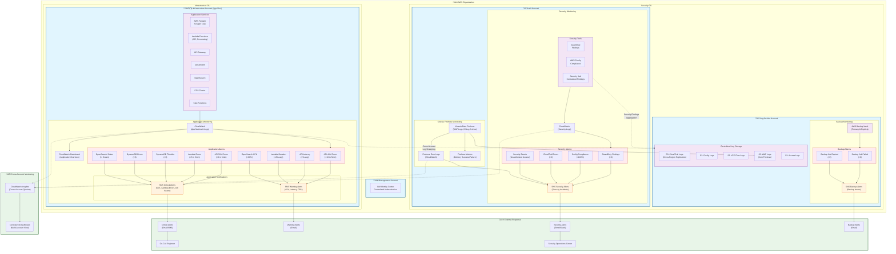

### **Observability & Alerting Flow Diagram**

```mermaid
    flowchart TD
        subgraph AWS_Organization["🏢 AWS Organization"]
            subgraph Management_Account["🏢 Management Account"]
                IAM_IC["IAM Identity Center<br/>Centralized Authentication"]
            end
            
            subgraph Infrastructure_OU["Infrastructure OU"]
                subgraph Infrastructure_Account["🏗️ Infrastructure Account (App-Dev)"]
                    subgraph App_Services["Application Services"]
                        Fargate["AWS Fargate<br/>Scraper Task"]
                        Lambda["Lambda Functions<br/>(API, Processing)"]
                        API_GW["API Gateway"]
                        DynamoDB["DynamoDB"]
                        OpenSearch["OpenSearch"]
                        ECS["ECS Cluster"]
                        StepFunctions["Step Functions"]
                    end
                    
                    subgraph App_Monitoring["Application Monitoring"]
                        CW_App["CloudWatch<br/>(App Metrics & Logs)"]
                        CW_Dashboard["CloudWatch Dashboard<br/>(Application Overview)"]
                        
                        subgraph App_Alarms["Application Alarms"]
                            API_4xx["API 4XX Errors<br/>(>10 in 5min)"]
                            API_5xx["API 5XX Errors<br/>(>5 in 5min)"]
                            API_Latency["API Latency<br/>(>5s avg)"]
                            Lambda_Errors["Lambda Errors<br/>(>5 in 5min)"]
                            Lambda_Duration["Lambda Duration<br/>(>25s avg)"]
                            DDB_Throttles["DynamoDB Throttles<br/>(>0)"]
                            DDB_Errors["DynamoDB Errors<br/>(>0)"]
                            OS_Status["OpenSearch Status<br/>(!= Green)"]
                            OS_CPU["OpenSearch CPU<br/>(>80%)"]
                        end
                        
                        subgraph App_SNS["Application Notifications"]
                            SNS_Critical["SNS Critical Alerts<br/>(5XX, Lambda Errors, DB Issues)"]
                            SNS_Warning["SNS Warning Alerts<br/>(4XX, Latency, CPU)"]
                        end
                    end
                end
            end
            
            subgraph Security_OU["Security OU"]
                subgraph Audit_Account["üîí Audit Account"]
                    subgraph Security_Monitoring["Security Monitoring"]
                        CW_Security["CloudWatch<br/>(Security Logs)"]
                        
                        subgraph Security_Tools["Security Tools"]
                            GuardDuty["GuardDuty<br/>Findings"]
                            Config["AWS Config<br/>Compliance"]
                            SecurityHub["Security Hub<br/>Centralized Findings"]
                        end
                        
                        subgraph Security_Alarms["Security Alarms"]
                            GD_Findings["GuardDuty Findings<br/>(>0)"]
                            Config_Compliance["Config Compliance<br/>(<100%)"]
                            CloudTrail_Errors["CloudTrail Errors<br/>(>0)"]
                            Security_Events["Security Events<br/>(Unauthorized Access)"]
                        end
                        
                        SNS_Security["SNS Security Alerts<br/>(Security Incidents)"]
                    end
                    
                    subgraph Firehose_Monitoring["Kinesis Firehose Monitoring"]
                        Firehose["Kinesis Data Firehose<br/>(WAF Logs ‚Üí Log Archive)"]
                        Firehose_Errors["Firehose Error Logs<br/>(CloudWatch)"]
                        Firehose_Metrics["Firehose Metrics<br/>(Delivery Success/Failure)"]
                    end
                end
                
                subgraph Log_Archive_Account["üìã Log Archive Account"]
                    subgraph Backup_Monitoring["Backup Monitoring"]
                        Backup_Vault["AWS Backup Vault<br/>(Primary & Replica)"]
                        
                        subgraph Backup_Alarms["Backup Alarms"]
                            Backup_Failed["Backup Job Failed<br/>(>0)"]
                            Backup_Expired["Backup Job Expired<br/>(>0)"]
                        end
                        
                        SNS_Backup["SNS Backup Alerts<br/>(Backup Issues)"]
                    end
                    
                    subgraph Log_Storage["Centralized Log Storage"]
                        S3_CloudTrail["S3: CloudTrail Logs<br/>(Cross-Region Replication)"]
                        S3_Config["S3: Config Logs"]
                        S3_VPC["S3: VPC Flow Logs"]
                        S3_WAF["S3: WAF Logs<br/>(from Firehose)"]
                        S3_Access["S3: Access Logs"]
                    end
                end
            end
        end
        
        subgraph External_Response["üö® External Response"]
            Email_Critical["Critical Alerts<br/>(Email/SMS)"]
            Email_Warning["Warning Alerts<br/>(Email)"]
            Email_Security["Security Alerts<br/>(Email/Slack)"]
            Email_Backup["Backup Alerts<br/>(Email)"]
            OnCall["On-Call Engineer"]
            SOC["Security Operations Center"]
        end
        
        subgraph Cross_Account_Monitoring["🔄 Cross-Account Monitoring"]
            CW_Insights["CloudWatch Insights<br/>(Cross-Account Queries)"]
            Centralized_Dashboard["Centralized Dashboard<br/>(Multi-Account View)"]
        end

        %% Application Monitoring Flows
        App_Services --> CW_App
        CW_App --> CW_Dashboard
        CW_App --> App_Alarms
        
        API_4xx --> SNS_Warning
        API_Latency --> SNS_Warning
        Lambda_Duration --> SNS_Warning
        OS_CPU --> SNS_Warning
        
        API_5xx --> SNS_Critical
        Lambda_Errors --> SNS_Critical
        DDB_Throttles --> SNS_Critical
        DDB_Errors --> SNS_Critical
        OS_Status --> SNS_Critical
        
        %% Security Monitoring Flows
        Security_Tools --> CW_Security
        CW_Security --> Security_Alarms
        
        GD_Findings --> SNS_Security
        Config_Compliance --> SNS_Security
        CloudTrail_Errors --> SNS_Security
        Security_Events --> SNS_Security
        
        %% Firehose Monitoring Flows
        Firehose --> Firehose_Errors
        Firehose --> Firehose_Metrics
        Firehose_Errors --> SNS_Security
        Firehose --> S3_WAF
        
        %% Backup Monitoring Flows
        Backup_Vault --> Backup_Alarms
        Backup_Failed --> SNS_Backup
        Backup_Expired --> SNS_Backup
        
        %% Cross-Account Log Aggregation
        CW_App -.-> CW_Insights
        CW_Security -.-> CW_Insights
        Firehose_Errors -.-> CW_Insights
        CW_Insights --> Centralized_Dashboard
        
        %% External Notifications
        SNS_Critical --> Email_Critical
        SNS_Warning --> Email_Warning
        SNS_Security --> Email_Security
        SNS_Backup --> Email_Backup
        
        Email_Critical --> OnCall
        Email_Security --> SOC
        
        %% Cross-Account Data Flows (dashed lines)
        CW_App -.->|"Cross-Account<br/>Log Streaming"| Log_Storage
        Security_Tools -.->|"Security Findings<br/>Aggregation"| Log_Storage
        
        %% Styling
        classDef accountBox fill:#e1f5fe,stroke:#01579b,stroke-width:2px
        classDef serviceBox fill:#f3e5f5,stroke:#4a148c,stroke-width:1px
        classDef alarmBox fill:#ffebee,stroke:#b71c1c,stroke-width:1px
        classDef snsBox fill:#fff3e0,stroke:#e65100,stroke-width:1px
        classDef externalBox fill:#e8f5e8,stroke:#1b5e20,stroke-width:2px
        
        class Infrastructure_Account,Audit_Account,Log_Archive_Account,Management_Account accountBox
        class App_Services,Security_Tools,Log_Storage,Backup_Vault serviceBox
        class App_Alarms,Security_Alarms,Backup_Alarms alarmBox
        class SNS_Critical,SNS_Warning,SNS_Security,SNS_Backup snsBox
        class External_Response,Cross_Account_Monitoring externalBox
```