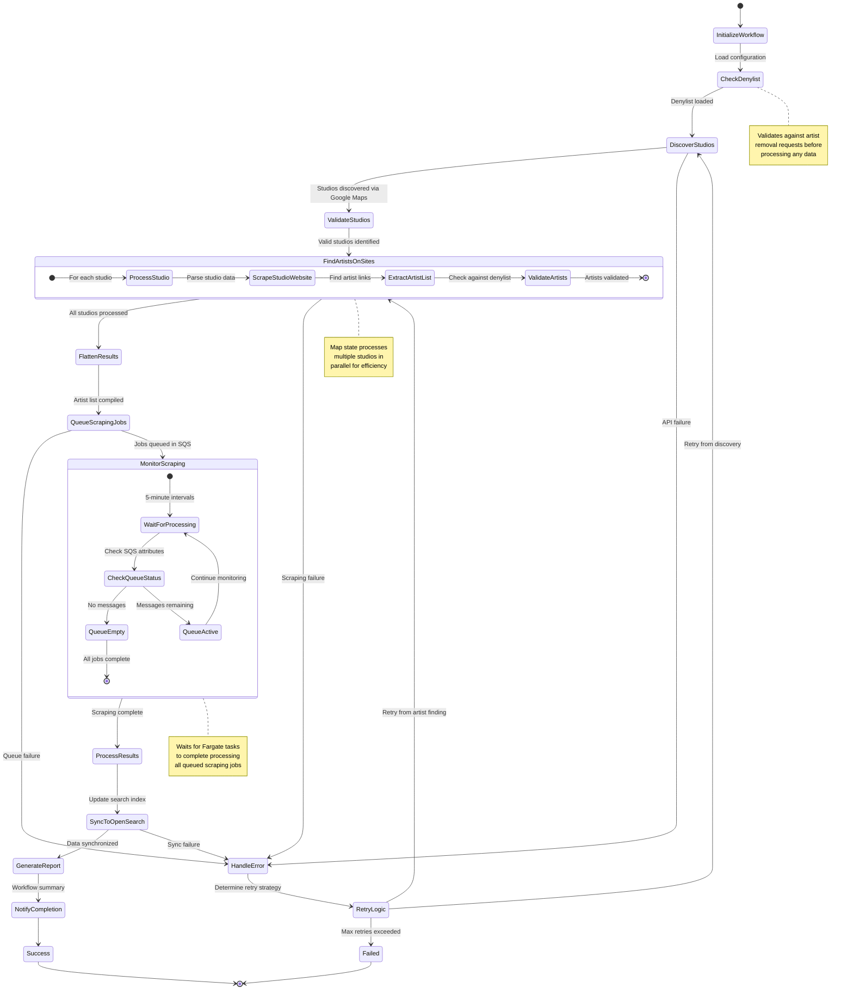

### **State Machine Diagram (AWS Step Functions)**

```mermaid
    stateDiagram-v2
    direction TB
    
    [*] --> InitializeWorkflow
    InitializeWorkflow --> CheckDenylist: Load configuration
    CheckDenylist --> DiscoverStudios: Denylist loaded
    
    DiscoverStudios --> ValidateStudios: Studios discovered via Google Maps
    ValidateStudios --> FindArtistsOnSites: Valid studios identified
    
    state FindArtistsOnSites {
        direction LR
        [*] --> ProcessStudio: For each studio
        ProcessStudio --> ScrapeStudioWebsite: Parse studio data
        ScrapeStudioWebsite --> ExtractArtistList: Find artist links
        ExtractArtistList --> ValidateArtists: Check against denylist
        ValidateArtists --> [*]: Artists validated
    }
    
    FindArtistsOnSites --> FlattenResults: All studios processed
    FlattenResults --> QueueScrapingJobs: Artist list compiled
    QueueScrapingJobs --> MonitorScraping: Jobs queued in SQS
    
    state MonitorScraping {
        direction TB
        [*] --> WaitForProcessing: 5-minute intervals
        WaitForProcessing --> CheckQueueStatus: Check SQS attributes
        CheckQueueStatus --> QueueEmpty: No messages
        CheckQueueStatus --> QueueActive: Messages remaining
        QueueActive --> WaitForProcessing: Continue monitoring
        QueueEmpty --> [*]: All jobs complete
    }
    
    MonitorScraping --> ProcessResults: Scraping complete
    ProcessResults --> SyncToOpenSearch: Update search index
    SyncToOpenSearch --> GenerateReport: Data synchronized
    GenerateReport --> NotifyCompletion: Workflow summary
    NotifyCompletion --> Success
    Success --> [*]
    
    %% Error handling states
    DiscoverStudios --> HandleError: API failure
    FindArtistsOnSites --> HandleError: Scraping failure
    QueueScrapingJobs --> HandleError: Queue failure
    SyncToOpenSearch --> HandleError: Sync failure
    
    HandleError --> RetryLogic: Determine retry strategy
    RetryLogic --> DiscoverStudios: Retry from discovery
    RetryLogic --> FindArtistsOnSites: Retry from artist finding
    RetryLogic --> Failed: Max retries exceeded
    Failed --> [*]
    
    note right of CheckDenylist
        Validates against artist
        removal requests before
        processing any data
    end note
    
    note right of FindArtistsOnSites
        Map state processes
        multiple studios in
        parallel for efficiency
    end note
    
    note right of MonitorScraping
        Waits for Fargate tasks
        to complete processing
        all queued scraping jobs
    end note
```