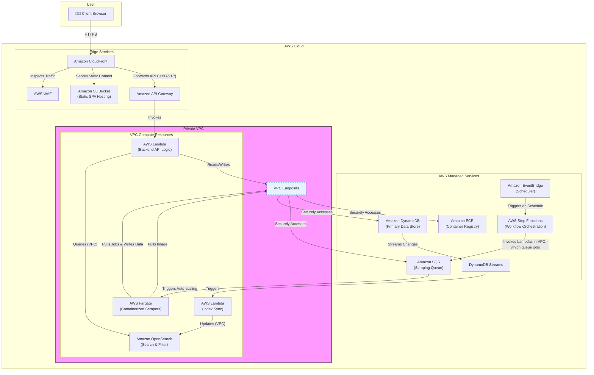
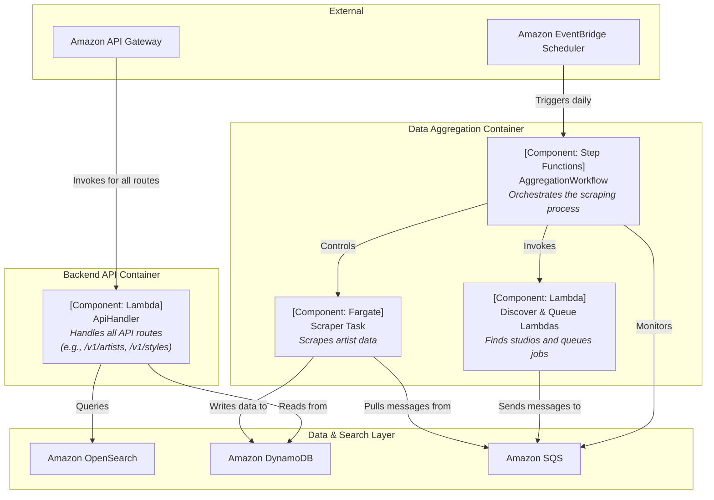
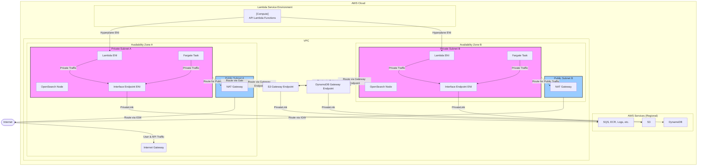
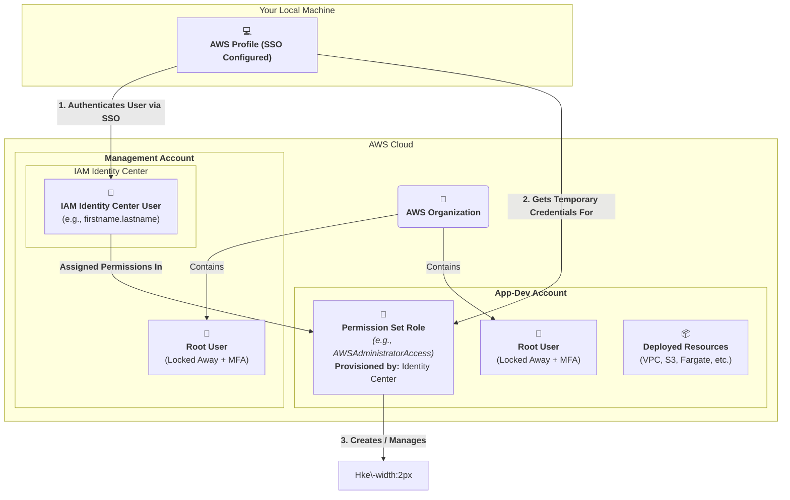
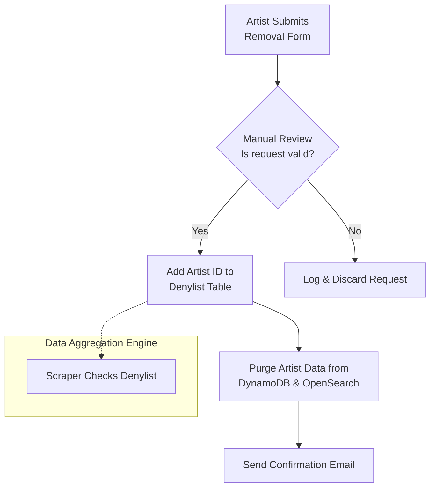
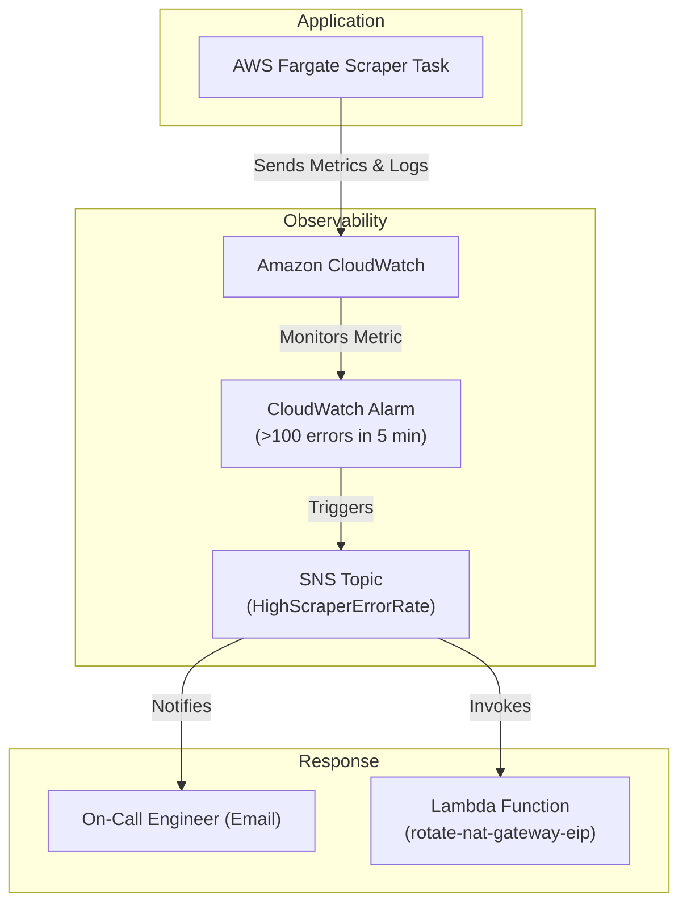
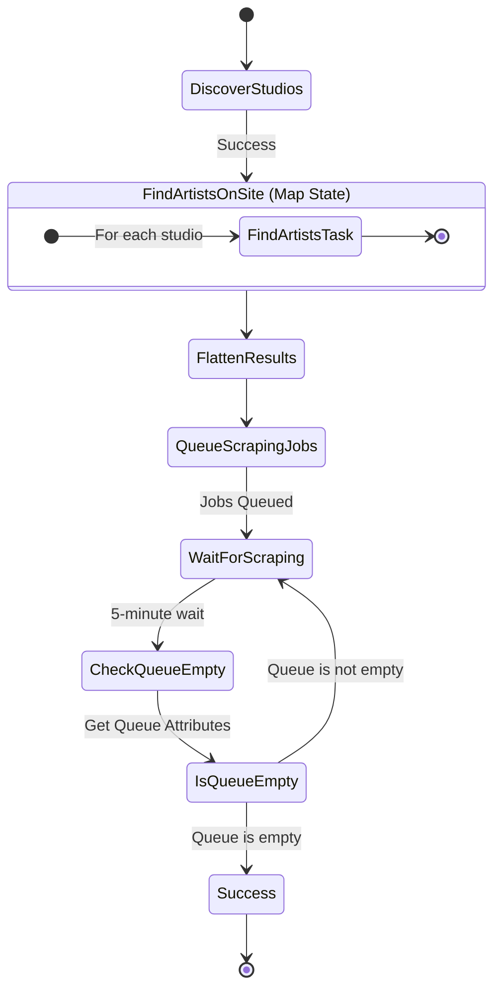
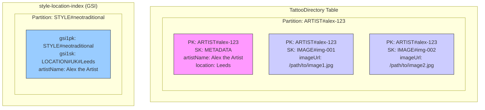
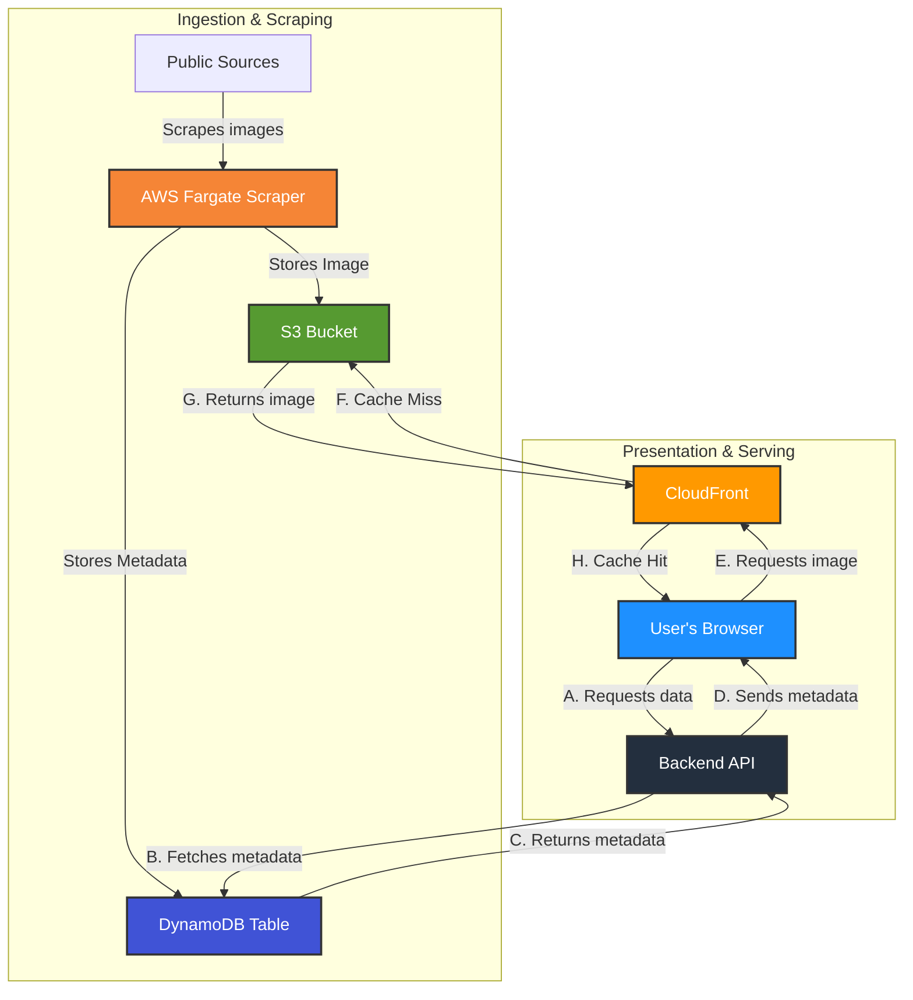

# **High-Level Design: Tattoo Artist Directory MVP**

---

# **0\. Document Control**

**Document Title:** Tattoo Artist Directory MVP \- High-Level Design **Author:** Joseph White \- AWS Technical Architect **Owner:** Project Stakeholders **Distribution:** Engineering & DevOps Teams **Document Status:** For Review & Approval

---

## **0.1. Revision History**

| Version | Date | Description | Author |
| :---- | :---- | :---- | :---- |
| 1.0 | July 4, 2025 | Initial High-Level Design based on PRD. | Joseph White |
| 2.0 | July 4, 2025 | Expanded HLD incorporating framework from reference documents. Added detailed sections for Introduction, Architectural View, Deployment View, and Support. | Joseph White |
| 3.0 | July 4, 2025 | Final comprehensive HLD incorporating AWS Well-Architected Framework principles, a detailed architectural diagram description, and enhanced technical analysis based on best practices research. | Joseph White |

## **0.2. Reviewer List**

| Name | Role |
| :---- | :---- |
| *\[Stakeholder Name\]* | *\[Stakeholder Role\]* |
| *\[Lead Engineer Name\]* | *\[Lead Engineer Role\]* |

## **0.3. Executive Summary**

This document outlines the High-Level Design (HLD) for the Minimum Viable Product (MVP) of a new Tattoo Artist Directory. The platform will create the most comprehensive directory of UK tattoo artists by aggregating public data, providing clients with a powerful search tool and artists with a zero-effort marketing channel. The primary project objective is to serve as a high-quality technical portfolio piece demonstrating modern, full-stack development practices on AWS. The proposed architecture is serverless-first, designed for scalability, security, and operational excellence in line with the AWS Well-Architected Framework.

### **0.3.1 Vision**

To become the most comprehensive and effortless platform for discovering tattoo artists, empowering clients to find the perfect artist and enabling artists to focus on their craft. This HLD translates that vision into a scalable, production-ready cloud architecture.

### **0.3.2 Engage**

This design requires engagement with project stakeholders to validate architectural decisions against business goals. The engineering and DevOps teams will use this document as the foundational blueprint for implementation, Infrastructure as Code (IaaC) development, and CI/CD pipeline setup.

### **0.3.3 Deliver**

The delivery plan involves a phased rollout, starting with an internal alpha to seed the database for the first target city (Leeds). This will be followed by a private beta for user feedback, culminating in a public launch. The architecture detailed herein is designed to be deployed via a fully automated CI/CD pipeline, ensuring rapid and repeatable delivery from day one.

---

# **1\. Introduction**

## **1.1. Business Context**

The current market for tattoo artist discovery is fragmented and inefficient. Prospective clients use generic platforms like Instagram, which function poorly for local, style-based discovery. Existing directory sites are often incomplete "walled gardens" that require artists to opt-in, or they have "pay-to-play" models that misalign client and artist interests. This project addresses the user problem of inefficient discovery and the artist's problem of time-consuming marketing.

## **1.2. Requirements**

The solution must meet both functional and non-functional requirements as defined in the PRD.

### **1.2.1 Functional Requirements:**

***Documentation Note:**To ensure a single source of truth, see **Section 3** of the **Software Requirements Document** for all FRs and their corresponding acceptance criteria.*

### **1.2.2 Non-Functional Requirements:**

***Documentation Note:**To ensure a single source of truth, see **Section 4** of the **Software Requirements Document** for all NFR and their corresponding acceptance criteria.*

## **1.3. In Scope**

* Design and implementation of a serverless backend on AWS.  
* Development of a responsive frontend web application.  
* Creation of an automated data aggregation engine.  
* Setup of a complete, automated CI/CD pipeline and 100% Infrastructure as Code (IaaC).  
* Initial data seeding for the city of Leeds.

## **1.4. Out of Scope**

* **Artist "Claim Profile" Feature:** This is a future enhancement and not part of the MVP.  
* **Proprietary Booking System:** The MVP will drive traffic to artists' existing channels, not replace their booking workflows.  
* **Monetization Features:** Long-term monetization options are open questions and not included in the MVP design.

## **1.5. Constraints**

* **Technology:** The project is constrained to the AWS cloud platform.  
* **Data Sources:** The platform is dependent on the availability and structure of public data from Google Maps, studio websites, and Instagram.  
* **Resources:** The project is limited by solo developer velocity.

## **1.6. Assumptions**

* The core user problem of artist discovery is significant enough to attract users.  
* Required public data is available, accessible, and parsable within technical and ethical limits.  
* The automated aggregation of public information will be viewed positively by artists as a marketing channel.  
* The non-functional requirement of 99.9% availability is for the user-facing application; the backend data aggregation pipeline has a lower availability requirement.

## **1.7. Risks & Mitigation**

| ID | Risk | Mitigation |
| :---- | :---- | :---- |
| R01 | **Technical Fragility of Scraping:** Instagram and other sources may change their site structure or implement anti-scraping measures, breaking the data aggregation engine. | **The project's success is decoupled from scraper fragility via the two-phase release plan:** The core platform (Phase 1\) is a deliverable and successful portfolio piece even if the scraper (Phase 2\) is blocked. Tactical IP rotation is a secondary mitigation for the Phase 2 component. **Architectural Decoupling (API-First):** The data aggregation engine is developed as a parallel workstream. The core application will be seeded via a manual bulk-upload script, allowing the API and frontend to be developed and proven independently of the scraper's status. **Graceful Degradation:** The frontend application is designed to function without portfolio images. If scraping fails, artist profiles will still render with all available data (name, studio, etc.) and display a "Portfolio not available" message with a direct link to the artist's source social media.  **Resilient Infrastructure:** The architecture uses a multi-source discovery strategy (Google Maps \-\> Studio Sites \-\> Instagram) to de-risk sole reliance on one platform. The aggregation engine is designed with AWS Step Functions for resilience, allowing individual steps to fail and be retried without halting the entire workflow. |
| R02 | **Terms of Service Violation:** Scraping Instagram for portfolio content carries a risk of violating their Terms of Service. | The project will only aggregate publicly available information. A clear policy for handling takedown or de-listing requests from artists will be established. The system is a portfolio piece, not a commercial venture, which may lower the risk profile. |
| R03 | **Data Accuracy:** The automated style-tagging algorithm may be inaccurate, leading to poor search results. | The initial algorithm will be simple, with plans to iterate and improve based on user feedback. The MVP focuses on aggregating the portfolio; advanced analysis is a future enhancement. |

## **1.8. Key Drivers**

The primary driver is to create a high-quality portfolio piece that showcases modern, scalable, and well-architected cloud development practices. A secondary driver is to solve a real-world problem for a specific user base, thereby demonstrating product-oriented thinking alongside technical proficiency.

---

# **2\. Architectural View**

## **2.1. Current Operating Model (Problem Space)**

Currently, there is no unified system. The "as-is" state is a manual and fragmented process undertaken by the end-user ("Chloe the Collector"). It involves:

1. Using multiple, inadequate platforms (Instagram search, Google, word-of-mouth).  
2. Manually tracking artists in spreadsheets or notes.  
3. Visiting numerous individual artist websites and social media profiles to collate information. This process is tedious, incomplete, and frustrating for the user. For the artist, the model relies on self-marketing via platforms not designed as professional portfolios.

## **2.2. Target Operating Model**

*The system architecture for the Tattoo Artist Directory MVP is designed as two distinct yet collaborative parts, each serving a critical function within the platform.*

*The **Core API & Data Platform** represents the synchronous, user-facing set of services. This part of the system is responsible for delivering the immediate application experience to clients, handling search queries, displaying artist profiles, and managing the core data stores that power these interactions.*

*In parallel, the **Async Data Aggregation Engine** operates as an event-driven, backend workflow. Its primary responsibility is to continuously and autonomously populate the Core API & Data Platform with up-to-date artist information, ensuring the directory remains comprehensive without direct user interaction.*

The target model is a fully automated platform that centralises artist discovery.

1. **Data Ingestion:** An automated **Data Aggregation Engine** runs on a schedule, discovering and scraping artist information from public sources into a central database.  
2. **Data Serving:** A serverless **Backend API** provides a clean, structured interface to this data.  
3. **User Interface:** A **Frontend Web Application** consumes this API, allowing users to effortlessly search, filter, and browse a comprehensive directory of artists through an intuitive interface.  
4. **Value Proposition:** The model shifts the burden of discovery from the user to the platform. For artists, it provides passive marketing by increasing their visibility without requiring any action on their part.

## **2.3. Future Operating Model Enhancements**

### **2.3.1 Caching Layer**

While not required for the MVP, the introduction of an in-memory caching layer is a standard architectural evolution for optimizing performance and cost at scale. The decision to implement this should be driven by data from monitoring tools, aligning with the principles of the AWS Well-Architected Framework. This enhancement would involve integrating Amazon ElastiCache for Redis between the API Compute layer and the Data & Search Layer.

The primary triggers for introducing a caching layer are:

* Performance Optimisation for "Hot" Data: As user traffic grows, monitoring may reveal that a small subset of data—such as highly popular artist profiles or the results of common search queries—accounts for a large percentage of read operations. Introducing a cache for this "hot" data can significantly reduce API latency, helping to maintain the p95 latency goal of \< 500ms and improve the end-user experience. A prime candidate for immediate caching would be semi-static data, like the list of available tattoo styles, which is requested frequently but changes rarely.

* Cost Optimisation at Scale: A core principle of cost optimisation is to use the most cost-effective resources. At high volume, read operations against DynamoDB and OpenSearch can become a significant cost driver. A caching layer absorbs a large fraction of these reads, which directly reduces the cost incurred by the backend data services and can defer the need to provision more expensive, larger-capacity database or search clusters.

* Enabling Future Stateful Features: The PRD identifies a "Claim Profile" feature as a future enhancement. This will require user authentication and session management. ElastiCache for Redis is a purpose-built service for a highly performant and scalable user session store, a use case for which a stateless compute tier is a prerequisite.

**Architectural Impact:**

The API Lambda functions would be modified to adopt a *cache-aside* pattern. For a given read request, the function would first query ElastiCache. If the data exists in the cache (a cache hit), it is returned immediately. If the data is not in the cache (a cache miss), the function proceeds to query DynamoDB or OpenSearch, returns the data to the client, and populates the cache asynchronously for subsequent requests.

This represents a classic architectural trade-off: the added operational complexity and cost of a new managed service are exchanged for significant gains in performance efficiency and reliability under load.

#### **Implementation Trigger:**

A Caching layer utilising Amazon ElastiCache for Redis will be implemented if any of the following conditions are met:

* **Budgetary constraints:** A caching layer (ElastiCache) will be considered for implementation if/when API p95 latency exceeds 400ms OR DynamoDB On-Demand read costs for the Artist table exceed £75/month.  
* **User Feedback:** 10% or more of user feedback explicitly mentions slow loading times or responsiveness issues, particularly during peak usage periods.  
* **API Load Exceeds Threshold:** Sustained API Gateway requests exceed 50 requests per second (RPS) for more than 5 minutes.  
* 

### **2.3.2 Automated Security Scanning**

This should be integrated into the CI/CD pipeline. This includes running `npm audit` for dependency scanning, using static analysis (SAST) tools to lint code for security issues, and potentially running dynamic scans (DAST) against the dev/staging environment.

#### **Implementation Trigger:**

Automated security scanning will be introduced into the CI/CD pipeline if any of the following conditions are met:

* **Critical Vulnerabilities:** \`npm audit\` reports a "critical" or "high" severity vulnerability in direct or transitive dependencies.  
* **Security Findings in Code:** SAST (Static Application Security Testing) tools identify 5 or more "high" severity security findings in the application codebase within a single release cycle.  
* **External Security Audit Recommendation:** A third-party security audit recommends the implementation of automated scanning tools.

### **2.3.3 AWS PrivateLink & 3rd Party Proxy Service**

AWS PrivateLink would serve as the secure communication backbone for the Data Aggregation component. Its primary role would be to replace the NAT Gateway for outbound traffic from the Fargate scrapers.

By establishing a VPC Endpoint, Fargate tasks could securely connect to a third-party rotating proxy service via AWS's private network. This would enhance the system's robustness by mitigating the risk of the scraper's IP address being blocklisted by target websites, while also improving the security posture by keeping sensitive scraping traffic off the public internet.

Potential 3rd party proxy services suitable for this role are available as part of the AWS Marketplace platform.

#### **Implementation Trigger:**

AWS PrivateLink and a 3rd party proxy service will be implemented if/when:

* **Scraper IP Blockage:** The Fargate scrapers experience an IP block rate exceeding 5% of requests over a 24-hour period, or encounter IP-related access denials from target websites on 3 or more distinct occasions within a month.  
* **Data Transfer Costs:** Outbound data transfer costs through the NAT Gateway for the Data Aggregation component exceed £50/month.  
* **Security Audit Recommendation:** A security audit or penetration test identifies the direct outbound internet access from Fargate as a significant security vulnerability requiring mitigation.

### **2.3.5 Public Documentation Page**

A publicly accessible documentation page for API error codes would be a valuable addition for both internal debugging and external client integration. This page would list all possible error codes returned by the Backend API, along with their corresponding HTTP status codes, a brief description of the error, and potential solutions or remediation steps. This transparency would significantly improve the developer experience for any future consumers of the API, enabling quicker issue resolution and reducing reliance on direct support.

**Implementation Trigger:**

A public documentation page for API error codes will be published if/when:

* **API Misuse/Support Tickets:** The project receives 5 or more support inquiries related to misunderstood API error codes within a 30-day period.  
* **New API Consumers:** The API is integrated by 2 or more external development teams or services.  
* **Developer Experience Feedback:** Direct user feedback or stakeholder requests highlight a need for clearer API documentation to improve developer experience.

### **2.3.6 Machine Learning-Based Inference**

A key area for future enhancement is to replace the simple hashtag scraper with a more sophisticated Machine Learning pipeline to improve the accuracy and relevance of style tags.

* **Text Analysis:** The artist's bio text could be processed by **AWS Comprehend**. By using custom entity recognition, the model could be trained to identify tattoo styles mentioned in natural language, even without hashtags.  
* **Image Analysis:** A more advanced approach would involve analyzing the artist's actual tattoo images. **AWS Rekognition Custom Labels** could be used to train a model to classify images into specific style categories (e.g., "Japanese," "Fine Line," "Neo-traditional"). This would provide the most accurate style data but requires a significant investment in data labeling and model training.

#### **Implementation Trigger:**

Machine Learning-based inference for style tagging will be implemented if/when:

* **Search Inaccuracy Feedback:** User feedback indicates that 20% or more of search results are irrelevant due to inaccurate style tagging (e.g., direct user surveys or reported issues).  
* **Manual Tagging Overhead:** The manual effort for correcting or adding style tags to new artists exceeds 10 hours per week.  
* **Data Volume:** The total number of artist profiles in the directory exceeds 5,000, making manual or simple tagging impractical.

### **2.3.7 Automated Artist Takedown Approval**

Currently, processing artist takedown requests requires a manual approval process due to the absence of a reliable method to authenticate the legitimacy of the request. To address this, a future enhancement would involve implementing an Instagram account verification mechanism. 

This would allow the system to confirm that the requesting party legitimately owns the associated artist's Instagram account, thereby automating the takedown approval process and preventing malicious actors from removing valid profiles.

#### **Implementation Trigger:**

Automated artist takedown approval will be implemented if/when:

* **Manual Processing Time:** The average time taken to manually process an artist takedown request exceeds 48 hours.  
* **Volume of Requests:** The system receives 10 or more legitimate artist takedown requests within a 30-day period.  
* **Security Incidents:** There is an attempted malicious takedown of a profile that highlights the need for a robust verification mechanism.

### **2.3.8 Artist Profile Claim**

The "Artist Profile Claim" feature is a planned future enhancement, not part of the Minimum Viable Product (MVP). It will enable tattoo artists to assert ownership and control over their public profiles within the directory. This feature is critical for empowering artists and moving beyond a purely aggregated, read-only platform.

#### **2.3.8.1 Key Requirements & Architectural Impact:**

**Authentication Mechanism:** Implementing an artist profile claim necessitates a robust authentication system. Artists will need a secure way to register, log in, and verify their identity. This implies:

* **User Registration & Login:** A new user management system will be required to handle artist sign-ups and authentication.

* **Identity Verification:** A mechanism to verify that the claiming artist genuinely owns the associated profile (e.g., integrating with Instagram for verification as mentioned in "Automated Artist Takedown Approval").

**Stateful Database Element:** The "Claim Profile" feature will introduce a significant stateful element to the architecture. While the current MVP relies on a stateless API compute tier, enabling profile claims will require:

* **User Session Management:** Maintaining authenticated artist sessions will likely require a dedicated session store, such as Amazon ElastiCache for Redis, as indicated in "Future Operating Model Enhancements." This service is designed for high-performance and scalable session management, a prerequisite for supporting stateful user interactions.

* **Artist-Specific Data:** The primary database (DynamoDB) will need to store additional data related to claimed profiles, such as artist login credentials (securely managed via AWS Secrets Manager), profile customisation settings, and potentially analytics related to their claimed page.

This enhancement directly aligns with the "Enabling Future Stateful Features" section under "Caching Layer" (2.3.1), where the need for a user session store like ElastiCache for Redis is explicitly mentioned. It also connects to the "Automated Artist Takedown Approval" (2.3.7), as a verified claim process could streamline de-listing requests. The implementation of this feature would mark a significant evolution of the platform from a pure directory to an interactive marketing tool for artists.

#### **Implementation Trigger:**

The "Artist Profile Claim" feature will be developed if/when:

* **Artist Interest:** 50 or more unique tattoo artists express direct interest in claiming their profiles or directly inquire about such a feature via a dedicated contact channel or survey.  
* **Engagement Metrics:** The platform reaches 1,000 Monthly Active Users (MAU) for the client-facing directory, indicating sufficient client-side traction to justify artist engagement.  
* **Strategic Prioritization:** Project stakeholders formally prioritize direct artist engagement and marketing as the next major product iteration.

### **2.3.9 Public Status Dashboard**

A public site status dashboard would provide real-time visibility into the health and availability of the Tattoo Artist Directory MVP. This transparency is valuable for users, artists, and stakeholders, building trust and reducing support inquiries during outages.

#### **2.3.9.1 Option 1: Managed Status Page Service (e.g., Better Stack, Atlassian Statuspage):**

* **Pros:** Quick to set up, highly customizable, includes features like incident communication, subscriber notifications, and a dedicated domain. Many services integrate directly with AWS CloudWatch metrics.  
* **Cons:** Introduces a third-party dependency and associated cost. For a portfolio piece, it might abstract away some of the underlying monitoring implementation details.  
* **Implementation:** Connect the chosen service to CloudWatch alarms and metrics via API integrations or webhooks. Define the components to be monitored (e.g., Frontend, Backend API, Data Aggregation) and the metrics that represent their health (e.g., API Gateway 5xx errors, Lambda throttles, CloudFront availability).

#### **2.3.9.2 Option 2: Native AWS Solution (e.g., Amazon CloudWatch Dashboards with public sharing):**

* **Pros:** Cost-effective (leveraging existing CloudWatch setup), fully within the AWS ecosystem, showcases deeper AWS proficiency.  
* **Cons:** Requires more manual setup for public accessibility and custom styling. Incident communication features are not built-in and would require additional services (e.g., SNS for notifications, custom Lambda for status updates).  
* **Implementation:** Create a dedicated CloudWatch Dashboard with key metrics and alarms for the application's health. While CloudWatch Dashboards can be shared publicly, this typically requires specific IAM policies and careful consideration of what data is exposed.

#### **2.3.9.3 Security Considerations \- Domain Isolation:**

A critical requirement for a public status dashboard is domain isolation. The status page **must be hosted on a separate domain or subdomain** from the main application (e.g.status.tattooartistdirectory.com).

* **Mitigation of DNS/CDN Attacks:** If the main application's domain or CDN is compromised or experiencing issues (e.g., a DDoS attack), the status page, if on the same domain, would also be affected and potentially unreachable. By hosting on a separate domain, managed by a different DNS provider or CDN, the status page acts as an independent source of truth, remaining accessible even if the primary application's infrastructure fails.  
* **Reduced Attack Surface:** Isolating the status page on a separate domain reduces the attack surface on the main application. It also prevents potential cross-site scripting (XSS) or other web vulnerabilities on the status page from directly impacting the main application's security.  
* **Clear Communication Channel:** A separate status domain provides a dedicated, reliable channel for communicating outages and updates to users, even if the primary application is completely down.

#### **Implementation Trigger**

A public status dashboard will be implemented if/when:

* **Outage-Related Inquiries:** The project receives 3 or more user or stakeholder inquiries about system availability or outages within a 30-day period.  
* **Monitoring Maturity:** The existing CloudWatch monitoring and alarming setup is deemed "Mature" (all key metrics are instrumented, dashboards are configured, and alarms are in place for critical thresholds).  
* **Transparency Requirement:** Project stakeholders or future users explicitly request greater transparency regarding system health and incident communications.

### **2.3.10 Observability Visualisation Enhancements**

For the existing serverless-first architecture, the introduction of advanced observability visualization tools like Grafana and potentially Prometheus would represent a significant future enhancement. While Grafana offers immediate benefits as a unified "single pane of glass," Prometheus introduces powerful, albeit more complex, capabilities for application-level metrics, particularly for the Fargate component.

#### 

#### **2.3.10.1 Key Benefits of Adding Grafana (Future)**

Implementing Grafana would unify disparate monitoring data into a single, highly customizable visualization layer. This would provide:

1. **Unified Dashboards**: A single Grafana dashboard could display metrics from AWS CloudWatch (e.g., Lambda invocations, DynamoDB consumed capacity), logs from Amazon OpenSearch, and traces from AWS X-Ray, offering a holistic view of application health.

2. **Advanced Visualization**: Grafana's superior dashboarding capabilities would allow for the creation of more intuitive and data-rich visualizations, enhancing the project's portfolio value.

3. **Cross-Source Alerting**: Sophisticated alert rules could be created in Grafana to correlate data from different sources (e.g., alerting if Lambda errors increase *and* a specific log pattern appears in OpenSearch).

#### 

#### **2.3.10.2 Key Benefits of Adding Prometheus (Future)**

Prometheus, an open-source standard for metrics collection, would offer:

1. **Powerful Query Language (PromQL)**: PromQL would enable complex real-time calculations on metrics, such as the precise percentage of failed requests for a specific API endpoint over a time window.

2. **Standardized Metrics**: Prometheus provides a standardized format for metrics, with a vast ecosystem of "exporters" for third-party applications, databases, and hardware.

3. **Enhanced Container Monitoring**: Prometheus is well-suited for monitoring containerized workloads like the Fargate-based scrapers. An exporter could run as a sidecar container to expose detailed application-level metrics.

#### 

#### **2.3.10.3 Implementation Challenges & Architectural Impact (Future)**

Integrating Prometheus and Grafana involves significant architectural considerations for a serverless design:

* **Hosting Overhead**: Hosting Prometheus and Grafana, likely on Amazon ECS with Fargate, would add operational complexity and cost, contrasting with the serverless model's goal of reducing infrastructure management.  
* **The Lambda Scraping Problem**: Prometheus's pull-based model is an anti-pattern for ephemeral Lambda functions. Lambda functions would need to push metrics to an intermediary service like the Prometheus Pushgateway, adding another component to manage.  
* **Exporter Management**: Obtaining metrics from managed services like OpenSearch would require dedicated exporter tasks (e.g., on Fargate).

#### 

#### **2.3.10.4 Conclusion & Recommendation for Future Enhancement**

For a future enhancement, the most pragmatic and highest-value approach would be to **integrate Grafana first, leveraging existing AWS monitoring services as data sources.** This would provide a unified, "single pane of glass" with minimal architectural change.

**Recommended Steps for Future Implementation:**

* **Deploy Grafana**: Utilize AWS Managed Grafana for a fully managed experience or deploy the open-source version to a Fargate task for more control.

* **Add Data Sources**: Configure Grafana to connect to AWS CloudWatch, Amazon OpenSearch, and AWS X-Ray.

* **Build Unified Dashboards**: Re-create key monitoring views in a single Grafana dashboard.

* **Evaluate Prometheus Later**: Once Grafana is established, assess whether the additional power of PromQL justifies the complexity of adding Prometheus and the Pushgateway for Lambda and Fargate metrics. Integrating a Prometheus exporter for Fargate scrapers would be a logical next step to further demonstrate containerized application instrumentation.

This phased approach would provide an immediate and impressive boost to monitoring capabilities while respecting the trade-offs of adding new components to a well-designed serverless architecture.

#### **Implementation Trigger:**

Advanced observability visualization (e.g., Grafana, potentially Prometheus) will be implemented if/when:

* **Debugging Complexity:** The average time to diagnose and resolve a "critical" or "high" severity issue (MTTR) exceeds 2 hours, indicating that existing CloudWatch dashboards and logs are insufficient for rapid root cause analysis.  
* **Metric Volume:** The number of unique CloudWatch metrics monitored across the architecture exceeds 100, making analysis in standard dashboards cumbersome.  
* **Cross-Service Insights:** The engineering team frequently requires correlated insights from multiple AWS services (e.g., Lambda, DynamoDB, OpenSearch) to understand performance or identify issues, which is difficult to achieve with current tooling.

## **2.4 Alternate Considered Architectural Patterns**

### **2.4.1 AWS Amplify** 


A great alternative in a production environment or if your team is highly proficient with Next.js and prefers a more integrated, full-stack framework experience. It deploys the frontend parts to the CDN and the backend API Routes as serverless functions with zero manual configuration.

Using Next.js's built-in **API Routes** feature for backend logic instead of a separate Express server. Then deploying the entire Next.js application using **AWS Amplify Hosting**.

#### **2.4.1.1 How it Works**

AWS Amplify is a framework designed to build and deploy full-stack web and mobile apps. When you deploy a Next.js app, Amplify automatically provisions the optimal AWS resources behind the scenes. It will:

* Deploy your API Routes as **Lambda functions**.

* Host your static UI components on **S3**.

* Serve everything through **CloudFront**.

#### 

#### **2.4.1.2 Benefit**

This achieves the same serverless outcome as the HLD but abstracts away the manual configuration of API Gateway and Lambda. It provides an excellent, streamlined developer experience while still leveraging a robust, serverless architecture.

* **Maximises Developer Velocity:** This is Amplify's core strength. It streamlines building and deploying much faster by abstracting away the infrastructure configuration.

* **Represents a Modern Workflow:** Using a managed platform like Amplify is a modern and efficient way to deploy full-stack applications. This demonstrates knowledge of how to leverage higher-level services to be productive.

#### **2.4.1.3 Drawbacks**

A drawback of this approach *for a portfolio piece* is that this abstractition layer hides the very skills this project is designed to showcase. An `amplify.yml` file is far less descriptive of deep infrastructure knowledge than a comprehensive Terraform project.

#### **2.4.1.4 Conclusion**

While AWS Amplify is arguably the "simpler" solution for getting to market quickly, Embracing Serverless Directly is the better solution for achieving the stated goals of this PRD. It provides a richer, more detailed, and more impressive demonstration of your capabilities across the full stack, from frontend development to backend business logic and, most critically, cloud infrastructure architecture.

### **2.4.2 AWS CDK & CodeBuild/CodePipeline vs GitHub Actions \&Terraform** 

#### **2.4.2.1 AWS Native Suite (CDK, CodeBuild, CodePipeline)**

This approach leverages tools built and managed by AWS to create a tightly integrated, cloud-native workflow.

* **AWS Cloud Development Kit (CDK)**: Allows developers to define cloud infrastructure using familiar programming languages like TypeScript, Python, or Go. This code synthesises into AWS CloudFormation templates for provisioning.  
* **AWS CodeBuild**: A fully managed continuous integration service that compiles source code, runs tests, and produces software packages. It can be used to build both application code and CDK-defined infrastructure.  
* **AWS CodePipeline**: A fully managed continuous delivery service that automates the release pipelines for fast and reliable updates. It orchestrates the entire workflow from source control (e.g., GitHub) through CodeBuild to deployment.

**Benefits:**

* **Deep AWS Integration**: Seamless integration between services, IAM roles, and the AWS console provides a smooth developer experience.  
* **Familiar Languages**: Using languages like Python or TypeScript for infrastructure can lower the barrier to entry for application developers and allow for complex logic and abstraction.  
* **Unified Tooling**: Provides a single vendor solution for the entire CI/CD and IaC lifecycle within AWS.

**Drawbacks:**

* **Vendor Lock-in**: This stack is designed exclusively for AWS. Skills and infrastructure definitions are not directly portable to other cloud providers.  
* **Implicit State Management**: State is managed by AWS CloudFormation. While robust, it's less explicit than Terraform's state file, which can make planning and predicting changes more complex.

#### **2.4.2.2 Terraform with GitHub Actions**

This approach combines the industry-standard, cloud-agnostic IaC tool with a flexible, repository-native CI/CD orchestrator.

* **Terraform**: An open-source tool that allows infrastructure to be defined in a declarative configuration language (HCL). It supports numerous providers beyond AWS, including other clouds, SaaS platforms, and on-premises resources.  
* **GitHub Actions**: A CI/CD platform integrated directly into GitHub repositories, allowing for the automation of software workflows, including infrastructure deployment using Terraform.

**Benefits:**

* **Cloud-Agnostic Standard**: Terraform is the de facto industry standard for IaC. Proficiency in Terraform is a highly transferable skill across different cloud environments and organizations.  
* **Declarative & Predictable**: HCL is a clear, declarative language focused on *what* infrastructure should exist, not *how* to create it. Terraform's plan command provides an explicit and detailed preview of changes before they are applied, which is a major strength for stability and peer review.  
* **Strong State Management**: Terraform's dedicated state file provides a reliable source of truth for the managed infrastructure, enabling robust tracking and collaboration.

**Drawbacks:**

* **Steeper Learning Curve**: HCL and the concepts of Terraform state management can present a steeper initial learning curve compared to using a familiar programming language with CDK.  
* **Less Integrated UI**: While powerful, there isn't a single, AWS-native UI that visualises the entire pipeline from code to deployment in the same way the AWS console does for its native tools.

#### **2.4.2.3 Conclusion & Decision**

For this project, the chosen approach is **Terraform with GitHub Actions**.

While the AWS native suite offers a highly streamlined experience for AWS-only projects, the primary objective of this project is to serve as a high-impact technical portfolio piece. Proficiency with **Terraform** is one of the most in-demand skills in the cloud and DevOps landscape.

By using Terraform, the project demonstrates a mastery of the industry-standard tool, signalling a deeper, more portable understanding of Infrastructure as Code principles. This strategic choice enhances the value and relevance of the portfolio for a broader range of potential employers and technical roles, outweighing the benefits of the AWS-native suite's tighter integration for this specific context.

### **2.4.3 AWS Managed NAT Gateway vs Fck-NAT**

**Fck-NAT** is an open-source solution designed as a highly cost-effective alternative to the AWS Managed NAT Gateway. Its primary goal is to drastically reduce cloud networking costs by replacing the managed service's per-hour and data processing fees with the minimal cost of a single, small EC2 instance. It achieves this by using a pre-configured Amazon Machine Image (AMI) that runs on a burstable instance (like a t4g.nano) and performs standard Linux IP masquerading to provide internet access to private subnets.

#### **2.4.3.1 Potential Implementation**

A potential implementation of Fck-NAT for this project's architecture would involve the following steps:

1. **Launch EC2 Instance**: An EC2 instance, typically a t4g.nano for maximum cost-efficiency, is launched in a **public subnet** using a community-provided Fck-NAT AMI.  
2. **Disable Source/Dest. Check**: The "Source/Destination Check" attribute on the instance's network interface is **disabled**. This is a critical step that allows the instance to forward traffic that it does not originate.  
3. **Configure Security Group**: The instance's security group is configured to allow inbound traffic on all ports from the private subnets' CIDR blocks and all outbound traffic to the internet (0.0.0.0/0).  
4. **Update Private Route Tables**: The route tables associated with the **private subnets** (where the Fargate tasks and Lambda functions reside) are modified. The default route (0.0.0.0/0) is changed to point to the network interface of the Fck-NAT EC2 instance, instead of an AWS Managed NAT Gateway.

For improved resilience, this instance would ideally be managed by an **Auto Scaling Group** with a desired capacity of one, allowing it to self-heal in the event of an instance failure.

#### **2.4.3.2 Benefits**

* **Significant Cost Savings**: This is the primary driver. The cost of running a single t4g.nano instance is an order of magnitude cheaper than the combined hourly and data processing fees of two managed NAT Gateways, especially for data-intensive workloads like web scraping.  
* **Simplicity**: The underlying NAT mechanism is based on standard, well-understood Linux networking principles (iptables).  
* **Demonstrates Cost Optimization**: For a portfolio piece, successfully implementing this solution demonstrates a deep, practical understanding of AWS networking and a strong commitment to cloud financial management.

#### **2.4.3.3 Drawbacks**

* **Reduced High Availability**: A single EC2 instance is a **Single Point of Failure (SPOF)**. Unlike the AWS Managed NAT Gateway, which is redundant by design across an Availability Zone, an outage of the Fck-NAT instance will sever all outbound internet connectivity for your private resources. While an Auto Scaling Group provides self-healing, there is still a downtime of several minutes while a new instance is launched and routes are updated. This runs counter to the highly available design goal of using two managed gateways.  
* **Limited Throughput**: The network bandwidth is constrained by the performance of the chosen EC2 instance. A t4g.nano has limited network throughput, which could become a bottleneck if the scraping tasks need to download large amounts of data concurrently. The AWS Managed NAT Gateway scales automatically to handle bursts up to 100 Gbps.  
* **Increased Management Overhead**: This is not a managed service. You are responsible for all operational tasks, including OS patching, security hardening, monitoring the instance's health, and ensuring the failover mechanism works correctly. This adds operational complexity to the project.

#### **2.4.3.4 Conclusion**

#### For this MVP, the AWS Managed NAT Gateway is the chosen solution due to its superior reliability, high availability, and ease of management, which are paramount for ensuring a robust and stable user-facing application. 

While Fck-NAT offers compelling cost savings, its increased operational overhead and single point of failure are not acceptable trade-offs for the MVP's reliability requirements. However, a Fck-NAT deployment will be prepared as a highly optimised, cost-saving alternative to be evaluated and potentially deployed at a later stage, especially if cost becomes a more significant constraint or if sufficient operational tooling is in place to mitigate its drawbacks.

### **2.4.4 OpenSearch Serverless**
The choice between a managed cluster and a serverless offering for a service like OpenSearch is a critical architectural decision with significant trade-offs. While OpenSearch Serverless is an excellent, modern option for many use cases, the decision to use OpenSearch Service (Managed Cluster) for this project was a deliberate one, driven by two key factors: the project's primary objective as a portfolio piece and the specific cost-performance profile at the MVP's scale.

#### **2.4.4.1 Primary Reason: Demonstrating Foundational Infrastructure Skills**

The most important driver for this choice is explicitly stated in your design documents (HLD Section 1.8, SRS Section 1.1): the project's primary goal is to serve as a high-quality technical portfolio piece.

**Granular Control and Configuration:** Implementing a managed aws_opensearch_domain requires you to make conscious decisions about instance types, instance counts, storage (EBS), high availability (Zone Awareness), and fine-grained network security (VPC placement, security groups). This demonstrates a deeper, more foundational understanding of how to build, secure, and scale a search cluster.

**Alignment with Other Architectural Choices:** This decision is consistent with other choices made in the architecture, such as using Terraform over a higher-level abstraction like AWS Amplify. The project consistently favors tools and services that showcase a granular command of the underlying infrastructure. Configuring a managed cluster is simply a more comprehensive and impressive demonstration of skill than configuring the more abstracted serverless version.

**Technical & Architectural Reasons**

Beyond the portfolio aspect, there are sound technical reasons why a managed cluster is a better fit for the MVP as defined.

**Cost-Effectiveness at Low, Consistent Load:** OpenSearch Serverless is ideal for intermittent or highly unpredictable workloads, as you only pay for what you use. However, it has a minimum cost floor (typically 4 OpenSearch Compute Units - OCUs, 2 for indexing and 2 for search) even when idle. For the MVP's target of 2,000 MAU, the workload is expected to be low but relatively consistent. In this scenario, a small, fixed-size managed cluster (e.g., two t3.small.search instances) can be more cost-predictable and often cheaper than the serverless equivalent's minimum charge. You are paying for a known, small capacity rather than a pay-per-use model that is optimized for spikiness.

**Direct VPC Integration and Security Model:** By deploying the OpenSearch domain directly within your private subnets, you create a very clear and simple network security boundary. The cluster is a resource inside your VPC, protected by security groups that only allow access from your Lambda functions. This is a classic, easy-to-understand security model. While OpenSearch Serverless is also secure and uses VPC endpoints, the collection itself runs in an AWS-managed VPC, which is a slightly more complex mental model.

In summary, while OpenSearch Serverless represents the cutting edge of operational simplicity, the choice of a Managed Cluster was a strategic one. It better aligns with the project's primary goal of showcasing deep infrastructure expertise and, for the specific low-traffic needs of the MVP, provides a more cost-predictable and architecturally straightforward solution.

## **2.5 Architectural Component Diagrams**

### **2.5.1 High-Level Overview Diagram**


**Input: Scheduled Workflow Initiation**

An Amazon EventBridge rule triggers a scheduled AWS Step Functions workflow daily. The workflow's primary role is to orchestrate the discovery of artists and then send individual scraping jobs as messages to an **Amazon SQS (Simple Queue Service) queue**. This decouples the orchestration logic from the execution of the scrapers.

**Processing:** **Asynchronous Scraping and Indexing**

The SQS queue buffers these jobs, allowing the AWS Fargate container tasks to scale independently based on queue depth. Each Fargate task pulls a job from the queue, scrapes public data from the target source (e.g., Instagram), and writes the aggregated artist data into the primary data store, **Amazon DynamoDB**. Any changes (creations or updates) to the DynamoDB table are captured by **DynamoDB Streams**. A dedicated **AWS Lambda function** is triggered by these stream events to process the change and synchronise the data with the **Amazon OpenSearch index**, ensuring the search data is kept up-to-date.

**Storage: Purpose-Built Data Tiers** 

The system utilises three distinct storage layers based on the data's access patterns:

* **Amazon DynamoDB** serves as the primary data store for all artist profile information.  
* **Amazon OpenSearch Service** is used to persist the search index, enabling efficient and complex filtering and geo-spatial queries.  
* **Amazon S3** stores the static assets (HTML, CSS, JavaScript) for the frontend web application.

**Output:** **User-Facing Application Delivery**

A user accesses the platform via a client browser. **Amazon CloudFront** serves the static web application from the S3 bucket, with **AWS WAF** inspecting traffic at the edge for security threats. The application then makes API calls to **Amazon API Gateway**, which securely routes requests to the backend **AWS Lambda** function. This backend function queries the Amazon OpenSearch index for all search and filtering requests, presenting the results to the user.

### **2.5.2 C4 Model: Level 1 \- System Context**


**Diagram Explanation**

* **Users:** The primary users are "Chloe the Collector," who actively uses the system to find artists, and "Alex the Artist," who benefits passively from the platform's marketing.  
* **Tattoo Artist Directory MVP:** This is the core system being built. Its main function is to aggregate data and present it in a searchable format.  
* **External Systems:** The system is critically dependent on public data from **Google Maps** for discovering tattoo studios and **Instagram** for scraping artist portfolio content.

### 

### **2.5.3 C4 Model: Level 2 \- Containers**


**Diagram Explanation**

* **Frontend Web App:** A Next.js Single-Page Application (SPA) running in the user's browser, hosted on S3 and served via CloudFront.  
* **Backend API:** A serverless API built with Amazon API Gateway and AWS Lambda that exposes the system's data and business logic.  
* **Data Aggregation Engine:** An asynchronous, scheduled workflow using AWS Step Functions and AWS Fargate to orchestrate the scraping of public data.  
* **Primary Data Store:** Amazon DynamoDB is used as the main database for its fast, key-value access patterns.  
* **Search Index:** Amazon OpenSearch Service powers the complex search and filtering features required by users. Data is synchronized from DynamoDB via DynamoDB Streams.

### 

### **2.5.4 C4 Model: Level 3 \- Components**


**Diagram Explanation**

* **Backend API Components:** The API is composed of single-purpose Lambda functions, each mapped to a specific endpoint in API Gateway. For example, the SearchArtists Lambda handles search queries by talking to OpenSearch, while GetArtistProfile fetches a specific record from DynamoDB.

* **Data Aggregation Component:** The core component is the AggregationWorkflow managed by AWS Step Functions. It's triggered on a schedule by Amazon EventBridge and orchestrates the entire multi-step process of finding and scraping artist data before writing it to DynamoDB.

### 

### **2.5.5 User Interaction Sequence Diagram (Search)**

.png> "Sequence Diagram")

**Diagram Explanation**

1. The user's browser first requests the web application assets, which are served quickly by **Amazon CloudFront**.  
2. The JavaScript application running in the browser then makes a search query to the backend.  
3. The request hits **Amazon API Gateway**, which acts as the secure entry point.  
4. API Gateway invokes the specific **AWS Lambda** function responsible for handling artist searches.  
5. The Lambda function queries the **Amazon OpenSearch** cluster to perform the complex search and filtering logic.  
6. The results are returned up the chain to the user's browser, which then renders the artist profiles.

### 

### **2.5.6 Data Aggregation Sequence Diagram**


**Diagram Explanation**

1. The entire process is initiated by an **Amazon EventBridge** rule that runs on a daily schedule.  
2. EventBridge triggers an **AWS Step Functions** state machine, which orchestrates the multi-step workflow.  
3. Early steps in the workflow discover artist profiles and then send a message for each artist to an **Amazon SQS queue**. This decouples the discovery from the scraping process and buffers the jobs.  
4. An **AWS Fargate** service runs containerized scraper tasks. It auto-scales based on the number of messages in the SQS queue.  
5. Each Fargate task pulls a message, performs the intensive work of scraping the public portfolio, and writes the final data directly to **Amazon DynamoDB**. This robust, buffered pattern ensures that jobs are not lost and the workload can be processed at a controlled rate.

### 

### **2.5.7 CI/CD Pipeline Diagram**


**Diagram Explanation**

1. **Source:** A developer pushes code to a Git repository, which triggers the **GitHub Actions**.  
2. **Build:** An **GitHub Actions** job compiles the code, runs unit tests, and packages the application artifacts (e.g., Lambda deployment packages, Fargate Docker images).  
3. **Deploy to Staging:** The pipeline uses HashiCorp Terraform to automatically deploy the changes to a production-like dev/staging environment.  
4. **Test & Approval:** Automated integration tests run against the dev/staging environment. If they pass, the pipeline pauses for a required manual approval before deploying to production.  
5. **Deploy to Production:** Upon approval, the exact same artefacts are deployed to the production environment, ensuring consistency and reliability.

### 

### **2.5.8 Network Architecture Diagram (VPC)**

.png> "Network Architecture Diagram (VPC)")

**Diagram Explanation**

* **Multi-AZ Design:** The VPC spans two Availability Zones (AZs) to ensure high availability. If one AZ fails, the application remains operational in the other.  
* **Public Subnets:** These subnets have a direct route to the Internet Gateway. They contain resources that need to be publicly accessible, like NAT Gateways.  
* **Private Subnets:** These subnets do not have a direct route to the internet. All critical application components—the **API Lambda functions**, the **Fargate scraper tasks**, and the **OpenSearch cluster**—are placed here to protect them from direct public access.  
* **NAT Gateway:** To allow resources in the private subnets (like a Fargate task needing to scrape a website) to initiate outbound connections to the internet, traffic is routed through a NAT Gateway. This allows outbound access while blocking inbound connections from the internet, maintaining a secure posture.  

### 

### **2.5.9 Data Model Diagram (DynamoDB Single-Table Design)**

.png> "Data Model Diagram (DynamoDB Single-Table Design")

**Diagram Explanation**

* The primary table structure shows the **PK** (Partition Key) and **SK** (Sort Key).
* The Different data entities (e.g., **Artist Profile**, **Artist Image**) are stored under the same **PK** but with different **SK** prefixes.
* The **style-location-index** GSI is structured with its own **gsi1pk** and **gsi1sk** to facilitate efficient search queries.

### 

### **2.5.10 State Machine Diagram (AWS Step Functions)**

.png> "State Machine Diagram (AWS Step Functions)")

**Diagram Explanation**

* Note the different states in the workflow (e.g., **DiscoverStudios**, **FindArtistsOnSite**, **QueueScrapingJobs**).
* Utilisation of a **Map** state to process multiple studios in parallel.
* Showcase of the transition between states upon success or failure.
* Error handling logic, such as **Retry** policies or **Catch** blocks that log errors without halting the entire execution.

### 

### **2.5.11 Observability & Alerting Flow Diagram**


**Diagram Explanation**

* A service like AWS Fargate or Lambda emitting metrics (e.g., **Scraper4xxErrorCount**) and logs to Amazon CloudWatch.
* A CloudWatch Alarm monitoring a specific metric.
* The alarm transitioning to an **ALARM** state and triggering an SNS topic.
* The SNS topic fanning out notifications to different subscribers (e.g., an email endpoint, an AWS Lambda function for automated remediation).

### 

### **2.5.12 Data Governance & Takedown Process Diagram**

.png> "Data Governance & Takedown Process Diagram")

**Diagram Explanation**

* An artist submitting the removal request via a public web form.
* The request triggering an administrative review (the manual approval step).
* Upon approval, the artist's ID being added to the "Denylist" table in DynamoDB.
* A cleanup process being triggered to purge the artist's data from the primary DynamoDB table and the OpenSearch index.
* The data aggregation engine checking the denylist before scraping.

### 

### **2.5.13 AWS Configured Access**


**The Hierarchy**

* **AWS Organization:** The top-level container holding your two accounts, providing centralized governance and billing.
* **Management & App-Dev Accounts:** Two separate and isolated accounts. The Management Account's primary role is now to host IAM Identity Center, your central hub for user management.
* **Root Users:** You have **two** of these—one for each account. Both are secured with MFA and their credentials are vaulted. They are not used for any operational tasks.
* **IAM Identity Center User:** Instead of creating separate admin users in each account, you now have **one single user** defined centrally in IAM Identity Center. This user represents you, the human operator.
* **Permission Set Role:** This is the benefit of IAM Identity Center. When you assign your user permissions to access the App-Dev account, Identity Center automatically creates a special **IAM Role** inside that account. This role contains the actual permissions (like **AdministratorAccess**) and trusts your Identity Center user to assume it.

**The Flows**

* **Authentication:** On your computer, you run **aws sso login.** Your SSO-configured **AWS Profile** opens a browser, you sign in as your **IAM Identity Center User**, and the **AWS CLI** receives secure, temporary credentials.
* **Getting Credentials:** When you run **terraform apply**, Terraform uses your authenticated session to request access to the **App-Dev Account**. IAM Identity Center provides it with the temporary credentials associated with the **Permission Set Role** that was provisioned there for your user.
* **Creation / Management:** Armed with the temporary admin credentials from that role, Terraform has the authority to create, update, and manage all the necessary infrastructure resources inside the secure App-Dev Account.

### **2.5.14 Image Ingestion and Display Diagram**


**Diagram Explanation**

**Image Ingestion & Scraping**
* An AWS Fargate Scraper automatically collects images and their associated information from public sources.
* The actual image files are stored in an Amazon S3 bucket.
* The metadata for each image (like its name, source URL & description) is stored in an Amazon DynamoDB table.

**Presentation & Serving**
* The User's Browser first requests data from a Backend API.
* The API fetches the image's metadata from the DynamoDB table and sends it back to the browser.
* The browser receives the metadata, which includes the image's location, and then requests the image file itself through Amazon CloudFront.
* CloudFront checks if it has a copy of the image stored in a nearby cache location. 

Cache Hit: If the image is in the cache, CloudFront delivers it directly to the user for a fast response.

Cache Miss: If the image isn't in the cache, CloudFront retrieves it from the origin S3 bucket, delivers it to the user, and caches it for future requests.

---

# 

# **3\. Architectural Components**

This design explicitly incorporates the principles of the six pillars of the AWS Well-Architected Framework to ensure a robust, secure, and efficient solution.

## **3.1. Introduction & Overview**

**User Request Flow:** The user's browser requests the web application. **Amazon CloudFront** serves the static Single-Page Application (SPA) assets (HTML, CSS, JS) from an **Amazon S3** bucket. **AWS WAF** is attached to CloudFront to protect against common web exploits.

**API Interaction:** The SPA, running in the browser, makes secure API calls to **Amazon API Gateway**. API Gateway acts as the managed "front door," routing requests to backend **AWS Lambda** functions that contain the business logic.

**Data & Search Logic:** For complex search queries, the API Lambda function queries the **Amazon OpenSearch Service** cluster, which provides fast, faceted search results. For direct profile lookups, the function queries the **Amazon DynamoDB** primary database.

**Data Synchronization:** To keep the search index current, **DynamoDB Streams** captures all data changes (creations, updates, deletions) in the artist table. These events trigger a dedicated Lambda function that automatically updates the OpenSearch index.

**Asynchronous Data Aggregation:** The entire data collection process is decoupled from the user-facing application. An **Amazon EventBridge** rule triggers a workflow on a recurring schedule (e.g., daily). This invokes an **AWS Step Functions** state machine that orchestrates the multi-step scraping pipeline. For complex scraping tasks that require a browser, Step Functions invokes containerised applications running on **AWS Fargate**. These tasks scrape public data and write the results to the DynamoDB table, initiating the sync process.

## **3.1. AWS CloudFront (CDN)**

CloudFront serves as the primary user entry point. It delivers the static Next.js frontend application (hosted in S3) from edge locations for low latency and routes dynamic API requests to API Gateway.

## **3.2. AWS WAF**

WAF is integrated with CloudFront at the network edge to provide security. It filters malicious traffic like SQL injection and XSS attacks, aligning with the OWASP Top 10 protection requirement.

## **3.3. AWS API Gateway**

This service acts as the managed "front door" for all backend logic. It receives API calls from the client, triggers the correct AWS Lambda function for the endpoint (e.g., `/v1/artists`), and manages the request/response flow.

## **3.4. Amazon S3**

S3 is used exclusively for hosting the static web assets (HTML, CSS, JS) of the frontend SPA. The bucket is correctly configured to be private, with access restricted to CloudFront via an Origin Access Identity (OAI).

## **3.5. Amazon OpenSearch**

This is the specialized search engine powering the core discovery feature. When a user searches or filters by style, the API Lambda function queries the OpenSearch cluster to retrieve relevant artist results.

## **3.6. Amazon DynamoDB**

DynamoDB is the primary database, storing all aggregated artist metadata (name, bio, location) and portfolio information. It is queried directly for retrieving a single artist's full profile and is the write target for the Fargate scraper tasks.

## **3.7. AWS EventBridge**

EventBridge is the scheduler. A cron-based rule triggers the entire data aggregation workflow on a daily schedule, ensuring the directory data remains fresh. 

## **3.8. AWS StepFunctions**

Step Functions orchestrates the complex, multi-step data aggregation workflow. It provides resilience, error handling, and a visual model of the entire process, from finding studios to queueing scraping jobs. 

## **3.9. AWS Fargate**

Fargate provides the serverless compute for the containerized scraper tasks. This is where the heavy lifting of scraping websites and Instagram occurs, a workload that is well-suited for containers rather than short-lived Lambda functions.

## **3.10. HashiCorp Terraform**

This is the specified Infrastructure as Code (IaaC) tool for defining all cloud resources programmatically, enabling version control and automated deployments.

## **3.11. Github Actions**

These services form the CI/CD pipeline that automates the build, testing, and deployment of the application to dev/staging and production environments.

## **3.12. AWS CloudWatch**

CloudWatch is the central observability service. It collects logs from all components (Lambda, Fargate) for debugging and gathers metrics (API latency, error rates) for dashboards and automated alarms.

## **3.13. AWS X-Ray**

X-Ray is used to implement distributed tracing. This is critical for understanding performance bottlenecks and debugging errors in a distributed system where a single user request flows through multiple services (API Gateway, Lambda, DynamoDB). 

## **3.14. AWS KMS**

The Key Management Service is used to manage the cryptographic keys for encrypting all data at rest in S3, DynamoDB, and OpenSearch, fulfilling a core security requirement.

## **3.15. AWS IAM**

#### IAM is used extensively to enforce the principle of least privilege. Every component (Lambda, Fargate task, etc.) has its unique role with narrowly-scoped permissions, ensuring it can only access the specific resources it needs.

## **3.16. Amazon SQS (Simple Queue Service)**

The LLD and sequence diagrams introduce an SQS queue to buffer scraping jobs for the Fargate tasks. This is a **fantastic and critical** architectural improvement that decouples discovery from scraping and improves resilience. It absolutely should be added to the HLD's primary component list.

## **3.17 DynamoDB Streams**

This is the invisible engine that makes the OpenSearch integration work. It captures all database changes and triggers the sync Lambda, ensuring the search index remains up-to-date. While it's described in the data flow, it should be listed as a first-class component in the HLD.

## **3.18 Core VPC Components (VPC, Subnets, NAT Gateway, Internet Gateway)**

The entire architecture lives within a VPC. The network design, with its use of public and private subnets and NAT Gateways, is fundamental to the system's security posture. These foundational networking elements should be explicitly listed as architectural components in the HLD.

## **3.19 Amazon SNS (Simple Notification Service)**

The operations plan mentions using SNS to send notifications from CloudWatch Alarms.

## **3.20 VPC Endpoints**

To adhere to the principle of least privilege and create a robust defense-in-depth security posture, the architecture makes extensive use of VPC Endpoints. These components provide private, secure connectivity between resources inside the VPC (like Lambda functions and Fargate tasks) and other AWS services, ensuring that traffic does not traverse the public internet. This design enhances security, can improve performance, and reduces data transfer costs associated with NAT Gateways.

### **3.20.1 Gateway Endpoints**

Gateway Endpoints are used for services that are accessed via target entries in a route table. They are a highly available and scalable way to access specific services without needing a public IP address.

In this architecture, Gateway Endpoints are configured for:

**Amazon S3:** Ensures that any interaction with S3 buckets, such as the Fargate task pulling a configuration file or a Lambda function accessing an asset, is routed over the AWS private network.

**Amazon DynamoDB:** All database reads and writes from the API Lambda, sync Lambda, and Fargate scraper tasks are routed through the endpoint, keeping sensitive database traffic completely isolated from the internet.

These endpoints are associated with the private route tables, automatically directing all traffic destined for S3 and DynamoDB from the private subnets through these secure gateways.

### **3.20.2 Interface Endpoints**

Interface Endpoints are Elastic Network Interfaces (ENIs) with private IP addresses that are placed directly inside the private subnets. They provide private access to a wider range of AWS services and are protected by their own security group.

In this architecture, Interface Endpoints are configured for:

**Amazon SQS:** Allows the Step Functions workflow and Fargate tasks to send and receive messages from the scraping queue securely.

**AWS Secrets Manager:** Enables the Lambda functions to retrieve database credentials and API keys without an internet-facing connection.

**Amazon ECR:** Critical for allowing the Fargate service to pull the scraper's container image (ecr.api and ecr.dkr endpoints) privately.

**AWS Step Functions:** Allows for secure communication and orchestration between the various workflow components.

**Amazon CloudWatch Logs:** Enables all VPC-based resources (Lambda, Fargate) to send logs to CloudWatch without needing to route traffic through the NAT Gateway.

A dedicated security group, vpc_endpoints-sg, is attached to these endpoints. It is configured to only allow inbound HTTPS traffic from the lambda-sg and fargate-sg security groups, ensuring that only the application's own compute resources can use them.

## **3.21 AWS PrivateLink (Not Implemented in MVP)**

If implemented, AWS PrivateLink would serve as the secure communication backbone for the Data Aggregation component. Its primary role would be to replace the NAT Gateway for outbound traffic from the Fargate scrapers.

By establishing a VPC Endpoint, Fargate tasks could securely connect to a third-party rotating proxy service via AWS's private network. This would enhance the system's robustness by mitigating the risk of the scraper's IP address being blocklisted by target websites, while also improving the security posture by keeping sensitive scraping traffic off the public internet.

## **3.22 Elasticache for Redis (Not Implemented in MVP)**

Amazon ElastiCache for Redis would be introduced as a high-speed, in-memory caching layer to improve the performance and scalability of the user-facing API.

Its role would be to cache frequently requested data, such as popular artist profiles and common search query results, that are otherwise stored in DynamoDB and OpenSearch. This would significantly reduce response times, decrease the read load on the primary data stores, and help ensure the system consistently meets its non-functional requirements for performance. 

---

# 

# **4\. Alignment with AWS Well-Architected Framework**

This design explicitly incorporates the principles of the six pillars of the AWS Well-Architected Framework to ensure a robust, secure, and efficient solution.

## **4.1. Operational Excellence**

This pillar focuses on running and monitoring systems to deliver business value and continually improving processes.

* **Perform Operations as Code:** The entire infrastructure will be defined using the **HashiCorp Terraform**, enabling version control, peer review, and automated, repeatable deployments.  
* **Make Frequent, Small, Reversible Changes:** A full **CI/CD pipeline** (**GitHub Actions**) will automate deployments. The microservices-based API and decoupled scrapers allow for small, independent updates, reducing the blast radius of any potential issues.  
* **Anticipate Failure:** The data aggregation workflow uses **AWS Step Functions**, which has built-in error handling and retry logic, anticipating that individual scraping tasks may fail.  
* **Learn from Failures:** Centralized logging via **Amazon CloudWatch** and distributed tracing with **AWS X-Ray** provide deep observability, enabling post-incident analysis to learn from operational events.

## **4.2. Security**

This pillar focuses on protecting information, systems, and assets.

* **Implement a Strong Identity Foundation:** The principle of least privilege is enforced everywhere. Each Lambda function and Fargate task will have a unique **IAM Role** with narrowly scoped permissions to access only the resources it needs.  
* **Apply Security at All Layers:** A defense-in-depth approach is used: **AWS WAF** at the edge, VPC network controls (public/private subnets, security groups), and IAM permissions at the resource level.  
* **Protect Data in Transit and at Rest:** All traffic between the user and CloudFront, and between all internal AWS services, is encrypted using TLS. Data is encrypted at rest in S3, DynamoDB, and OpenSearch using **AWS KMS**.  
* **Keep People Away from Data:** There is no direct access to the databases. All interaction is programmatic via the API or automated via the aggregation engine.  
* **Prevent Abuse:** To protect the public API from scraping and other abuse, the system will implement rate limiting. An **AWS WAF rate-based rule** will be applied at the edge to block aggressive clients, and **Amazon API Gateway throttling** will be configured to protect the backend services from being overwhelmed.

## **4.3. Reliability**

This pillar ensures the workload performs its intended function correctly and consistently.

* **Automatically Recover from Failure:** By using managed services like Lambda, Fargate, and DynamoDB, the underlying infrastructure is automatically managed by AWS. If a Lambda instance fails, another is invoked automatically. If a Fargate container fails, it is automatically replaced.  
* **Scale Horizontally to Increase Availability:** All core compute and database services are designed to scale horizontally across multiple Availability Zones, eliminating single points of failure.  
* **Stop Guessing Capacity:** The serverless and auto-scaling nature of the components means capacity is added or removed automatically based on real-time demand, preventing failures due to resource saturation.

## **4.4. Performance Efficiency**

This pillar focuses on using computing resources efficiently to meet requirements.

* **Use Serverless Architectures:** The "serverless-first" approach removes the operational overhead of managing servers, allowing focus to be on application logic and performance. AWS handles the underlying efficiency.  
* **Mechanical Sympathy (Purpose-Built Tools):** The design uses purpose-built databases for specific tasks. **DynamoDB** is used for fast, key-value lookups, while **OpenSearch** is used for complex search queries. This avoids the inefficiency of using a general-purpose database for all tasks.  
* **Experiment More Often:** The IaaC setup allows for rapid creation of test environments to experiment with different Lambda memory configurations or Fargate container sizes to find the most efficient setup.

## **4.5. Cost Optimization**

This pillar focuses on avoiding unnecessary costs.

* **Adopt a Consumption Model:** The serverless architecture is inherently cost-effective for an MVP. Costs are incurred on a pay-per-request basis for API Gateway, Lambda, and Fargate, and pay-for-what-you-use for DynamoDB. There are no costs for idle resources.  
* **Stop Spending Money on Undifferentiated Heavy Lifting:** By using managed services, the project avoids the costs associated with server patching, maintenance, and administration.  
* **Analyze and Attribute Expenditure:** **Resource tagging** will be implemented across all components to allow for granular cost analysis and attribution in AWS Cost Explorer.

## **4.6. Sustainability**

This pillar focuses on minimizing the environmental impacts of running cloud workloads.

* **Maximize Utilization:** The serverless model inherently maximizes utilization. AWS runs Lambda functions and Fargate tasks on shared hardware, leading to extremely high server utilization rates and reducing wasted energy compared to dedicated, idle servers.  
* **Use Managed Services:** Leveraging managed services like S3, DynamoDB, and OpenSearch benefits from the environmental economies of scale that AWS achieves in its data centers.  
* **Anticipate and Adopt New, More Efficient Hardware:** As AWS introduces more efficient compute platforms (e.g., Graviton processors), Lambda and Fargate workloads can be migrated to benefit from better performance per watt with minimal code changes.

---

# 

# **5\. Deployment View**

## **5.1. Environments**

A multi-account strategy using AWS Organizations is recommended for environment separation to provide a strong security and billing boundary.

* **Development:** An account for developers to experiment and build features.  
* **Dev/Staging:** An account with a production-like configuration for integration testing, performance testing, and UAT.  
* **Production:** The live, customer-facing environment. Each environment will have its own completely separate set of resources, deployed via the same IaaC templates to ensure consistency.

## **5.2. CI/CD Pipeline**

The deployment process will be fully automated using **GitHub Actions**.

1. **Source:** A developer pushes code to a Git repository.  
2. **Build:** This triggers **GitHub Actions**, which starts a **GitHub Actions** job. The build job installs dependencies, runs unit tests, and packages the application artefacts (e.g., Lambda deployment packages, Docker images for Fargate).  
3. **Deploy to Dev/Staging:** The pipeline deploys the changes to the Dev/Staging environment using HashiCorp Terraform to update the stack. Automated integration and end-to-end tests are run against the Dev/Staging environment.  
4. **Manual Approval:** After successful tests in Dev/Staging, the pipeline pauses for a manual approval step before deploying to Production.  
5. **Deploy to Production:** Upon approval, the same artefacts are deployed to the Production environment.

---

# 

# **6\. Support and Operations**

## **6.1. Monitoring & Observability**

Operational support will be managed through modern DevOps practices centered on observability.

* **Monitoring & Alerting:** **Amazon CloudWatch** will be the central monitoring tool. Key metrics (API latency, error rates, Lambda concurrency, DynamoDB throughput) will be displayed on dashboards. CloudWatch Alarms will be configured to provide automated notifications via **Amazon SNS** for any metric that breaches a defined threshold.  
* **Logging:** All components (Lambda, Fargate, API Gateway) will be configured to send structured (JSON) logs to **CloudWatch Logs**. These logs can be queried using CloudWatch Logs Insights to facilitate efficient querying and analysis in Amazon CloudWatch Logs Insights. This can be achieved via a library such as PowerTools for Lambda.  
* **Tracing:** **AWS X-Ray** will be enabled for API Gateway and Lambda functions to provide end-to-end distributed tracing. This is critical for identifying performance bottlenecks and pinpointing the root cause of errors in a distributed system.  
* All Lambda functions and Fargate tasks MUST produce **structured JSON** logs

---

# 

# **7\. Appendices**

## **7.1. References**

* \[1\] Product Requirement Document: Tattoo Artist Directory MVP  
* \[2\] AWS Architecture Best Practices Report  
* \[3\] SVD Alerting Tool \- High-level design (Reference HLD 1\)  
* \[4\] Azure Files High-Level Design (Reference HLD 2\)  
* \[5\] AWS Well-Architected Framework Pillars and Principles  
* \[6\] AWS Serverless Application Reference Architectures  
* \[7\] AWS Web Scraping Pipeline Architectures

## **7.2. Glossary**

| Term | Explanation |
| :---- | :---- |
| **API** | Application Programming Interface |
| **AWS** | Amazon Web Services |
| **AZ** | Availability Zone |
| **CI/CD** | Continuous Integration / Continuous Delivery |
| **DynamoDB** | Amazon's managed NoSQL database service |
| **Fargate** | A serverless compute engine for containers |
| **HLD** | High-Level Design |
| **IaaC** | Infrastructure as Code |
| **IAM** | Identity and Access Management |
| **KMS** | Key Management Service |
| **Lambda** | AWS's serverless, event-driven compute service |
| **MAU** | Monthly Active Users |
| **MVP** | Minimum Viable Product |
| **OpenSearch** | A distributed, open-source search and analytics suite |
| **PRD** | Product Requirements Document |
| **S3** | Simple Storage Service |
| **SPA** | Single-Page Application |
| **VPC** | Virtual Private Cloud |
| **WAF** | Web Application Firewall |

## **7.3 Diagrams as Code**

### **AWS Amplify Architecture**

```mermaid
    **flowchart** TD  
    **subgraph** User\["User"\]  
            U\["👩‍🎨 Client Browser"\]  
    **end**  
    **subgraph** Managed\_Web\_Hosting\["Managed Frontend and API"\]  
            Amplify\["AWS Amplify Hosting\\nManages Next.js SSR/SSG, API Routes, CDN and WAF"\]  
    **end**  
    **subgraph** Data\_Search\_Layer\["Data\_Search\_Layer"\]  
            DynamoDB\["Amazon DynamoDB\\nPrimary Data Store"\]  
            DDBStream\["DynamoDB Streams"\]  
            LambdaSync\["AWS Lambda\\nIndex Sync"\]  
            OpenSearch\["Amazon OpenSearch\\nSearch and Filter"\]  
    **end**  
    **subgraph** Async\_Data\_Aggregation\["Async\_Data\_Aggregation"\]  
            EventBridge\["Amazon EventBridge\\nScheduler"\]  
            StepFunctions\["AWS Step Functions\\nWorkflow Orchestration"\]  
            Fargate\["AWS Fargate\\nContainerized Scrapers"\]  
    **end**  
    **subgraph** AWS\_Cloud\["AWS\_Cloud"\]  
            Managed\_Web\_Hosting  
            Data\_Search\_Layer  
            Async\_Data\_Aggregation  
    **end**  
        U \-- "HTTPS Requests \- Pages and API" **\--\>** Amplify  
        Amplify **\--** Reads, Writes, Queries **\--\>** DynamoDB  
        Amplify **\--** Queries **\--\>** OpenSearch  
        DynamoDB **\--** Streams Changes **\--\>** DDBStream  
        DDBStream **\--** Triggers **\--\>** LambdaSync  
        LambdaSync **\--** Updates **\--\>** OpenSearch  
        EventBridge **\--** Triggers on Schedule **\--\>** StepFunctions  
        StepFunctions **\--** Orchestrates **\--\>** Fargate  
        Fargate **\--** Writes Aggregated Data **\--\>** DynamoDB
```

### **High Level Overview**



### **C4 Model: Level 1 \- System Context**

```mermaid
    **flowchart** TD  
    **subgraph** subGraph0\["External Systems"\]  
            GoogleMaps\["Google Maps API"\]  
            Instagram\["Instagram (Public Data)"\]  
    **end**  
    **subgraph** Users\["Users"\]  
            Client\[("👩‍🎨 Chloe the Collector\<br\>\<b\>The Seeker\</b\>")\]  
            Artist\[("✒️ Alex the Artist\<br\>\<b\>The Creator\</b\>")\]  
    **end**  
    **subgraph** subGraph2\["Tattoo Artist Directory"\]  
            System("Tattoo Artist Directory MVP")  
    **end**  
        Client **\--** Searches & Filters for Artists **\--\>** System  
        System **\--** Provides a Searchable Directory **\--\>** Client  
        System **\--** Aggregates Public Portfolio Data From **\--\>** GoogleMaps **&** Instagram  
        Artist **\--** Is Passively Marketed by **\--\>** System  
        System **\--** Drives Client Inquiries To **\--\>** Artist
```

### **C4 Model: Level 2 \- Containers**

```mermaid
    **graph** TD  
        **subgraph** "User"  
            ClientBrowser\["👩‍🎨 Client Browser"\]  
        **end**

        **subgraph** "AWS Cloud"  
            **subgraph** "Tattoo Artist Directory System"  
                WebApp\["\[Container: Frontend Web App\]\<br\>Next.js Single-Page App\<br\>\<i\>Delivers the UI to the user\</i\>"\]  
                BackendAPI\["\[Container: Backend API\]\<br\>AWS Lambda & API Gateway\<br\>\<i\>Provides data access via a secure API\</i\>"\]  
                DataAggregator\["\[Container: Data Aggregation Engine\]\<br\>AWS Step Functions & Fargate\<br\>\<i\>Asynchronously scrapes and processes artist data\</i\>"\]  
                DataStore\["\[Container: Primary Data Store\]\<br\>Amazon DynamoDB\<br\>\<i\>Stores all artist metadata and portfolio info\</i\>"\]  
                SearchIndex\["\[Container: Search Index\]\<br\>Amazon OpenSearch Service\<br\>\<i\>Provides powerful search and filtering capabilities\</i\>"\]  
            **end**  
        **end**

        **subgraph** "External Systems"  
            GoogleMaps\["Google Maps API"\]  
            Instagram\["Instagram (Public Data)"\]  
        **end**

        ClientBrowser **\--** "Makes HTTPS requests to" **\--\>** WebApp  
        ClientBrowser **\--** "Makes API calls (HTTPS) to" **\--\>** BackendAPI  
        WebApp **\--** "Serves static content (HTML/CSS/JS)" **\--\>** ClientBrowser  
        BackendAPI **\--** "Reads/Writes artist data" **\--\>** DataStore  
        BackendAPI **\--** "Sends complex queries to" **\--\>** SearchIndex  
        DataAggregator **\--** "Writes aggregated data to" **\--\>** DataStore  
        DataAggregator **\--** "Scrapes public data from" **\--\>** GoogleMaps  
        DataAggregator **\--** "Scrapes public data from" **\--\>** Instagram  
        DataStore **\--** "Streams data changes to" **\--\>** SearchIndex
```

### **C4 Model: Level 3 \- Components**



### **User Interaction Sequence Diagram (Search)**

```mermaid
    **sequenceDiagram**  
        participant User as 👩‍🎨 Client Browser  
        participant CloudFront as Amazon CloudFront  
        participant APIGW as Amazon API Gateway  
        participant Lambda as SearchArtists Function  
        participant OpenSearch as Amazon OpenSearch

        User**\-\>\>+**CloudFront**:** HTTPS GET /search?style=...  
        CloudFront**\--\>\>-**User**:** Serves static page assets (React App)  
        
        User**\-\>\>+**APIGW: API Call**:** GET /v1/artists?style=...  
        APIGW**\-\>\>+**Lambda**:** Invokes function with request data  
        Lambda**\-\>\>+**OpenSearch**:** Queries for artists matching style  
        OpenSearch**\--\>\>-**Lambda**:** Returns search results  
        Lambda**\--\>\>-**APIGW**:** Returns results as JSON  
        APIGW**\--\>\>-**User**:** 200 OK with JSON payload
```

### **Data Aggregation Sequence Diagram**

```mermaid
    **sequenceDiagram**  
        participant EBS as Amazon EventBridge Scheduler  
        participant SFW as AWS Step Functions Workflow  
        participant SQS as Amazon SQS ScrapingQueue  
        participant FST as AWS Fargate Scraper Task  
        participant DDB as Amazon DynamoDB DataTable

        EBS**\-\>\>**SFW**:** Trigger daily cron(0 2 \* \* ? \*)  
        activate SFW

        SFW**\-\>\>**SFW**:** DiscoverStudios (Lambda Task)  
        SFW**\-\>\>**SFW**:** FindArtistsOnSite (Lambda Task)

        SFW**\-\>\>**SQS**:** QueueScrapingJobs (Lambda Task) Sends a message for each artist  
        activate SQS  
        SQS**\--\>\>**SFW**:** Acknowledges messages  
        deactivate SFW

        Note over SQS,FST**:** Fargate auto-scales based on queue depth, processing messages concurrently.

        **loop** For each available message  
            activate FST  
            FST**\-\>\>**SQS**:** Pulls message  
            SQS**\--\>\>**FST**:** Returns message data

            Note right of FST**:** Intensive scraping of public\<br/\>portfolio website occurs here.

            FST**\-\>\>**DDB**:** Writes aggregated portfolio data  
            activate DDB  
            DDB**\--\>\>**FST**:** Confirms write operation  
            deactivate DDB

            FST**\-\>\>**SQS**:** Deletes message from queue  
            deactivate FST  
        **end**
```

### **CI/CD Pipeline Diagram**

```mermaid
    **graph** LR  
        **subgraph** Developer  
            Code\["Git Repository \- GitHub"\]  
        **end**

        **subgraph** GitHub\_Actions\_Workflow  
            Trigger(Push to main)  
            Build\["Build & Unit Test Job"\]  
            DeployStaging\["Deploy to Staging Job"\]  
            Test\["Automated Test Job"\]  
            TestResult{"Tests Pass?"}  
            Approval{"Manual Approval Gate"}  
            DeployProd\["Deploy to Production Job"\]  
            
            **subgraph** Failure\_Path  
                PipelineFailed\[Pipeline Failed\] **\--\>** NotifyTeam\["Notify Team \- Slack/Email"\]  
            **end**  
        **end**

        **subgraph** AWS\_Environments  
            Staging\["Staging Environment"\]  
            Production\["Production Environment"\]  
        **end**

        %% \--- Connections \---  
        
        %% CI/CD Flow  
        Code **\--** "Git Push" **\--\>** Trigger  
        Trigger **\--\>** Build\["- Build artifacts \- Build Docker image \- Run unit tests"\]  
        Build **\--\>** DeployStaging\["terraform apply \- auto-approve"\]  
        DeployStaging **\--\>** Staging  
        
        %% Testing Feedback Loop  
        Staging **\--\>** Test\["Run integration & E2E tests"\]  
        Test **\--\>** TestResult  
        TestResult **\--** "Yes" **\--\>** Approval  
        TestResult **\--** "No" **\--\>** PipelineFailed  
        
        %% Production Deployment  
        Approval **\--** "Approved" **\--\>** DeployProd\["terraform apply"\]  
        DeployProd **\--\>** Production  
        
        %% \--- Styling \---  
        style PipelineFailed fill:\#f77,stroke:\#c00,stroke\-width:2px
```

### **Network Architecture Diagram (VPC)**



### **AWS Configured Access**



### **Data Governance & Takedown Process Diagram**



### **Observability & Alerting Flow Diagram**



### **State Machine Diagram (AWS Step Functions)**



### **Data Model Diagram (DynamoDB Single-Table Design)**


### **Image Ingestion and Display**



## **7.4 Cost Reference**

### **7.4.1 Cost Per Service**

| Service | Description | Monthly | Annual | Configuration summary |
| :---- | :---- | :---- | :---- | :---- |
| AWS Lambda | Handles backend API logic for user-facing requests like search and profile retrieval. | £0.00 | £0.00 | Invoke Mode (Buffered), Architecture (x86), Architecture (x86), Number of requests (40000 per month), Amount of ephemeral storage allocated (512 MB) |
| AWS Lambda | Triggers on database changes to keep the search index synchronized. | £0.00 | £0.00 | Architecture (x86), Architecture (x86), Invoke Mode (Buffered), Amount of ephemeral storage allocated (512 MB), Number of requests (630000 per month) |
| AWS Fargate | Runs the containerized scraper tasks for data aggregation. | £64.76 | £777.15 | Operating system (Linux), CPU Architecture (x86), Average duration (4 hours), Number of tasks or pods (25 per day), Amount of ephemeral storage allocated for Amazon ECS (20 GB), Amount of memory allocated (1 GB) |
| DynamoDB on-demand capacity | The primary NoSQL database for artist metadata and portfolio information. | £0.23 | £2.70 | Table class (Standard), Average item size (all attributes) (1 KB), Data storage size (1 GB) |
| Amazon OpenSearch Service | Powers the complex search and filtering functionality. | £106.15 | £1,273.77 | Number of instances (2), Storage for each Amazon OpenSearch Service instance (General Purpose SSD (gp3)), UltraWarm storage cost (0), Nodes (2), Instance type (t3.small.search), Utilization (On-Demand only) (100 %Utilized/Month), Instance Node Type (General purpose), Storage Type (EBS Only), Pricing strategy (OnDemand), Number of nodes (0), Instance type (ultrawarm1.large.search), Utilization (On-Demand only) (100 %Utilized/Month), Pricing strategy (OnDemand), Nodes (3), Instance type (t3.small.search), Utilization (On-Demand only)  (100 %Utilized/Month), Instance Node Type (General purpose), Storage Type (EBS Only), Pricing strategy (OnDemand), Storage amount per volume (gp3) (10 GB), Provisioning IOPS per volume (gp3) (3000), Provisioning throughput (MB/s) per volume (gp3) (125 MBps) |
| S3 Standard | Hosts the static assets for the frontend web application. | £0.03 | £0.36 | S3 Standard storage (1 GB per month), PUT, COPY, POST, LIST requests to S3 Standard (1000), GET, SELECT, and all other requests from S3 Standard (20000) |
| Amazon CloudFront | The Content Delivery Network (CDN) that serves the frontend application and routes API traffic. | £0.02 | £0.18 | Data transfer out to internet (0 GB per month), Data transfer out to origin (1 GB per month), Number of requests (HTTPS) (0 per month) |
| Amazon API Gateway | The managed "front door" for the backend API. | £0.11 | £1.26 | HTTP API requests units (millions), Average size of each request (34 KB), REST API request units (exact number), Cache memory size (GB) (None), WebSocket message units (thousands), Average message size (32 KB), Requests (40000 per month) |
| Step Functions \- Standard Workflows | Orchestrates the multi-step data aggregation workflow. | £0.00 | £0.00 | State transitions per workflow (10), Workflow requests (30 per month) |
| Amazon Simple Queue Service (SQS) | A queue to buffer scraping jobs, decoupling discovery from the Fargate scrapers. | £0.03 | £0.36 | Standard queue requests (0.09 million per month) |
| AWS Web Application Firewall (WAF) | Protects the application from common web exploits at the edge. | £4.53 | £54.36 | Number of Web Access Control Lists (Web ACLs) utilized (1 per month), Number of Rules added per Web ACL (1 per month) |
| AWS Key Management Service | Manages encryption keys for data at rest. | £4.50 | £54.00 | Number of customer managed Customer Master Keys (CMK) (3), Number of symmetric requests (1000000) |
| AWS Secrets Manager | Stores sensitive credentials like the Google Maps API key. | £0.71 | £8.55 | Number of secrets (2), Average duration of each secret (30 days), Number of API calls (30000 per month) |
| Amazon CloudWatch | The central service for logs, metrics, and alarms. | £2.27 | £27.18 | Standard Logs: Data Ingested (5 GB) |
| AWS X-Ray | Provides distributed tracing to debug performance issues. | £0.00 | £0.00 | Sampling rate (1), Add X-Ray Insights (No), Number of requests per month (1), Number of queries per month (0), Traces retrieved per query (0) |
| Network Address Translation (NAT) Gateway | Allows private resources like Fargate tasks to access the internet for scraping. | £59.25 | £711.00 | Number of NAT Gateways (2) |
| AWS PrivateLink | PrivateLink only provides the secure, private connection to a 3rd party proxy service. | £12.50 | £149.94 | Number of VPC Interface endpoints per AWS region (1) |
| Amazon ElastiCache | To improve performance by caching frequent database queries. | £52.90 | £634.77 | Engine (Valkey), Nodes (0), Instance type (cache.r6gd.8xlarge), Utilization (On-Demand only) (100 %Utilized/Month), Cache Engine (Redis), Cache Node Type (Memory optimized), Pricing strategy (OnDemand), Instance type (cache.t4g.small), Cache Engine (Redis), Nodes (2), Utilization (On-Demand only) (100 %Utilized/Month), Cache Node Type (Standard), Pricing strategy (OnDemand), Average simple request rate (0.5 per second), Average data transferred per request \[KBs\] (25), Average cache data size (in GB)  (0.25) |

### **7.4.2 Fck-NAT Pricing**

**AWS Managed NAT Gateway Pricing**

| 730 hours in a month x 0.05 USD \= 36.50 USD (Gateway usage hourly cost) | £27.38 |
| :---- | :---- |
| 60 GB per month x 0.05 USD \= 3.00 USD (NAT Gateway data processing cost) | £2.25 |
| 36.50 USD \+ 3.00 USD \= 39.50 USD (NAT Gateway processing and month hours) | £29.63 |
| 2 NAT Gateways x 39.50 USD \= 79.00 USD (Total NAT Gateway usage and data processing cost) | £59.25 |
| Total NAT Gateway usage and data processing cost (monthly): 79.00 USD | £59.25 |

**Fck-NAT Pricing**

| 730 hours in a month x 0.0047 USD \= 3.431 USD (Fck.NAT Gateway usage hourly cost) | £2.57 |
| :---- | :---- |
| 60 GB per month x 0.00 USD \= 0.00 USD (Fck.NAT data processing cost) | £0.00 |
| 3.431 USD \+ 0.00 USD \= 3.431 USD (Fck.NAT Gateway processing and month hours) | £2.57 |
| 2 NAT Gateways x 3.431 USD \= 6.862 USD (Fck.NAT Gateway usage and data processing cost) | £5.15 |
| Total Fck.NAT Gateway usage and data processing cost (monthly): 6.862 USD | £5.15 |

### **7.4.2 Cost Outcomes**

| Architectural Options | Monthly  | Annual |
| :---- | :---- | :---- |
| Utilising NAT Gateway | £242.57 | £2,910.87 |
| Utilising AWS PrivateLink (Plus 3rd Party Proxy) | £195.82 | £2,349.81 |
| Utilising FckNAT | £188.47 | £2,261.67 |
| Utilising NAT Gateway with ElastiCache | £295.47 | £3,545.64 |
| Utilising AWS PrivateLink with ElastiCache | £248.72 | £2,984.58 |
| Utilising FckNAT with ElastiCache | £241.37 | £2,896.44 |