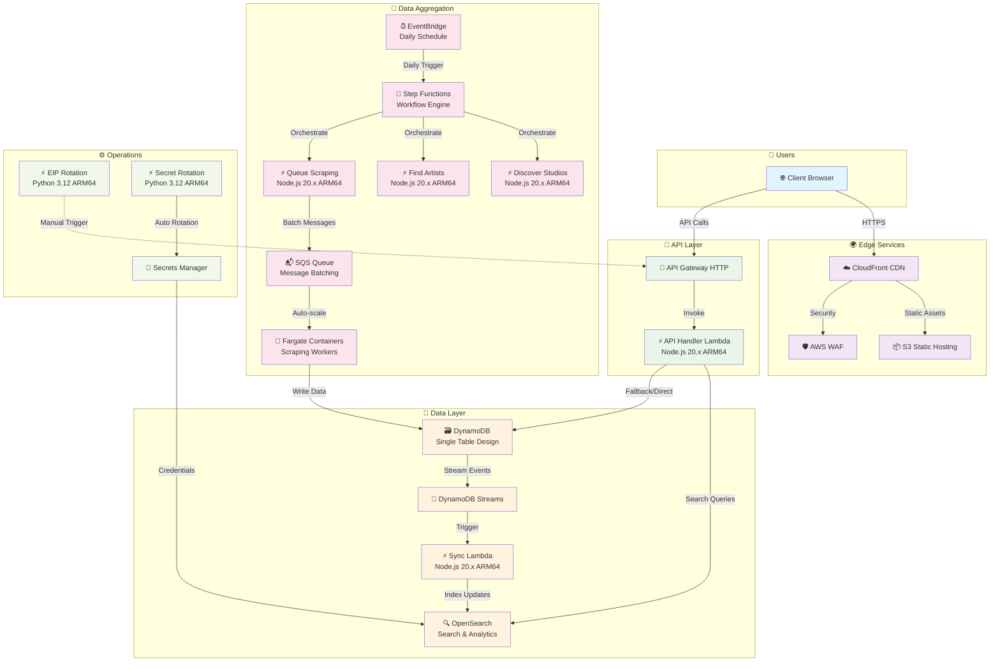
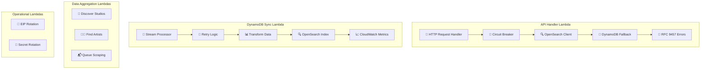

# **Software Requirements Specification for Tattoo Artist Directory MVP**

---

# **0\. Document Control**

**Document Title:** Software Requirements Specification for Tattoo Artist Directory MVP **Version:** 2.0 (Comprehensive) **Status:** For Final Review & Approval **Author:** Joseph White \- AWS Technical Architect **Distribution:** Engineering & DevOps Teams, Project Stakeholders

---

## **0.1. Revision History**

| Version | Date         | Description | Author       |
| :------ | :----------- | :---------- | :----------- |
| 1.0     | July 4, 2025 | xxx         | Joseph White |
| 2.0     | July 4, 2025 | xxx         | Joseph White |

## **0.2. Reviewer List**

| Name                     | Role                     |
| :----------------------- | :----------------------- |
| _\[Stakeholder Name\]_   | _\[Stakeholder Role\]_   |
| _\[Lead Engineer Name\]_ | _\[Lead Engineer Role\]_ |

---

# **1\. Introduction**

## **1.1 Purpose**

This document outlines the Software Requirements Specification (SRS) for the Minimum Viable Product (MVP) of the Tattoo Artist Directory. The primary purpose of this project is to solve the problem of inefficient and fragmented tattoo artist discovery by creating the most comprehensive, searchable directory of UK tattoo artists, starting with an initial launch in Leeds.

The platform will utilise an automated data aggregation engine to build its database from public sources, providing prospective clients ("Seekers") with a powerful discovery tool and artists ("Creators") with a zero-effort marketing channel. A key project objective is to serve as a high-quality technical portfolio piece demonstrating modern, full-stack development and cloud architecture practices on Amazon Web Services (AWS).

## **1.2 Scope**

The scope of the MVP is to deliver a production-ready web application that fulfils the core vision of a comprehensive, aggregated artist directory for a single city.

### **1.2.1 In Scope:**

- An automated data aggregation engine that discovers and scrapes artist data from public sources (Google Maps, studio websites, Instagram).
- Public-facing artist profile pages displaying aggregated information, including name, bio, portfolio gallery, styles, and location.
- A discovery tool allowing users to search and filter artists by style, location, and keywords, with results available in a grid and an interactive map view.
- The initial data seeding will be for the city of Leeds.
- The entire infrastructure will be defined using Infrastructure as Code (IaaC) and deployed via a fully automated CI/CD pipeline.

### **1.2.2 Out of Scope:**

- **Artist "Claim Profile" Feature:** Functionality for artists to claim and manage their profiles is a future enhancement.
- **Proprietary Booking System:** The MVP will not include any direct booking functionality; it will direct users to artists' existing channels.
- **Monetisation Features:** All monetisation strategies are explicitly out of scope for the MVP.

## **1.3 Definitions, Acronyms, and Abbreviations**

| Term       | Definition                                            |
| :--------- | :---------------------------------------------------- |
| API        | Application Programming Interface                     |
| AWS        | Amazon Web Services                                   |
| AZ         | Availability Zone                                     |
| CI/CD      | Continuous Integration / Continuous Delivery          |
| CDN        | Content Delivery Network                              |
| DynamoDB   | Amazon's managed NoSQL database service               |
| Fargate    | A serverless compute engine for containers on AWS     |
| HLD        | High-Level Design                                     |
| IaaC       | Infrastructure as Code                                |
| IAM        | Identity and Access Management (AWS)                  |
| Lambda     | AWS's serverless, event-driven compute service        |
| LLD        | Low-Level Design                                      |
| MAU        | Monthly Active Users                                  |
| MVP        | Minimum Viable Product                                |
| OpenSearch | A distributed, open-source search and analytics suite |
| PRD        | Product Requirements Document                         |
| S3         | Simple Storage Service (AWS)                          |
| SPA        | Single-Page Application                               |
| SRS        | Software Requirements Specification                   |
| VPC        | Virtual Private Cloud (AWS)                           |
| WAF        | Web Application Firewall                              |

##

## **1.4 References**

1. Product Requirement Document: Tattoo Artist Directory MVP
2. High-Level Design: Tattoo Artist Directory MVP
3. Low-Level Design: Tattoo Artist Directory MVP
4. Product Specification: Tattoo Artist Directory MVP

---

# **2\. Overall Description**

## **2.1 Product Perspective**

The Tattoo Artist Directory is a new, standalone web platform. It operates as a self-contained system but is critically dependent on external, public data sources for its primary function. It interfaces with:

- **Google Maps:** For the initial discovery of tattoo studio locations.
- **Instagram (Public Data):** For scraping artist portfolio images and profile information.

The system will not require users to create accounts in the MVP version.

## **2.2 Product Functions**

The core functionality of the MVP can be summarised as follows:

1. **Data Aggregation:** Automatically discovering and scraping public data to build and maintain the artist directory.
2. **Artist Profile Display:** Presenting the aggregated artist information in a structured, consistent, and user-friendly format on individual profile pages.
3. **Artist Search and Filtering:** Providing powerful tools for clients to discover artists based on specific criteria like tattoo style and location.

## **2.3 User Characteristics**

| User Persona                     | Description                                                                                                                                           | Goals                                                                                                                    | Frustrations                                                                                                                             |
| :------------------------------- | :---------------------------------------------------------------------------------------------------------------------------------------------------- | :----------------------------------------------------------------------------------------------------------------------- | :--------------------------------------------------------------------------------------------------------------------------------------- |
| **Chloe the Collector (Seeker)** | A 28-year-old graphic designer who researches extensively to find the perfect artist for her specific tattoo ideas.                                   | Discover _all_ available local artists who specialise in a niche style and easily compare their portfolios in one place. | Ineffective search on platforms like Instagram, tedious manual tracking of artists, and great artists having a poor web presence.        |
| **Alex the Artist (Creator)**    | A talented 24-year-old artist building their reputation. They have a good Instagram following but prefer designing tattoos to social media marketing. | To be discovered by new, serious clients; to showcase their portfolio effectively by style, not just chronologically.    | Instagram's chronological feed doesn't showcase their range; managing DMs is disorganised; lacks time/skills for SEO or web development. |

###

## **2.4 Constraints**

- **Technology Platform:** The project is constrained to the AWS cloud platform and its services.
- **Data Source Dependency:** The system is fundamentally dependent on the availability, structure, and accessibility of public data from Google Maps and Instagram.
- **Development Resources:** The project is constrained by the velocity of a solo developer.
- **Ethical/Legal:** The project must operate within the bounds of acceptable use for public data and establish a clear policy for artist de-listing requests. Scraping activities carry an inherent risk of violating Terms of Service of external platforms.

## **2.5 Assumptions and Dependencies**

- **Problem Significance:** We assume the problem of artist discovery is significant enough to attract users to a new platform.
- **Data Availability:** We assume that the required data (studio locations, artist profiles, portfolio images) is publicly available and can be programmatically scraped and parsed.
- **Artist Reception:** We assume that artists will view the automated aggregation of their public information as a positive, zero-effort marketing channel.
- **Dependency on Instagram:** The project is highly dependent on Instagram for portfolio content. This is a known risk due to the technical fragility of scraping and potential Terms of Service violations.

---

# **3\. Functional Requirements**

|                      Feature                       | Priority | Complexity | Associated Functional Requirement |
| :------------------------------------------------: | :------: | :--------: | :-------------------------------: |
|         **\[F1\]** Data Aggregation Engine         |    P1    |    High    |                3.1                |
|             **\[F2\]** Artist Profile              |    P0    |   Medium   |                3.2                |
|          **\[F3\]** Data Sync (Internal)           |    P0    |   Medium   |                \-                 |
|        **\[F4\]** Artist Search & Discovery        |    P0    |    High    |                3.3                |
|        **\[F5\]** Frontend Web Application         |    P0    |   Medium   |                \-                 |
| **\[F6\]** Data Governance/Artist Takedown Process |    P0    |    Low     |                3.5                |

## **3.1 Data Aggregation**

- **FR-AGG-01:** The system shall automatically discover tattoo studios in specified UK cities using the Google Maps API through the Discover Studios Lambda function.
- **FR-AGG-02:** The system shall programmatically scrape the websites of discovered studios using the Find Artists Lambda function to identify resident artist names and links to their Instagram profiles.
- **FR-AGG-03:** The system shall programmatically scrape public Instagram profiles of identified artists using Fargate containers to collect their profile picture, bio, and portfolio images.
- **FR-AGG-04:** All aggregated data shall be structured and stored in the DynamoDB primary table using the single-table design pattern with ARTIST#{artistId} partition keys.
- **FR-AGG-05:** The entire data aggregation workflow shall be triggered automatically on a recurring schedule via Amazon EventBridge and orchestrated by AWS Step Functions.
- **FR-AGG-06:** The Queue Scraping Lambda function shall check each artist ID against a denylist table before queuing for scraping and skip if a match is confirmed.
- **FR-AGG-07:** The Fargate scraping containers **must** parse the bio text of scraped artist profiles to identify and extract all hashtags for style inference.
- **FR-AGG-08:** The system **must** clean extracted hashtags by converting them to lowercase and removing the leading '#' character.
- **FR-AGG-09:** The system **must** filter the cleaned hashtag list against a predefined stop list of common, non-style-related terms.
- **FR-AGG-10:** The system **must** store the final, cleaned list of inferred styles as a String Set in the `styles` attribute of the artist's record in the DynamoDB table.
- **FR-AGG-11:** The Queue Scraping Lambda function shall batch discovered artists into SQS messages with a maximum of 10 artists per batch for efficient processing.
- **FR-AGG-12:** Each scraping operation shall include a unique scrapeId for idempotency control to prevent duplicate processing of the same artist data.

## **3.2 Artist Profile**

- **FR-PRF-01:** The system shall provide a `/v1/artists/{artistId}` API endpoint that returns comprehensive artist data for rendering unique, public-facing web pages.
- **FR-PRF-02:** The artist profile API response shall include the artist's name, avatar image URL, biography, studio information, and location data with geohash coordinates.
- **FR-PRF-03:** The artist profile data shall include a portfolioImages array containing image URLs, descriptions, and style classifications for responsive gallery display.
- **FR-PRF-04:** The artist profile data shall include a styles array with inferred tattoo styles that can be rendered as clickable tags linking to style-filtered search results.
- **FR-PRF-05:** The artist profile data shall include contactInfo object with Instagram handle, website, email, and phone number for prominent call-to-action buttons.
- **FR-PRF-06:** The artist profile data shall include tattooStudio object with address coordinates (latitude/longitude) for embedded map display showing the studio's location.
- **FR-PRF-07:** The system shall provide a `/v1/removal-requests` POST endpoint for artists to submit delisting requests, with data stored in a separate denylist table.
- **FR-PRF-08:** The artist profile data shall include pricing information (hourlyRate, minimumCharge, currency) and availability status (bookingOpen, nextAvailable, waitingList).
- **FR-PRF-09:** The artist profile data shall include experience metadata (yearsActive, certifications) and specialties array for comprehensive artist information display.
- **FR-PRF-10:** The API Handler Lambda shall return 404 errors with RFC 9457 compliant error responses when an artist ID is not found in the database.

## **3.3 Search and Filtering**

- **FR-SRCH-01:** The API Handler Lambda function shall provide RESTful endpoints for users to search for artists by keywords using the `/v1/artists?query={term}` endpoint.
- **FR-SRCH-02:** The system shall allow users to filter artist search results by one or more tattoo styles using the `/v1/artists?style={style}` parameter with support for exact style matching.
- **FR-SRCH-03:** The system shall allow users to filter artist search results by location using the `/v1/artists?location={location}` parameter with fuzzy matching support.
- **FR-SRCH-04:** Search results shall be returned as JSON arrays with pagination support (limit and page parameters) and displayed in responsive grid layouts by the frontend.
- **FR-SRCH-05:** The system shall provide geolocation data (latitude/longitude) in search results to enable interactive map views that plot the location of each artist/studio.
- **FR-SRCH-06:** The API Handler Lambda function shall filter out any artist results that have opted out (opted_out: true) to ensure compliance with data governance requirements.
- **FR-SRCH-07:** The system shall implement a circuit breaker pattern in the API Handler Lambda to provide DynamoDB fallback when OpenSearch is unavailable.
- **FR-SRCH-08:** Search queries shall support multi-match across artist names, studio names, and Instagram handles with configurable fuzziness for improved user experience.
- **FR-SRCH-09:** The system shall return search results sorted by rating (descending) and review count (descending) by default, with _score as a tiebreaker.
- **FR-SRCH-10:** The `/v1/styles` endpoint shall return all available tattoo styles with usage counts aggregated from the artist database.

## **3.4 Data Governance**

- **FR-GOV-01**: The system shall provide a `/v1/removal-requests` POST endpoint accessible via the frontend takedown form for artists to request removal from the directory.
- **FR-GOV-02**: A successful removal request shall be processed by a dedicated Lambda function that adds the artist's unique identifier to a denylist table in DynamoDB.
- **FR-GOV-03**: The Queue Scraping Lambda function must query the denylist table before queuing any artist for scraping and skip artists found on the denylist.
- **FR-GOV-04**: Upon manual approval of a removal request, all existing data for that artist must be purged from the primary DynamoDB table and OpenSearch index within 5 business days.
- **FR-GOV-05**: The DynamoDB Sync Lambda function shall automatically remove artist documents from the OpenSearch index when artist records are deleted from DynamoDB.
- **FR-GOV-06**: The system shall maintain an audit trail of all removal requests including timestamp, artist identifier, and processing status in CloudWatch logs.
- **FR-GOV-07**: The denylist table shall use the artist's Instagram handle or unique identifier as the primary key to prevent re-ingestion of opted-out artists.
- **FR-GOV-08**: All Lambda functions processing personal data shall sanitize logs to remove or mask PII before writing to CloudWatch logs as per NFR-SEC-05.

---

# **4\. Non-Functional Requirements**

## **4.1 Performance**

- **NFR-PERF-01:** Client-side page load time shall be less than 3 seconds (Largest Contentful Paint).
- **NFR-PERF-02:** Server response time for search results shall be less than 1.5 seconds.
- **NFR-PERF-03:** The backend API shall maintain a 95th percentile (p95) latency of less than 500ms under expected load.

## **4.2 Reliability and Availability**

- **NFR-REL-01:** The user-facing web application shall have an uptime of 99.9%.
- **NFR-REL-02:** The backend data aggregation pipeline has a lower availability requirement than the user-facing application.
- **NFR-REL-03:** Data freshness for artist profiles must be less than 48 hours old.
- **NFR-REL-04**: The user-facing stack (CloudFront, API Gateway, Lambda) will be deployed in a multi-AZ configuration to meet a 99.9% availability target.
- **NFR-REL-05:** The data processing stack (Step Functions, Fargate) will be deployed in a multi-AZ configuration to meet a 99% availability target.

## **4.3 Security**

- **NFR-SEC-01:** All communication between the client and server, and between internal services, shall be encrypted using TLS (HTTPS everywhere).
- **NFR-SEC-02:** AWS WAF will be deployed with `AWSManagedRulesCommonRuleSet` to ensure protection against the OWASP Top 10 common web application security risks.
- **NFR-SEC-03:** All data storage (S3, DynamoDB, OpenSearch) and data in transit will use KMS-managed encryption. This covers data within the database, search index, and object storage.
- **NFR-SEC-04:** The principle of least privilege shall be enforced for all system components using narrowly scoped IAM roles for service-to-service communication.
- **NFR-SEC-05**: All logs must be sanitised to remove or mask any data classified as PII before being written to CloudWatch logs.

## **4.4 Usability and Accessibility**

- **NFR-USA-01:** The web application shall be fully mobile-responsive and provide a consistent user experience across common viewport sizes.
- **NFR-USA-02:** The web application shall meet the Web Content Accessibility Guidelines (WCAG) 2.1 at the AA conformance level.

## **4.5 Scalability**

- **NFR-SCL-01:** The architecture shall be designed to support up to 2,000 Monthly Active Users (MAU) without performance degradation.
- **NFR-SCL-02:** The data aggregation engine must be capable of scraping and processing over 1,000 artist profiles per day.
- **NFR-SCL-03:** The API compute layer (Lambda) will use on demand scaling to handle initial load, with scaling beyond that. The scraper compute layer (Fargate) will auto-scale based on SQS queue depth.

## **4.6 Maintainability**

- **NFR-MNT-01:** 100% of the system's cloud infrastructure shall be defined as code (IaaC) using HashiCorp Terraform.
- **NFR-MNT-02:** A fully automated Continuous Integration and Continuous Delivery (CI/CD) Gitlab Actions pipeline shall be implemented to manage testing and deployment.
- **NFR-MNT-03:** The CI/CD pipeline must complete a deployment to the Dev/Staging environment, including all tests, in under 15 minutes.

## **4.7 Data Governance & Compliance**

- **NFR-GOV-01 (Data Removal Integrity)**: Upon the successful processing of a data removal request, no Personally Identifiable Information (PII) associated with the subject artist must persist in any primary data stores, including Amazon DynamoDB and Amazon OpenSearch.
- **NFR-GOV-02 (Denylist Enforcement)**: The Data Aggregation engine must query the denylist before initiating any new data scraping task. The engine is explicitly prohibited from collecting or processing data for any artist identifier present on this list.
- **NFR-GOV-03 (PII Removal Timeliness)**: All PII associated with a valid data removal request must be permanently purged from all production data stores within **5 business days** of the initial request receipt.
- **NFR-GOV-04 (Removal Request Availability)**: The end-to-end mechanism for submitting and processing data removal requests, from the web form to the denylist entry, must achieve **99.9% availability**.
- **NFR-GOV-05:** All artist data is subject to an opt-out policy, and any processed requests must meet data governance & compliance standards outlined in the data protection policy.
- **NFR-GOV-06:** A ‘Request removal’ form submission triggers a Lambda function (via webhook). This Lambda adds the artist's Instagram URL or a unique ID to a "denylist" table/set in DynamoDB, once manually approved as a legitimate request. The Data Aggregation engine must be modified to check this denylist before scraping an artist, and a separate cleanup process should purge any existing data for that artist.

## **4.8 Budget & Cost**

- **NFR-COST-01 (MVP Operational Cost)**: The total monthly cloud infrastructure cost for the production environment must not exceed **£400** **GBP** when supporting the target load of 2,000 Monthly Active Users (MAU).
- **NFR-COST-02 (Cost Scaling)**: The architecture must scale efficiently. The marginal infrastructure cost for each additional 1,000 MAU must not exceed **£125 GBP**.
- **NFR-COST-03 (Cost Transparency)**: All deployed AWS resources must be tagged with `Project`, `Environment`, and `Service` tags to enable granular cost tracking and reporting via AWS Cost Explorer.
- **NFR-COST-04 (Data Egress Efficiency)**: Data egress costs from AWS to the internet must not account for more than **30%** of the total monthly infrastructure bill, ensuring efficient use of the Content Delivery Network (CDN).

---

# **5\. System Architecture Overview**

The system is designed using a modern, serverless-first, and event-driven architectural pattern on AWS. This approach is chosen to maximise scalability, minimise operational overhead, and align with the project's goal of showcasing best practices in cloud development.

## **5.1 Architecture Components**

The architecture is composed of four primary logical blocks:

### **5.1.1 Frontend Web Application**
- **Framework**: Next.js 14+ with App Router architecture (`src/app/` directory structure)
- **UI Components**: shadcn/ui (Radix primitives) + Tailwind CSS with custom design system
- **State Management**: React Query (server state) + useState (local state)
- **Forms & Validation**: React Hook Form + Zod validation schemas
- **Testing**: Jest + React Testing Library + Playwright (E2E)
- **Hosting**: Amazon S3 bucket with global distribution via Amazon CloudFront (CDN)
- **Security**: AWS WAF at the edge to protect against common web exploits
- **Performance**: WebP image optimization, progressive loading, 90+ Lighthouse scores

#### **Frontend Architecture Details**
- **Pages**: 
  - `/` - Homepage with featured artists and search
  - `/artists` - Artist directory with search and filtering
  - `/artists/[id]` - Individual artist profile pages
  - `/studios` - Studio directory and profiles
  - `/styles` - Tattoo style showcase and filtering
  - `/search` - Advanced search interface
  - `/takedown` - Artist removal request form
- **Components**:
  - `ArtistCard` - Reusable artist display component
  - `SearchResultsContainer` - Search results with pagination
  - `MapWithSearch` - Interactive map integration
  - `StyleFilter` - Multi-select style filtering
  - `ErrorBoundary` - Error handling and fallback UI
- **API Integration**: 
  - Custom API client with retry logic and error handling
  - Lambda RIE adapter for local development
  - Circuit breaker pattern implementation
- **Design System**: 
  - Centralized design tokens and component library
  - Accessibility compliance (WCAG 2.1 AA)
  - Mobile-first responsive design
  - Animation and visual effects system

### **5.1.2 Backend API Layer**
- **API Gateway**: Amazon API Gateway HTTP API with Lambda integration
- **Authentication**: AWS IAM for internal services, public endpoints for directory access
- **Rate Limiting**: Configurable throttling (prod: 2000 req/s, dev: 50 req/s)
- **CORS**: Configured for frontend domain access
- **Error Handling**: RFC 9457 compliant error responses

### **5.1.3 Compute Layer (Lambda Functions)**
The system employs seven specialized Lambda functions:

1. **API Handler Lambda** (`api-handler`)
   - **Purpose**: Main API endpoint handler for all user-facing requests
   - **Runtime**: Node.js 20.x on ARM64
   - **Timeout**: 30 seconds
   - **Memory**: Configurable (default: 512MB)
   - **Concurrency**: 100 (prod), 10 (dev)
   - **Endpoints**: `/v1/artists`, `/v1/artists/{id}`, `/v1/styles`, `/health`
   - **Features**: Circuit breaker pattern, DynamoDB fallback, OpenSearch integration

2. **DynamoDB Sync Lambda** (`dynamodb-sync`)
   - **Purpose**: Synchronizes DynamoDB changes to OpenSearch index
   - **Runtime**: Node.js 20.x on ARM64
   - **Timeout**: 5 minutes
   - **Trigger**: DynamoDB Streams (batch size: 10, window: 5s)
   - **Features**: Retry logic, dead letter queue, lag monitoring

3. **Discover Studios Lambda** (`discover-studios`)
   - **Purpose**: Discovers tattoo studios from Google Maps API
   - **Runtime**: Node.js 20.x on ARM64
   - **Timeout**: 5 minutes
   - **Integration**: Step Functions workflow
   - **Output**: Studio metadata for artist discovery

4. **Find Artists Lambda** (`find-artists`)
   - **Purpose**: Extracts artist information from studio websites
   - **Runtime**: Node.js 20.x on ARM64
   - **Timeout**: 5 minutes
   - **Integration**: Step Functions workflow
   - **Output**: Artist profiles for scraping queue

5. **Queue Scraping Lambda** (`queue-scraping`)
   - **Purpose**: Queues discovered artists for detailed scraping
   - **Runtime**: Node.js 20.x on ARM64
   - **Timeout**: 5 minutes
   - **Integration**: SQS message batching (10 messages/batch)
   - **Features**: Idempotency controls, priority scoring

6. **NAT Gateway EIP Rotation Lambda** (`rotate-nat-gateway-eip`)
   - **Purpose**: Operational runbook for IP rotation
   - **Runtime**: Python 3.12 on ARM64
   - **Timeout**: 1 minute
   - **Trigger**: Manual via Function URL
   - **Security**: AWS IAM authorization required

7. **Secret Rotation Lambda** (`secret-rotation`)
   - **Purpose**: Automated OpenSearch password rotation
   - **Runtime**: Python 3.12 on ARM64
   - **Timeout**: 5 minutes
   - **Integration**: AWS Secrets Manager
   - **Features**: Zero-downtime rotation

### **5.1.4 Asynchronous Data Aggregation Engine**
- **Orchestration**: AWS Step Functions state machine
- **Scheduling**: Amazon EventBridge (daily triggers)
- **Queue Management**: Amazon SQS with dead letter queues
- **Processing**: AWS Fargate containers for intensive scraping
- **Workflow**: Discover Studios → Find Artists → Queue Scraping → Fargate Processing

### **5.1.5 Data Layer**
- **Primary Storage**: Amazon DynamoDB with single-table design
- **Search Engine**: Amazon OpenSearch Service for complex queries
- **Synchronization**: DynamoDB Streams → Lambda → OpenSearch
- **Caching**: CloudFront (1-year static), API Gateway (5-minute responses)
- **Encryption**: KMS-managed encryption for all data stores

## **5.2 Data Flow Architecture**

### **5.2.1 User Request Flow**
1. User accesses frontend via CloudFront
2. Frontend makes API calls to API Gateway
3. API Gateway routes to API Handler Lambda
4. Lambda queries OpenSearch (primary) or DynamoDB (fallback)
5. Response returned with circuit breaker protection

### **5.2.2 Data Aggregation Flow**
1. EventBridge triggers Step Functions daily
2. Discover Studios Lambda finds tattoo studios
3. Find Artists Lambda extracts artist information
4. Queue Scraping Lambda batches work for processing
5. Fargate containers perform detailed scraping
6. Data written to DynamoDB triggers OpenSearch sync

### **5.2.3 Data Synchronization Flow**
1. DynamoDB item changes trigger Streams
2. DynamoDB Sync Lambda processes stream records
3. Lambda transforms and indexes data in OpenSearch
4. Failed operations sent to dead letter queue
5. Monitoring metrics sent to CloudWatch

---

# **6\. Service Level Objectives**

## **6.1 API Service Level Objectives:**

| API Endpoint           | Proposed Target | Approx. Downtime/Month | Justification                                                                                                                                                                                                                    |
| :--------------------- | :-------------- | :--------------------- | :------------------------------------------------------------------------------------------------------------------------------------------------------------------------------------------------------------------------------- |
| GET /artists/{id}      | 99.95%          | 22 minutes             | Core User Experience. This endpoint is critical for the primary user journey. Its data path (API Gateway → Lambda → DynamoDB) is the most reliable in the architecture, making this higher target achievable without extra cost. |
| GET /artists           | 99.90%          | 44 minutes             | Core Search Functionality. While critical, this endpoint depends on Amazon OpenSearch. A 99.9% target aligns with the AWS SLA for a Multi-AZ OpenSearch domain, making it a practical and defensible SLO.                        |
| POST /removal-requests | 99.50%          | 3.6 hours              | Governance Function. This is crucial for data compliance but is low-traffic and less critical to the real-time user experience. An outage is not ideal but can be tolerated.                                                     |
| GET /styles            | 99.50%          | 3.6 hours              | Ancillary Function. This endpoint provides data for the UI filters. If it fails, the user experience is degraded (filters may not populate), but the core functionality of viewing and finding artists still works.              |
| GET /health            | 99.90%          | 44 minutes             | Operational Endpoint. This reflects the baseline availability of the API Gateway and Lambda stack. It should be reliable for monitoring purposes, but its failure does not directly impact users.                                |

# **7\. Use Cases**

## **7.1 UC-01: Discover and Evaluate Artists**

- **Use Case ID:** UC-01
- **Actor:** Chloe the Collector (The Seeker)
- **Description:** A user searches for artists who match their specific style and location criteria, evaluates a profile, and connects with the artist.
- **Preconditions:** The user is accessing the platform's homepage in a web browser.
- **Basic Flow:**
  - The user inputs "Leeds" into the location filter.
  - The user selects the "Neo-traditional" and "Blackwork" style filters from a list.
  - The system displays a grid of artist profiles that match the selected criteria.
  - The user clicks on an artist profile that interests them.
  - The system navigates to the full artist profile page.
  - The user reviews the artist's portfolio image gallery, bio, and location.
  - The user clicks the "Contact on Instagram" button.
  - The system opens a new tab to the artist's Instagram profile page.
- **Alternative Flows:**
  - **7.1.A \- Map View:** At step 3, the user can toggle to an "Explore" or map view, which shows pins for each artist's studio location. Clicking a pin reveals a summary and a link to the full profile.

## **7.2 UC-02: Gain Passive Marketing Exposure**

- **Use Case ID:** UC-02
- **Actor:** Alex the Artist (The Creator)
- **Description:** An artist with a public profile is automatically discovered, indexed, and made visible to new clients without taking any action themselves. This is a passive use case from the artist's perspective.
- **Preconditions:** The artist is a resident at a tattoo studio with a website, and they maintain a public Instagram profile for their work.
- **Basic Flow:**
  1. The system's scheduled Data Aggregation Engine runs.
  2. The engine discovers the artist's studio via Google Maps.
  3. The engine scrapes the studio's website and finds a link to the artist's Instagram profile.
  4. The engine scrapes the artist's public Instagram profile, collecting their bio, profile picture, and recent portfolio images.
  5. The system creates a new profile for the artist in its database.
  6. The artist's profile is now discoverable via the platform's search functionality, driving new client inquiries to their Instagram.

---

# **8\. Appendices**

## **8.1 Data Models**

The system uses a single-table design in Amazon DynamoDB for primary data storage, optimised for the application's main access patterns.

### **8.1.1 DynamoDB Table Structure**

- **Table Name:** TattooDirectory
- **Key Structure Rationale:**
  - **Partition Key (PK):** ARTIST\#{artistId} \- Co-locates all data for a single artist, allowing for efficient retrieval of a full profile with a single query.
  - **Sort Key (SK):** METADATA for artist profile data, enabling future expansion for additional data types per artist.
- **Global Secondary Indexes (GSI):**
  - **style-location-index:** Powers search functionality with PK of STYLE\#{styleName} and SK of LOCATION\#{country}\#{city}
  - **location-index:** Enables location-based queries with PK of LOCATION\#{country}\#{city}

### **8.1.2 Artist Profile Data Model**

| Attribute Name    | Type       | Description                                                                                                                                  | Example                                   |
| :---------------- | :--------- | :------------------------------------------------------------------------------------------------------------------------------------------- | :---------------------------------------- |
| `pk`              | String     | Partition Key. ARTIST\#{artist_id}                                                                                                           | ARTIST\#artist-001                        |
| `sk`              | String     | Sort Key. METADATA for profile data                                                                                                          | METADATA                                  |
| `artistId`        | String     | Unique identifier for the artist                                                                                                             | artist-001                                |
| `artistName`      | String     | The artist's professional name                                                                                                               | Marcus Chen                               |
| `bio`             | String     | Artist biography and specialization description                                                                                              | Tebori and machine specialist...          |
| `avatar`          | String     | Profile image URL                                                                                                                            | https://cdn.example.com/portrait-34.jpg  |
| `instagramHandle` | String     | Instagram username without @ symbol                                                                                                          | needlemarcuschen_ink                      |
| `locationDisplay` | String     | Human-readable location                                                                                                                      | Edinburgh, UK                             |
| `tattooStudio`    | Object     | Studio information object                                                                                                                    | {studioId, studioName, address}           |
| `styles`          | String Set | Array of tattoo styles the artist specializes in                                                                                            | ["japanese", "neo_traditional"]           |
| `portfolioImages` | Array      | Array of portfolio image objects                                                                                                             | [{url, description, style}, ...]          |
| `geohash`         | String     | Geohash for location-based searches                                                                                                          | m3bgfv                                    |
| `rating`          | Number     | Average rating (1-5 scale)                                                                                                                  | 4.6                                       |
| `reviewCount`     | Number     | Total number of reviews                                                                                                                      | 132                                       |
| `pricing`         | Object     | Pricing information                                                                                                                          | {hourlyRate, minimumCharge, currency}     |
| `availability`    | Object     | Booking availability status                                                                                                                  | {status, bookingOpen, nextAvailable}      |
| `experience`      | Object     | Professional experience details                                                                                                              | {yearsActive, certifications}             |
| `contactInfo`     | Object     | Contact information                                                                                                                          | {instagram, email, phone, website}        |
| `specialties`     | Array      | Specialized services offered                                                                                                                 | ["Custom designs", "Walk-ins welcome"]    |
| `styleMetadata`   | Array      | Detailed style information                                                                                                                   | [{styleName, characteristics, motifs}]    |
| `opted_out`       | Boolean    | Whether artist has opted out of directory                                                                                                    | false                                     |

### **8.1.3 OpenSearch Document Structure**

OpenSearch documents are synchronized from DynamoDB and optimized for search:

```json
{
  "id": "artist-001",
  "artistId": "artist-001",
  "name": "Marcus Chen",
  "styles": ["japanese", "neo_traditional"],
  "location": "Edinburgh, UK",
  "locationCity": "Edinburgh",
  "locationCountry": "UK",
  "instagramHandle": "needlemarcuschen_ink",
  "studioName": "Ink & Steel Studio",
  "portfolioImages": [...],
  "geohash": "m3bgfv",
  "geoLocation": {
    "lat": 55.95551370941419,
    "lon": -3.1907882724495567
  },
  "searchKeywords": "marcus chen ink steel studio japanese neo_traditional edinburgh",
  "lastUpdated": "2024-01-15T10:30:00Z",
  "pk": "ARTIST#artist-001",
  "sk": "METADATA"
}
```

### **8.1.4 API Response Models**

#### Artist Search Response
```json
{
  "items": [
    {
      "artistId": "artist-001",
      "name": "Marcus Chen",
      "instagramHandle": "needlemarcuschen_ink",
      "location": "Edinburgh, UK",
      "styles": ["japanese", "neo_traditional"],
      "rating": 4.6,
      "reviewCount": 132,
      "portfolioImages": [...],
      "contactInfo": {...},
      "studioInfo": {...},
      "availability": {...}
    }
  ],
  "total": 1,
  "pagination": {
    "page": 1,
    "limit": 20,
    "hasMore": false
  }
}
```

#### Error Response (RFC 9457)
```json
{
  "type": "https://api.tattoodirectory.com/docs/errors#400",
  "title": "Bad Request",
  "status": 400,
  "detail": "At least one search parameter is required: 'query', 'style', or 'location'.",
  "instance": "req-12345",
  "timestamp": "2024-01-15T10:30:00Z",
  "traceId": "abc123def456"
}
```

## **8.2 Lambda Function Specifications**

### **8.2.1 API Handler Lambda**
- **Function Name**: `{prefix}-api-handler`
- **Runtime**: Node.js 20.x on ARM64
- **Memory**: 512MB (configurable)
- **Timeout**: 30 seconds
- **Concurrency**: 100 (prod), 10 (dev)
- **VPC**: Private subnets with internal security group
- **Environment Variables**:
  - `DYNAMODB_TABLE_NAME`: Main table name
  - `OPENSEARCH_ENDPOINT`: OpenSearch domain endpoint
  - `APP_SECRETS_ARN`: Secrets Manager ARN
- **Permissions**:
  - DynamoDB: GetItem, Query, Scan on main table and indexes
  - OpenSearch: ESHttpGet, ESHttpPost, ESHttpPut
  - Secrets Manager: GetSecretValue
- **Features**:
  - Circuit breaker pattern with 50% error threshold
  - DynamoDB fallback when OpenSearch unavailable
  - RFC 9457 compliant error responses
  - Request/response logging with correlation IDs

### **8.2.2 DynamoDB Sync Lambda**
- **Function Name**: `{prefix}-dynamodb-sync`
- **Runtime**: Node.js 20.x on ARM64
- **Memory**: 512MB
- **Timeout**: 5 minutes
- **Concurrency**: 5 (reserved)
- **Trigger**: DynamoDB Streams (batch size: 10, window: 5s)
- **Dead Letter Queue**: SQS queue for failed records
- **Environment Variables**:
  - `OPENSEARCH_ENDPOINT`: OpenSearch domain endpoint
  - `APP_SECRETS_ARN`: Secrets Manager ARN
- **Permissions**:
  - DynamoDB: DescribeStream, GetRecords, GetShardIterator, ListStreams
  - OpenSearch: ESHttpPost, ESHttpPut, ESHttpDelete
  - CloudWatch: PutMetricData
- **Features**:
  - Exponential backoff retry (3 attempts, 1s-10s delay)
  - Health monitoring and lag detection
  - Batch processing with error isolation
  - Comprehensive CloudWatch metrics

### **8.2.3 Data Aggregation Lambdas**

#### Discover Studios Lambda
- **Function Name**: `{prefix}-discover-studios`
- **Runtime**: Node.js 20.x on ARM64
- **Memory**: 512MB
- **Timeout**: 5 minutes
- **Concurrency**: 5 (reserved)
- **VPC**: Private subnets with internet security group
- **Integration**: Step Functions synchronous task
- **Output**: Array of discovered studio metadata

#### Find Artists Lambda
- **Function Name**: `{prefix}-find-artists`
- **Runtime**: Node.js 20.x on ARM64
- **Memory**: 512MB
- **Timeout**: 5 minutes
- **Concurrency**: 5 (reserved)
- **VPC**: Private subnets with internet security group
- **Integration**: Step Functions synchronous task
- **Output**: Array of artist profiles with portfolio data

#### Queue Scraping Lambda
- **Function Name**: `{prefix}-queue-scraping`
- **Runtime**: Node.js 20.x on ARM64
- **Memory**: 512MB
- **Timeout**: 5 minutes
- **Concurrency**: 5 (reserved)
- **VPC**: Private subnets with internal security group
- **Integration**: Step Functions synchronous task
- **Output**: SQS message batch results with scrape ID

### **8.2.4 Operational Lambdas**

#### NAT Gateway EIP Rotation Lambda
- **Function Name**: `{prefix}-rotate-eip`
- **Runtime**: Python 3.12 on ARM64
- **Memory**: 256MB
- **Timeout**: 1 minute
- **Concurrency**: 2 (reserved)
- **Trigger**: Manual via Function URL (AWS IAM auth)
- **Purpose**: Operational runbook for IP address rotation
- **Permissions**: EC2 NAT Gateway and EIP management

#### Secret Rotation Lambda
- **Function Name**: `{prefix}-secret-rotation`
- **Runtime**: Python 3.12 on ARM64
- **Memory**: 256MB
- **Timeout**: 5 minutes
- **Concurrency**: 2 (reserved)
- **Integration**: AWS Secrets Manager automatic rotation
- **Purpose**: Zero-downtime OpenSearch password rotation
- **Permissions**: Secrets Manager and OpenSearch access

## **8.3 Infrastructure Architecture**

### **8.3.1 Terraform Module Structure**

The infrastructure is organized into 19 modular Terraform modules for maintainability and reusability:

- **00-Templates**: Reusable Terraform templates and patterns
- **01-Foundation**: Core AWS account setup and basic resources
- **03-Audit-Foundation**: Audit logging and compliance infrastructure
- **04-Central-Logging**: Centralized logging with CloudWatch and S3
- **05-Networking**: VPC, subnets, NAT gateways, and security groups
- **06-Central-Security**: KMS keys, IAM policies, and security baselines
- **07-App-Security**: Application-specific security groups and policies
- **08-Log-Storage**: Log aggregation and retention policies
- **09-App-Storage**: DynamoDB tables and S3 buckets
- **10-Search**: OpenSearch domain and configuration
- **11-IAM**: Lambda execution roles and service permissions
- **12-Compute**: Lambda functions, ECS cluster, and Step Functions
- **13-API**: API Gateway, custom domains, and routing
- **14-Security-Monitoring**: Security alerts and monitoring
- **15-App-Monitoring**: Application metrics and dashboards
- **16-Backup**: Backup policies and disaster recovery
- **17-Governance**: Data governance and compliance controls
- **18-Audit-Governance**: Audit trails and compliance reporting
- **19-Delivery**: CI/CD pipeline and deployment automation

### **8.3.2 Environment Configuration**

- **Development**: Single AZ deployment, reduced instance sizes, relaxed security
- **Production**: Multi-AZ deployment, high availability, enhanced security
- **Infrastructure as Code**: 100% Terraform-managed with state management
- **CI/CD Pipeline**: Automated testing, security scanning, and deployment
- **Cost Management**: Resource tagging, cost monitoring, and optimization

### **8.3.3 Security Architecture**

- **Network Security**: VPC with private subnets, NAT gateways, security groups
- **Data Encryption**: KMS-managed encryption for all data at rest and in transit
- **Access Control**: IAM least-privilege principle, service-to-service authentication
- **Monitoring**: CloudWatch logs, metrics, and alarms for security events
- **Compliance**: GDPR-compliant data processing with audit trails

## **8.4 External API References**

### **8.4.1 Google Maps API Integration**
- **Primary Use**: Studio discovery and location validation
- **APIs Used**:
  - **Places API**: Finding tattoo studios by location and type
  - **Geocoding API**: Converting addresses to coordinates
  - **Maps JavaScript API**: Frontend map display
- **Rate Limits**: Managed through API key quotas
- **Error Handling**: Graceful degradation with cached data

### **8.4.2 Instagram Data Sources**
- **Method**: Public profile scraping (no formal API)
- **Data Collected**: Profile images, bio text, portfolio images
- **Risk Mitigation**: 
  - Respect robots.txt and rate limits
  - Implement opt-out mechanisms
  - Use rotating IP addresses via NAT Gateway
- **Compliance**: GDPR-compliant data processing with removal requests

### **8.4.3 Studio Website Scraping**
- **Method**: Automated HTML parsing
- **Data Extracted**: Artist names, portfolio links, contact information
- **Technologies**: Headless browser automation in Fargate containers
- **Rate Limiting**: Configurable delays between requests
- **Error Handling**: Retry logic with exponential backoff

## **8.3 Open Questions**

The following questions were identified during the initial planning phase and remain open for future consideration.

- How will the accuracy of the automated style-tagging algorithm be measured and improved over time?
- What are the potential long-term, ethical monetisation options for the platform?

## **8.5 Step Functions State Machine**

### **8.5.1 Data Aggregation Workflow**

The system uses AWS Step Functions to orchestrate the data aggregation pipeline:

```json
{
  "Comment": "Tattoo Artist Directory Data Aggregation Pipeline",
  "StartAt": "DiscoverStudios",
  "States": {
    "DiscoverStudios": {
      "Type": "Task",
      "Resource": "arn:aws:lambda:region:account:function:prefix-discover-studios",
      "Parameters": {
        "searchParams": {
          "locations": ["london", "manchester", "birmingham", "leeds", "glasgow"],
          "styles": ["traditional", "realism", "blackwork", "neo-traditional"],
          "maxResults": 50
        }
      },
      "Next": "ProcessStudiosMap",
      "Retry": [
        {
          "ErrorEquals": ["Lambda.ServiceException", "Lambda.AWSLambdaException"],
          "IntervalSeconds": 2,
          "MaxAttempts": 3,
          "BackoffRate": 2.0
        }
      ],
      "Catch": [
        {
          "ErrorEquals": ["States.ALL"],
          "Next": "HandleDiscoveryFailure"
        }
      ]
    },
    "ProcessStudiosMap": {
      "Type": "Map",
      "ItemsPath": "$.discoveredItems",
      "MaxConcurrency": 5,
      "Iterator": {
        "StartAt": "FindArtists",
        "States": {
          "FindArtists": {
            "Type": "Task",
            "Resource": "arn:aws:lambda:region:account:function:prefix-find-artists",
            "End": true,
            "Retry": [
              {
                "ErrorEquals": ["Lambda.ServiceException"],
                "IntervalSeconds": 1,
                "MaxAttempts": 2,
                "BackoffRate": 2.0
              }
            ]
          }
        }
      },
      "Next": "QueueScraping"
    },
    "QueueScraping": {
      "Type": "Task",
      "Resource": "arn:aws:lambda:region:account:function:prefix-queue-scraping",
      "Parameters": {
        "discoveredItems.$": "$"
      },
      "Next": "RunScrapingTasks",
      "Retry": [
        {
          "ErrorEquals": ["Lambda.ServiceException"],
          "IntervalSeconds": 2,
          "MaxAttempts": 3,
          "BackoffRate": 2.0
        }
      ]
    },
    "RunScrapingTasks": {
      "Type": "Task",
      "Resource": "arn:aws:states:::ecs:runTask.sync",
      "Parameters": {
        "TaskDefinition": "arn:aws:ecs:region:account:task-definition/prefix-scraper",
        "Cluster": "arn:aws:ecs:region:account:cluster/prefix-cluster",
        "LaunchType": "FARGATE",
        "NetworkConfiguration": {
          "AwsvpcConfiguration": {
            "Subnets": ["subnet-xxx", "subnet-yyy"],
            "SecurityGroups": ["sg-fargate"],
            "AssignPublicIp": "DISABLED"
          }
        }
      },
      "End": true,
      "Retry": [
        {
          "ErrorEquals": ["States.TaskFailed"],
          "IntervalSeconds": 30,
          "MaxAttempts": 2,
          "BackoffRate": 2.0
        }
      ]
    },
    "HandleDiscoveryFailure": {
      "Type": "Fail",
      "Cause": "Studio discovery failed after retries"
    }
  }
}
```

### **8.5.2 System Architecture Diagram**



### **8.5.3 Lambda Function Architecture**


