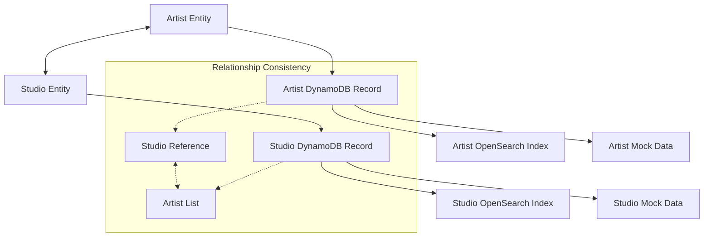
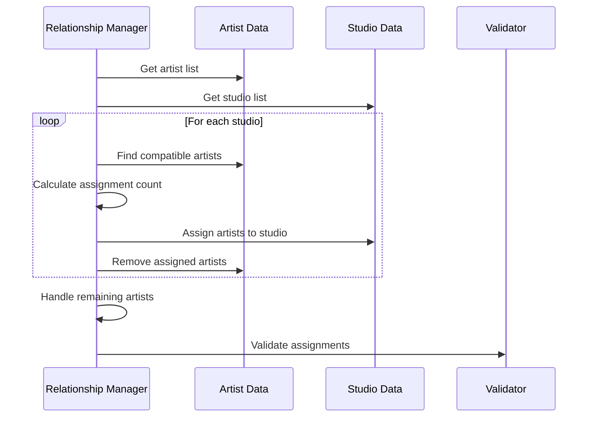
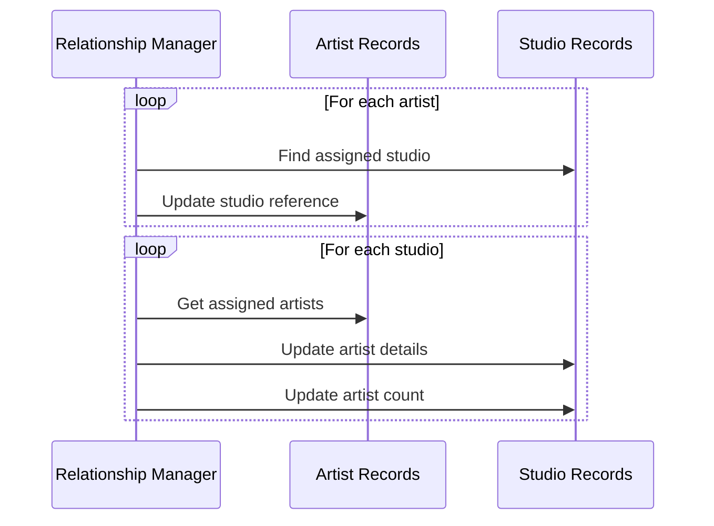

# Studio-Artist Relationship Management Documentation

## Overview

The Studio-Artist Relationship Management system maintains bidirectional relationships between artists and studios throughout the data pipeline. This system ensures data consistency, handles relationship creation and updates, and provides validation and repair mechanisms for relationship integrity.

## Relationship Architecture

### Bidirectional Relationship Model



### Relationship Data Structure

#### Artist Side (Studio Reference)

```javascript
// Artist record with studio relationship
{
  artistId: "artist-001",
  artistName: "Sarah Mitchell",
  // ... other artist fields ...
  
  // Studio relationship
  tattooStudio: {
    studioId: "studio-001",
    studioName: "Ink & Steel Studio",
    address: {
      street: "123 Brick Lane, Shoreditch, London E1 6SB",
      city: "London",
      postcode: "E1 6SB",
      latitude: 51.5225,
      longitude: -0.0786
    }
  }
}
```

#### Studio Side (Artist References)

```javascript
// Studio record with artist relationships
{
  studioId: "studio-001",
  studioName: "Ink & Steel Studio",
  // ... other studio fields ...
  
  // Artist relationships
  artists: ["artist-001", "artist-002", "artist-003"],
  artistCount: 3,
  artistDetails: [
    {
      artistId: "artist-001",
      artistName: "Sarah Mitchell",
      styles: ["traditional", "neo_traditional"],
      rating: 4.8
    },
    {
      artistId: "artist-002", 
      artistName: "James Wilson",
      styles: ["realism", "portrait"],
      rating: 4.6
    }
  ]
}
```

## Relationship Management Components

### 1. Artist-Studio Relationship Manager

```javascript
class ArtistStudioRelationshipManager {
  constructor(config) {
    this.config = config;
    this.validator = new RelationshipValidator();
  }

  /**
   * Create bidirectional relationships between artists and studios
   */
  async createBidirectionalRelationships(artists, studios) {
    console.log('🔗 Creating bidirectional artist-studio relationships...');
    
    const updatedArtists = [...artists];
    const updatedStudios = [...studios];
    
    // Phase 1: Assign artists to studios
    await this.assignArtistsToStudios(updatedArtists, updatedStudios);
    
    // Phase 2: Update artist records with studio information
    await this.updateArtistStudioReferences(updatedArtists, updatedStudios);
    
    // Phase 3: Update studio records with artist information
    await this.updateStudioArtistReferences(updatedStudios, updatedArtists);
    
    // Phase 4: Validate relationship consistency
    await this.validateRelationships(updatedArtists, updatedStudios);
    
    console.log('✅ Bidirectional relationships created and validated');
    return { artists: updatedArtists, studios: updatedStudios };
  }

  /**
   * Assign artists to studios based on compatibility
   */
  async assignArtistsToStudios(artists, studios) {
    const unassignedArtists = [...artists];
    
    for (const studio of studios) {
      // Find compatible artists for this studio
      const compatibleArtists = this.findCompatibleArtists(studio, unassignedArtists);
      
      // Determine how many artists to assign
      const targetCount = this.calculateArtistCount(studio, compatibleArtists.length);
      const artistsToAssign = compatibleArtists.slice(0, targetCount);
      
      // Assign artists to studio
      studio.artists = artistsToAssign.map(artist => artist.artistId);
      studio.artistCount = artistsToAssign.length;
      
      // Update studio specialties based on assigned artists
      studio.specialties = this.calculateStudioSpecialties(artistsToAssign);
      
      // Remove assigned artists from unassigned list
      artistsToAssign.forEach(artist => {
        const index = unassignedArtists.findIndex(a => a.artistId === artist.artistId);
        if (index > -1) unassignedArtists.splice(index, 1);
      });
    }
    
    // Handle remaining unassigned artists
    await this.assignRemainingArtists(studios, unassignedArtists);
  }

  /**
   * Find artists compatible with a studio
   */
  findCompatibleArtists(studio, availableArtists) {
    return availableArtists.filter(artist => {
      // Geographic compatibility
      const geographicMatch = this.checkGeographicCompatibility(artist, studio);
      
      // Style compatibility
      const styleMatch = this.checkStyleCompatibility(artist, studio);
      
      // Rating compatibility
      const ratingMatch = this.checkRatingCompatibility(artist, studio);
      
      return geographicMatch && (styleMatch || ratingMatch);
    });
  }

  /**
   * Check geographic compatibility between artist and studio
   */
  checkGeographicCompatibility(artist, studio) {
    // Extract city from location strings
    const artistCity = this.extractCity(artist.location);
    const studioCity = this.extractCity(studio.locationDisplay);
    
    // Same city is highly compatible
    if (artistCity === studioCity) return true;
    
    // Major UK cities are compatible with each other
    const majorCities = ['London', 'Manchester', 'Birmingham', 'Liverpool', 'Leeds'];
    if (majorCities.includes(artistCity) && majorCities.includes(studioCity)) {
      return true;
    }
    
    return false;
  }

  /**
   * Check style compatibility between artist and studio
   */
  checkStyleCompatibility(artist, studio) {
    if (!artist.styles || !studio.specialties) return true;
    
    // Check for overlapping styles
    const artistStyles = Array.isArray(artist.styles) ? artist.styles : [artist.styles];
    const studioSpecialties = Array.isArray(studio.specialties) ? studio.specialties : [studio.specialties];
    
    return artistStyles.some(style => studioSpecialties.includes(style));
  }

  /**
   * Update artist records with studio references
   */
  async updateArtistStudioReferences(artists, studios) {
    for (const artist of artists) {
      // Find the studio this artist is assigned to
      const studio = studios.find(s => s.artists.includes(artist.artistId));
      
      if (studio) {
        artist.tattooStudio = {
          studioId: studio.studioId,
          studioName: studio.studioName,
          address: {
            street: studio.address,
            city: studio.locationDisplay.split(',')[0].trim(),
            postcode: studio.postcode,
            latitude: studio.latitude,
            longitude: studio.longitude
          }
        };
      }
    }
  }

  /**
   * Update studio records with artist details
   */
  async updateStudioArtistReferences(studios, artists) {
    for (const studio of studios) {
      const studioArtists = artists.filter(a => studio.artists.includes(a.artistId));
      
      studio.artistDetails = studioArtists.map(artist => ({
        artistId: artist.artistId,
        artistName: artist.artistName,
        styles: artist.styles || [],
        rating: artist.rating || 4.0
      }));
      
      // Update artist count
      studio.artistCount = studioArtists.length;
    }
  }
}
```

### 2. Relationship Validator

```javascript
class RelationshipValidator {
  /**
   * Validate bidirectional relationship consistency
   */
  async validateRelationships(artists, studios) {
    const errors = [];
    const warnings = [];
    
    // Validate artist → studio references
    for (const artist of artists) {
      if (artist.tattooStudio) {
        const studio = studios.find(s => s.studioId === artist.tattooStudio.studioId);
        
        if (!studio) {
          errors.push(`Artist ${artist.artistId} references non-existent studio ${artist.tattooStudio.studioId}`);
        } else if (!studio.artists.includes(artist.artistId)) {
          errors.push(`Studio ${studio.studioId} doesn't list artist ${artist.artistId} in its artists array`);
        } else {
          // Validate studio information consistency
          if (artist.tattooStudio.studioName !== studio.studioName) {
            warnings.push(`Artist ${artist.artistId} has outdated studio name reference`);
          }
        }
      }
    }
    
    // Validate studio → artist references
    for (const studio of studios) {
      for (const artistId of studio.artists) {
        const artist = artists.find(a => a.artistId === artistId);
        
        if (!artist) {
          errors.push(`Studio ${studio.studioId} references non-existent artist ${artistId}`);
        } else if (!artist.tattooStudio || artist.tattooStudio.studioId !== studio.studioId) {
          errors.push(`Artist ${artistId} doesn't reference studio ${studio.studioId} correctly`);
        }
      }
      
      // Validate artist count consistency
      if (studio.artistCount !== studio.artists.length) {
        warnings.push(`Studio ${studio.studioId} artist count mismatch: ${studio.artistCount} vs ${studio.artists.length}`);
      }
    }
    
    if (errors.length > 0) {
      throw new Error(`Relationship validation failed: ${errors.join('; ')}`);
    }
    
    if (warnings.length > 0) {
      console.warn(`⚠️  Relationship warnings: ${warnings.join('; ')}`);
    }
    
    return { valid: true, errors, warnings };
  }

  /**
   * Validate relationship data integrity
   */
  async validateRelationshipIntegrity(artists, studios) {
    const issues = {
      orphanedArtists: [],
      emptyStudios: [],
      duplicateAssignments: [],
      missingReferences: []
    };
    
    // Find orphaned artists (not assigned to any studio)
    const assignedArtistIds = new Set();
    studios.forEach(studio => {
      studio.artists.forEach(artistId => assignedArtistIds.add(artistId));
    });
    
    artists.forEach(artist => {
      if (!assignedArtistIds.has(artist.artistId)) {
        issues.orphanedArtists.push(artist.artistId);
      }
    });
    
    // Find empty studios (no artists assigned)
    studios.forEach(studio => {
      if (!studio.artists || studio.artists.length === 0) {
        issues.emptyStudios.push(studio.studioId);
      }
    });
    
    // Find duplicate assignments
    const allAssignments = [];
    studios.forEach(studio => {
      studio.artists.forEach(artistId => {
        if (allAssignments.includes(artistId)) {
          issues.duplicateAssignments.push(artistId);
        } else {
          allAssignments.push(artistId);
        }
      });
    });
    
    return issues;
  }
}
```

### 3. Relationship Repair System

```javascript
class RelationshipRepairSystem {
  constructor(relationshipManager) {
    this.relationshipManager = relationshipManager;
    this.validator = new RelationshipValidator();
  }

  /**
   * Repair broken or inconsistent relationships
   */
  async repairRelationships(artists, studios) {
    console.log('🔧 Repairing artist-studio relationships...');
    
    const repairResults = {
      repaired: 0,
      orphansAssigned: 0,
      emptyStudiosPopulated: 0,
      duplicatesResolved: 0
    };
    
    // Step 1: Identify issues
    const issues = await this.validator.validateRelationshipIntegrity(artists, studios);
    
    // Step 2: Repair orphaned artists
    if (issues.orphanedArtists.length > 0) {
      await this.assignOrphanedArtists(artists, studios, issues.orphanedArtists);
      repairResults.orphansAssigned = issues.orphanedArtists.length;
    }
    
    // Step 3: Populate empty studios
    if (issues.emptyStudios.length > 0) {
      await this.populateEmptyStudios(artists, studios, issues.emptyStudios);
      repairResults.emptyStudiosPopulated = issues.emptyStudios.length;
    }
    
    // Step 4: Resolve duplicate assignments
    if (issues.duplicateAssignments.length > 0) {
      await this.resolveDuplicateAssignments(artists, studios, issues.duplicateAssignments);
      repairResults.duplicatesResolved = issues.duplicateAssignments.length;
    }
    
    // Step 5: Update references
    await this.relationshipManager.updateArtistStudioReferences(artists, studios);
    await this.relationshipManager.updateStudioArtistReferences(studios, artists);
    
    // Step 6: Validate repairs
    await this.validator.validateRelationships(artists, studios);
    
    console.log('✅ Relationship repairs completed:', repairResults);
    return repairResults;
  }

  /**
   * Assign orphaned artists to compatible studios
   */
  async assignOrphanedArtists(artists, studios, orphanedArtistIds) {
    const orphanedArtists = artists.filter(a => orphanedArtistIds.includes(a.artistId));
    
    for (const artist of orphanedArtists) {
      // Find the most compatible studio
      const compatibleStudios = studios.filter(studio => {
        return this.relationshipManager.checkGeographicCompatibility(artist, studio) &&
               studio.artists.length < this.relationshipManager.config.studio.generation.maxArtistsPerStudio;
      });
      
      if (compatibleStudios.length > 0) {
        // Choose studio with fewest artists
        const targetStudio = compatibleStudios.reduce((min, studio) => 
          studio.artists.length < min.artists.length ? studio : min
        );
        
        // Assign artist to studio
        targetStudio.artists.push(artist.artistId);
        targetStudio.artistCount = targetStudio.artists.length;
      }
    }
  }

  /**
   * Populate empty studios with compatible artists
   */
  async populateEmptyStudios(artists, studios, emptyStudioIds) {
    const emptyStudios = studios.filter(s => emptyStudioIds.includes(s.studioId));
    
    for (const studio of emptyStudios) {
      // Find unassigned or lightly assigned artists
      const availableArtists = artists.filter(artist => {
        const currentStudio = studios.find(s => s.artists.includes(artist.artistId));
        return !currentStudio || currentStudio.artists.length > 2;
      });
      
      // Find compatible artists
      const compatibleArtists = this.relationshipManager.findCompatibleArtists(studio, availableArtists);
      
      if (compatibleArtists.length > 0) {
        // Assign at least one artist
        const artistToAssign = compatibleArtists[0];
        
        // Remove from previous studio if necessary
        const previousStudio = studios.find(s => s.artists.includes(artistToAssign.artistId));
        if (previousStudio) {
          previousStudio.artists = previousStudio.artists.filter(id => id !== artistToAssign.artistId);
          previousStudio.artistCount = previousStudio.artists.length;
        }
        
        // Assign to empty studio
        studio.artists.push(artistToAssign.artistId);
        studio.artistCount = 1;
      }
    }
  }
}
```

## Relationship Creation Workflow

### 1. Initial Assignment Phase



### 2. Reference Update Phase



## Compatibility Algorithms

### Geographic Compatibility

```javascript
class GeographicCompatibility {
  static checkCompatibility(artist, studio) {
    const artistLocation = this.parseLocation(artist.location);
    const studioLocation = this.parseLocation(studio.locationDisplay);
    
    // Same city - highest compatibility
    if (artistLocation.city === studioLocation.city) {
      return { compatible: true, score: 1.0, reason: 'same_city' };
    }
    
    // Same region - medium compatibility
    if (artistLocation.region === studioLocation.region) {
      return { compatible: true, score: 0.7, reason: 'same_region' };
    }
    
    // Major cities - low compatibility
    const majorCities = ['London', 'Manchester', 'Birmingham', 'Liverpool', 'Leeds'];
    if (majorCities.includes(artistLocation.city) && majorCities.includes(studioLocation.city)) {
      return { compatible: true, score: 0.4, reason: 'major_cities' };
    }
    
    return { compatible: false, score: 0.0, reason: 'incompatible_location' };
  }

  static parseLocation(locationString) {
    // Parse "Shoreditch, London, UK" format
    const parts = locationString.split(',').map(s => s.trim());
    return {
      area: parts[0] || '',
      city: parts[1] || '',
      country: parts[2] || '',
      region: this.getRegion(parts[1] || '')
    };
  }

  static getRegion(city) {
    const regions = {
      'London': 'South East',
      'Manchester': 'North West',
      'Birmingham': 'West Midlands',
      'Liverpool': 'North West',
      'Leeds': 'Yorkshire'
    };
    return regions[city] || 'Unknown';
  }
}
```

### Style Compatibility

```javascript
class StyleCompatibility {
  static checkCompatibility(artist, studio) {
    const artistStyles = Array.isArray(artist.styles) ? artist.styles : [artist.styles];
    const studioSpecialties = Array.isArray(studio.specialties) ? studio.specialties : [studio.specialties];
    
    // Calculate overlap
    const overlap = artistStyles.filter(style => studioSpecialties.includes(style));
    const overlapRatio = overlap.length / Math.max(artistStyles.length, 1);
    
    // Style compatibility matrix
    const compatibilityMatrix = {
      'traditional': ['neo_traditional', 'american_traditional'],
      'realism': ['portrait', 'black_and_grey'],
      'geometric': ['dotwork', 'linework'],
      'watercolour': ['abstract', 'artistic']
    };
    
    // Check for related styles
    let relatedMatches = 0;
    artistStyles.forEach(artistStyle => {
      const relatedStyles = compatibilityMatrix[artistStyle] || [];
      relatedMatches += studioSpecialties.filter(specialty => 
        relatedStyles.includes(specialty)
      ).length;
    });
    
    const relatedRatio = relatedMatches / Math.max(artistStyles.length, 1);
    const totalScore = overlapRatio + (relatedRatio * 0.5);
    
    return {
      compatible: totalScore > 0.3,
      score: Math.min(totalScore, 1.0),
      exactMatches: overlap.length,
      relatedMatches: relatedMatches,
      reason: totalScore > 0.7 ? 'high_compatibility' : 
              totalScore > 0.3 ? 'medium_compatibility' : 'low_compatibility'
    };
  }
}
```

## Relationship Validation Rules

### Consistency Rules

1. **Bidirectional Reference**: Every artist-studio reference must be bidirectional
2. **Unique Assignment**: Each artist can only be assigned to one studio
3. **Valid References**: All references must point to existing entities
4. **Count Consistency**: Studio artist counts must match artist list lengths
5. **Data Consistency**: Studio information in artist records must be current

### Validation Implementation

```javascript
class RelationshipValidationRules {
  static async validateBidirectionalConsistency(artists, studios) {
    const errors = [];
    
    // Rule 1: Artist → Studio references must be valid
    artists.forEach(artist => {
      if (artist.tattooStudio) {
        const studio = studios.find(s => s.studioId === artist.tattooStudio.studioId);
        if (!studio) {
          errors.push(`INVALID_STUDIO_REFERENCE: Artist ${artist.artistId} → Studio ${artist.tattooStudio.studioId}`);
        } else if (!studio.artists.includes(artist.artistId)) {
          errors.push(`MISSING_REVERSE_REFERENCE: Studio ${studio.studioId} missing artist ${artist.artistId}`);
        }
      }
    });
    
    // Rule 2: Studio → Artist references must be valid
    studios.forEach(studio => {
      studio.artists.forEach(artistId => {
        const artist = artists.find(a => a.artistId === artistId);
        if (!artist) {
          errors.push(`INVALID_ARTIST_REFERENCE: Studio ${studio.studioId} → Artist ${artistId}`);
        } else if (!artist.tattooStudio || artist.tattooStudio.studioId !== studio.studioId) {
          errors.push(`MISSING_REVERSE_REFERENCE: Artist ${artistId} missing studio ${studio.studioId}`);
        }
      });
    });
    
    return errors;
  }

  static async validateDataConsistency(artists, studios) {
    const warnings = [];
    
    artists.forEach(artist => {
      if (artist.tattooStudio) {
        const studio = studios.find(s => s.studioId === artist.tattooStudio.studioId);
        if (studio) {
          // Check name consistency
          if (artist.tattooStudio.studioName !== studio.studioName) {
            warnings.push(`OUTDATED_STUDIO_NAME: Artist ${artist.artistId} has outdated studio name`);
          }
          
          // Check address consistency
          if (artist.tattooStudio.address.postcode !== studio.postcode) {
            warnings.push(`OUTDATED_STUDIO_ADDRESS: Artist ${artist.artistId} has outdated studio address`);
          }
        }
      }
    });
    
    return warnings;
  }
}
```

## CLI Integration

### Relationship Management Commands

```bash
# Validate all relationships
npm run manage-studio-relationships validate

# Repair broken relationships
npm run manage-studio-relationships repair

# Rebuild relationships from scratch
npm run manage-studio-relationships rebuild

# Generate relationship report
npm run manage-studio-relationships report
```

### Command Implementation

```javascript
// In data-cli.js
async function manageStudioRelationships(action) {
  const relationshipManager = new ArtistStudioRelationshipManager(config);
  
  switch (action) {
    case 'validate':
      return await relationshipManager.validateAllRelationships();
    
    case 'repair':
      return await relationshipManager.repairRelationships();
    
    case 'rebuild':
      return await relationshipManager.rebuildRelationships();
    
    case 'report':
      return await relationshipManager.generateRelationshipReport();
    
    default:
      throw new Error(`Unknown relationship action: ${action}`);
  }
}
```

## Performance Considerations

### Optimization Strategies

1. **Batch Processing**: Process relationships in batches to avoid memory issues
2. **Caching**: Cache compatibility calculations for repeated operations
3. **Indexing**: Use efficient data structures for lookups
4. **Lazy Loading**: Load relationship data only when needed

### Performance Monitoring

```javascript
class RelationshipPerformanceMonitor {
  static async measureRelationshipCreation(artists, studios) {
    const startTime = Date.now();
    const startMemory = process.memoryUsage();
    
    // Perform relationship creation
    const result = await relationshipManager.createBidirectionalRelationships(artists, studios);
    
    const endTime = Date.now();
    const endMemory = process.memoryUsage();
    
    return {
      duration: endTime - startTime,
      memoryUsed: endMemory.heapUsed - startMemory.heapUsed,
      artistCount: artists.length,
      studioCount: studios.length,
      relationshipsCreated: result.artists.filter(a => a.tattooStudio).length
    };
  }
}
```

## Testing and Validation

### Relationship Testing

```javascript
describe('Studio-Artist Relationships', () => {
  describe('Relationship Creation', () => {
    test('creates bidirectional relationships');
    test('assigns artists based on compatibility');
    test('handles geographic constraints');
    test('respects studio capacity limits');
  });

  describe('Relationship Validation', () => {
    test('validates bidirectional consistency');
    test('detects orphaned artists');
    test('identifies empty studios');
    test('finds duplicate assignments');
  });

  describe('Relationship Repair', () => {
    test('repairs broken references');
    test('assigns orphaned artists');
    test('populates empty studios');
    test('resolves duplicate assignments');
  });
});
```

### Manual Testing Procedures

```bash
# Test relationship creation
npm run seed-studios --scenario studio-diverse
npm run validate-studios relationships

# Test relationship repair
npm run manage-studio-relationships validate
npm run manage-studio-relationships repair
npm run validate-studios relationships

# Test relationship rebuild
npm run manage-studio-relationships rebuild
npm run validate-studios all
```

This comprehensive relationship management system ensures data integrity and consistency across all artist-studio relationships while providing tools for validation, repair, and monitoring.