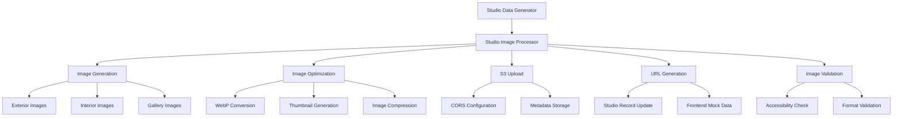

# Studio Image Processing Workflow Documentation

## Overview

The Studio Image Processing workflow handles the generation, optimization, and storage of studio images across three categories: exterior, interior, and gallery images. This system integrates with the existing image processing pipeline while providing studio-specific functionality for realistic test data generation.

## Image Processing Architecture

### Workflow Overview



### Component Integration

```javascript
// Studio Image Processor Integration
class StudioDataProcessor {
  async processStudioImages(studios) {
    console.log('🖼️ Processing studio images...');
    
    const processedStudios = [];
    
    for (const studio of studios) {
      const studioWithImages = await this.imageProcessor.processStudioImages(studio);
      processedStudios.push(studioWithImages);
    }
    
    console.log(`✅ Processed images for ${processedStudios.length} studios`);
    return processedStudios;
  }
}
```

## Studio Image Types

### 1. Exterior Images

**Purpose**: Studio building exterior and storefront images
**Usage**: Studio profile headers, map view markers, location verification

**Characteristics**:
- Building facades, storefronts, signage
- Street view perspectives
- Architectural details
- Branding and signage visibility

**Generation Rules**:
```javascript
const EXTERIOR_IMAGE_CONFIG = {
  count: 1,                    // 1 primary exterior image
  dimensions: {
    width: 1200,
    height: 800,
    aspectRatio: '3:2'
  },
  styles: [
    'modern-storefront',
    'traditional-shopfront', 
    'converted-building',
    'industrial-space'
  ],
  features: [
    'clear-signage',
    'street-visibility',
    'architectural-character',
    'professional-appearance'
  ]
};
```

### 2. Interior Images

**Purpose**: Studio workspace and interior environment
**Usage**: Studio profile galleries, workspace showcases, atmosphere display

**Characteristics**:
- Tattoo stations and equipment
- Waiting areas and reception
- Artwork displays and portfolios
- Clean, professional environments

**Generation Rules**:
```javascript
const INTERIOR_IMAGE_CONFIG = {
  count: 2,                    // 2 interior images
  dimensions: {
    width: 1200,
    height: 900,
    aspectRatio: '4:3'
  },
  styles: [
    'modern-clean',
    'industrial-chic',
    'traditional-parlor',
    'artistic-creative'
  ],
  features: [
    'tattoo-stations',
    'sterilization-equipment',
    'artwork-displays',
    'comfortable-seating',
    'professional-lighting'
  ]
};
```

### 3. Gallery Images

**Purpose**: Portfolio wall displays and artwork showcases
**Usage**: Studio portfolio sections, artistic style demonstrations

**Characteristics**:
- Flash sheets and artwork displays
- Portfolio walls and galleries
- Artist work showcases
- Style demonstrations

**Generation Rules**:
```javascript
const GALLERY_IMAGE_CONFIG = {
  count: 1,                    // 1 gallery/portfolio image
  dimensions: {
    width: 1000,
    height: 1000,
    aspectRatio: '1:1'
  },
  styles: [
    'flash-sheet-wall',
    'portfolio-display',
    'artwork-gallery',
    'style-showcase'
  ],
  features: [
    'diverse-artwork',
    'professional-display',
    'style-variety',
    'quality-examples'
  ]
};
```

## Image Processing Pipeline

### 1. Image Generation Phase

```javascript
class StudioImageProcessor {
  async generateStudioImages(studio) {
    const images = [];
    
    // Generate exterior image
    const exteriorImage = await this.generateExteriorImage(studio);
    images.push(exteriorImage);
    
    // Generate interior images
    const interiorImages = await this.generateInteriorImages(studio, 2);
    images.push(...interiorImages);
    
    // Generate gallery image
    const galleryImage = await this.generateGalleryImage(studio);
    images.push(galleryImage);
    
    return images;
  }

  async generateExteriorImage(studio) {
    const imageConfig = {
      type: 'exterior',
      style: this.selectExteriorStyle(studio),
      location: studio.locationDisplay,
      studioName: studio.studioName,
      dimensions: EXTERIOR_IMAGE_CONFIG.dimensions
    };
    
    return await this.createStudioImage(imageConfig);
  }

  async generateInteriorImages(studio, count) {
    const images = [];
    
    for (let i = 0; i < count; i++) {
      const imageConfig = {
        type: 'interior',
        style: this.selectInteriorStyle(studio, i),
        specialties: studio.specialties,
        artistCount: studio.artistCount,
        dimensions: INTERIOR_IMAGE_CONFIG.dimensions
      };
      
      const image = await this.createStudioImage(imageConfig);
      images.push(image);
    }
    
    return images;
  }
}
```

### 2. Image Optimization Phase

```javascript
class ImageOptimizer {
  async optimizeStudioImage(imageBuffer, config) {
    // Convert to WebP format
    const webpImage = await sharp(imageBuffer)
      .webp({ quality: 85, effort: 6 })
      .toBuffer();
    
    // Generate thumbnail
    const thumbnail = await sharp(imageBuffer)
      .resize(400, 300, { fit: 'cover' })
      .webp({ quality: 80 })
      .toBuffer();
    
    return {
      fullSize: webpImage,
      thumbnail: thumbnail,
      metadata: {
        format: 'webp',
        quality: 85,
        dimensions: config.dimensions
      }
    };
  }
}
```

### 3. S3 Upload Phase

```javascript
class S3StudioUploader {
  async uploadStudioImages(studioId, images) {
    const uploadedImages = [];
    
    for (const image of images) {
      // Upload full-size image
      const fullSizeKey = `studios/${studioId}/${image.type}-${image.index}.webp`;
      const fullSizeUrl = await this.uploadToS3(image.fullSize, fullSizeKey);
      
      // Upload thumbnail
      const thumbnailKey = `studios/${studioId}/${image.type}-${image.index}-thumb.webp`;
      const thumbnailUrl = await this.uploadToS3(image.thumbnail, thumbnailKey);
      
      uploadedImages.push({
        type: image.type,
        url: fullSizeUrl,
        thumbnailUrl: thumbnailUrl,
        description: image.description,
        isPrimary: image.isPrimary,
        metadata: image.metadata
      });
    }
    
    return uploadedImages;
  }

  async uploadToS3(imageBuffer, key) {
    const params = {
      Bucket: this.bucketName,
      Key: key,
      Body: imageBuffer,
      ContentType: 'image/webp',
      CacheControl: 'public, max-age=31536000', // 1 year cache
      Metadata: {
        'generated-by': 'studio-image-processor',
        'created-at': new Date().toISOString()
      }
    };
    
    const result = await this.s3Client.upload(params).promise();
    return result.Location;
  }
}
```

## Image Storage Structure

### S3 Bucket Organization

```
tattoo-images/
├── studios/
│   ├── studio-001/
│   │   ├── exterior-1.webp              # Primary exterior image
│   │   ├── exterior-1-thumb.webp        # Exterior thumbnail
│   │   ├── interior-1.webp              # First interior image
│   │   ├── interior-1-thumb.webp        # Interior thumbnail
│   │   ├── interior-2.webp              # Second interior image
│   │   ├── interior-2-thumb.webp        # Interior thumbnail
│   │   ├── gallery-1.webp               # Gallery/portfolio image
│   │   └── gallery-1-thumb.webp         # Gallery thumbnail
│   ├── studio-002/
│   │   └── ... (same structure)
│   └── studio-XXX/
│       └── ... (same structure)
```

### Naming Conventions

```javascript
const IMAGE_NAMING_PATTERNS = {
  fullSize: '{type}-{index}.webp',           // exterior-1.webp
  thumbnail: '{type}-{index}-thumb.webp',    // exterior-1-thumb.webp
  s3Key: 'studios/{studioId}/{filename}',   // studios/studio-001/exterior-1.webp
  
  // URL patterns
  localstack: 'http://localhost:4566/tattoo-images/{s3Key}',
  production: 'https://d1234567890.cloudfront.net/{s3Key}'
};
```

## Image Metadata and Validation

### Image Metadata Structure

```javascript
const StudioImageMetadata = {
  // Basic information
  type: 'exterior',                    // exterior, interior, gallery
  studioId: 'studio-001',             // Associated studio
  filename: 'exterior-1.webp',        // Original filename
  
  // Technical details
  format: 'webp',                     // Image format
  dimensions: {
    width: 1200,
    height: 800,
    aspectRatio: '3:2'
  },
  fileSize: 245760,                   // Size in bytes
  quality: 85,                        // Compression quality
  
  // URLs
  url: 'https://s3.../exterior-1.webp',      // Full-size URL
  thumbnailUrl: 'https://s3.../exterior-1-thumb.webp', // Thumbnail URL
  
  // Content information
  description: 'Studio front entrance',       // Alt text
  isPrimary: true,                            // Primary image for type
  tags: ['storefront', 'signage', 'modern'], // Content tags
  
  // System information
  createdAt: '2024-01-15T10:30:00Z',
  processedAt: '2024-01-15T10:31:00Z',
  uploadedAt: '2024-01-15T10:32:00Z'
};
```

### Image Validation Rules

```javascript
class StudioImageValidator {
  async validateStudioImages(studio) {
    const validationResults = {
      valid: true,
      errors: [],
      warnings: []
    };
    
    // Validate required image types
    const requiredTypes = ['exterior'];
    const availableTypes = studio.images.map(img => img.type);
    
    for (const requiredType of requiredTypes) {
      if (!availableTypes.includes(requiredType)) {
        validationResults.errors.push(`Missing required image type: ${requiredType}`);
        validationResults.valid = false;
      }
    }
    
    // Validate image accessibility
    for (const image of studio.images) {
      const accessible = await this.checkImageAccessibility(image.url);
      if (!accessible) {
        validationResults.errors.push(`Image not accessible: ${image.url}`);
        validationResults.valid = false;
      }
    }
    
    // Validate image formats
    for (const image of studio.images) {
      if (!this.isValidImageFormat(image.url)) {
        validationResults.warnings.push(`Non-optimal image format: ${image.url}`);
      }
    }
    
    return validationResults;
  }

  async checkImageAccessibility(url) {
    try {
      const response = await fetch(url, { method: 'HEAD' });
      return response.ok;
    } catch (error) {
      return false;
    }
  }

  isValidImageFormat(url) {
    return url.endsWith('.webp') || url.endsWith('.jpg') || url.endsWith('.jpeg');
  }
}
```

## CORS Configuration

### S3 CORS Settings

```json
{
  "CORSRules": [
    {
      "AllowedOrigins": [
        "http://localhost:3000",
        "https://*.tattoo-directory.com"
      ],
      "AllowedMethods": ["GET", "HEAD"],
      "AllowedHeaders": ["*"],
      "MaxAgeSeconds": 3600,
      "ExposeHeaders": ["ETag"]
    }
  ]
}
```

### CORS Setup in LocalStack

```javascript
async function configureCORS() {
  const corsConfiguration = {
    CORSRules: [
      {
        AllowedOrigins: ['http://localhost:3000'],
        AllowedMethods: ['GET', 'HEAD'],
        AllowedHeaders: ['*'],
        MaxAgeSeconds: 3600
      }
    ]
  };
  
  await s3Client.putBucketCors({
    Bucket: 'tattoo-images',
    CORSConfiguration: corsConfiguration
  }).promise();
}
```

## Integration with Frontend

### Mock Data Generation

```javascript
class FrontendStudioImageSync {
  convertStudioImagesToMockFormat(studio) {
    return {
      studioId: studio.studioId,
      images: studio.images.map(image => ({
        type: image.type,
        url: this.convertToMockUrl(image.url),
        thumbnailUrl: this.convertToMockUrl(image.thumbnailUrl),
        description: image.description,
        isPrimary: image.isPrimary
      }))
    };
  }

  convertToMockUrl(s3Url) {
    // Convert S3 URL to local development URL
    return s3Url.replace(
      'http://localhost:4566/tattoo-images/',
      '/images/'
    );
  }
}
```

### Frontend Image Component Integration

```javascript
// Example frontend usage
const StudioImageGallery = ({ studio }) => {
  const exteriorImage = studio.images.find(img => img.type === 'exterior');
  const interiorImages = studio.images.filter(img => img.type === 'interior');
  const galleryImage = studio.images.find(img => img.type === 'gallery');
  
  return (
    <div className="studio-images">
      {exteriorImage && (
        <div className="exterior-image">
          <Image
            src={exteriorImage.url}
            alt={exteriorImage.description}
            width={1200}
            height={800}
            priority
          />
        </div>
      )}
      
      <div className="interior-images">
        {interiorImages.map((image, index) => (
          <Image
            key={index}
            src={image.url}
            alt={image.description}
            width={600}
            height={450}
          />
        ))}
      </div>
      
      {galleryImage && (
        <div className="gallery-image">
          <Image
            src={galleryImage.url}
            alt={galleryImage.description}
            width={500}
            height={500}
          />
        </div>
      )}
    </div>
  );
};
```

## Performance Optimization

### Image Loading Strategies

```javascript
const IMAGE_LOADING_CONFIG = {
  // Lazy loading for non-critical images
  lazyLoad: ['interior', 'gallery'],
  
  // Priority loading for critical images
  priority: ['exterior'],
  
  // Preload thumbnails for better UX
  preloadThumbnails: true,
  
  // Progressive loading
  progressive: true,
  
  // Responsive images
  responsive: {
    mobile: { width: 400, quality: 75 },
    tablet: { width: 800, quality: 80 },
    desktop: { width: 1200, quality: 85 }
  }
};
```

### Caching Strategy

```javascript
const CACHE_CONFIG = {
  // CloudFront cache settings
  cloudfront: {
    ttl: 31536000,              // 1 year for images
    compress: true,
    viewerProtocolPolicy: 'redirect-to-https'
  },
  
  // Browser cache settings
  browser: {
    cacheControl: 'public, max-age=31536000, immutable',
    etag: true
  },
  
  // CDN optimization
  optimization: {
    webp: true,
    progressive: true,
    quality: 85
  }
};
```

## Error Handling and Recovery

### Image Processing Errors

```javascript
class StudioImageErrorHandler {
  async handleImageProcessingError(error, studio, imageType) {
    console.error(`Image processing failed for ${studio.studioId} (${imageType}):`, error);
    
    switch (error.type) {
      case 'GENERATION_FAILED':
        return await this.retryImageGeneration(studio, imageType);
      
      case 'UPLOAD_FAILED':
        return await this.retryImageUpload(studio, imageType);
      
      case 'OPTIMIZATION_FAILED':
        return await this.useUnoptimizedImage(studio, imageType);
      
      default:
        return await this.usePlaceholderImage(studio, imageType);
    }
  }

  async retryImageGeneration(studio, imageType, maxRetries = 3) {
    for (let attempt = 1; attempt <= maxRetries; attempt++) {
      try {
        return await this.generateStudioImage(studio, imageType);
      } catch (error) {
        if (attempt === maxRetries) {
          return await this.usePlaceholderImage(studio, imageType);
        }
        await this.delay(1000 * attempt); // Exponential backoff
      }
    }
  }

  async usePlaceholderImage(studio, imageType) {
    const placeholderUrl = `/images/placeholders/studio-${imageType}-placeholder.webp`;
    
    return {
      type: imageType,
      url: placeholderUrl,
      thumbnailUrl: placeholderUrl,
      description: `${studio.studioName} ${imageType} (placeholder)`,
      isPrimary: imageType === 'exterior',
      isPlaceholder: true
    };
  }
}
```

## Testing and Validation

### Image Processing Tests

```javascript
describe('Studio Image Processing', () => {
  describe('Image Generation', () => {
    test('generates all required image types');
    test('creates proper image dimensions');
    test('applies correct optimization settings');
    test('handles generation failures gracefully');
  });

  describe('S3 Upload', () => {
    test('uploads images with correct naming');
    test('sets proper CORS configuration');
    test('generates accessible URLs');
    test('handles upload failures');
  });

  describe('Image Validation', () => {
    test('validates image accessibility');
    test('checks required image types');
    test('validates image formats');
    test('reports validation errors');
  });
});
```

### Manual Testing Workflow

```bash
# Test studio image processing
npm run process-studio-images --studio-id studio-001

# Validate image accessibility
npm run validate-studios images

# Test image generation with different scenarios
npm run seed-studios --scenario studio-diverse
npm run validate-studios images

# Test error handling
npm run process-studio-images --force --validate
```

## Monitoring and Metrics

### Image Processing Metrics

```javascript
const IMAGE_PROCESSING_METRICS = {
  // Performance metrics
  processingTime: 'Average time per studio image processing',
  uploadTime: 'Average S3 upload time per image',
  optimizationRatio: 'File size reduction from optimization',
  
  // Quality metrics
  successRate: 'Percentage of successful image processing',
  accessibilityRate: 'Percentage of accessible uploaded images',
  formatOptimization: 'Percentage of images in WebP format',
  
  // Error metrics
  generationFailures: 'Number of image generation failures',
  uploadFailures: 'Number of S3 upload failures',
  validationFailures: 'Number of image validation failures'
};
```

This comprehensive workflow documentation covers all aspects of studio image processing, from generation through validation, providing developers with the complete understanding needed to work with studio images in the system.