# Backup and Disaster Recovery Architecture

## Overview

This diagram illustrates the comprehensive backup and disaster recovery architecture across the multi-account AWS Control Tower environment. It shows AWS Backup service configuration, cross-region replication strategies, backup vaults, retention policies, and recovery procedures with defined RTO/RPO targets.

## Architecture Components

- **AWS Backup Service**: Centralized backup management with automated backup plans
- **Cross-Region Replication**: Production backup vaults replicated to secondary region
- **S3 Cross-Region Replication**: Log storage buckets replicated for disaster recovery
- **Backup Monitoring**: CloudWatch alarms and SNS notifications for backup job status
- **Recovery Procedures**: Defined RTO/RPO targets and recovery workflows

## RTO/RPO Targets

- **DynamoDB Recovery**: RTO: 4 hours, RPO: 24 hours (daily backups)
- **ECS Configuration Recovery**: RTO: 2 hours, RPO: 24 hours
- **Log Data Recovery**: RTO: 1 hour, RPO: 15 minutes (continuous replication)
- **Cross-Region Failover**: RTO: 8 hours, RPO: 24 hours

```mermaid
graph TB
    subgraph AWS_Organization["🏢 AWS Organization"]
        subgraph Management_Account["Management Account"]
            ControlTower["AWS Control Tower"]
            Organizations["AWS Organizations"]
        end
        
        subgraph Infrastructure_OU["Infrastructure OU"]
            subgraph Infrastructure_Account["🏗️ Infrastructure Account (App-Dev)"]
                subgraph Primary_Region["Primary Region (eu-west-2)"]
                    subgraph App_Resources["Application Resources"]
                        DynamoDB_Main["📊 DynamoDB Main Table<br/>• Point-in-time recovery<br/>• Streams enabled"]
                        DynamoDB_Denylist["📊 DynamoDB Denylist"]
                        DynamoDB_Idempotency["📊 DynamoDB Idempotency<br/>• TTL enabled"]
                        ECS_Cluster["🐳 ECS Cluster<br/>• Task definitions<br/>• Service configurations"]
                        S3_Frontend["🪣 S3 Frontend Bucket"]
                        S3_Lambda["🪣 S3 Lambda Artifacts"]
                    end
                    
                    subgraph Backup_Resources["Backup Resources"]
                        BackupRole["🔐 AWS Backup Service Role<br/>• DynamoDB permissions<br/>• ECS permissions"]
                    end
                end
                
                subgraph Secondary_Region["Secondary Region (eu-west-1)"]
                    S3_Frontend_Replica["🪣 S3 Frontend Replica<br/>• Cross-region replication<br/>• STANDARD_IA storage"]
                end
            end
        end
        
        subgraph Security_OU["Security OU"]
            subgraph Log_Archive_Account["📋 Log Archive Account"]
                subgraph Primary_Log_Region["Primary Region (eu-west-2)"]
                    subgraph Backup_Vaults["AWS Backup Vaults"]
                        BackupVault_Primary["🏦 Primary Backup Vault<br/>• KMS encrypted<br/>• Vault lock enabled (prod)<br/>• Compliance retention"]
                        
                        subgraph Backup_Plans["Backup Plans & Selections"]
                            DailyBackupPlan["📅 Daily Backup Plan<br/>• 5 AM UTC schedule<br/>• 1 hour start window<br/>• 5 hour completion window"]
                            WeeklyBackupPlan["📅 Weekly Backup Plan<br/>• Sunday 6 AM UTC<br/>• 4x longer retention"]
                            
                            DynamoDBSelection["🎯 DynamoDB Backup Selection<br/>• All DynamoDB tables<br/>• Environment tag filter<br/>• Project tag filter"]
                            ECSSelection["🎯 ECS Backup Selection<br/>• ECS cluster<br/>• Task definitions<br/>• Service configurations"]
                        end
                    end
                    
                    subgraph Log_Storage["Log Storage Buckets"]
                        S3_CloudTrail["🪣 CloudTrail Logs<br/>• 10 year retention (prod)<br/>• Immutable storage<br/>• Cross-region replication"]
                        S3_Config["🪣 Config Logs<br/>• 7 year retention (prod)<br/>• Compliance storage"]
                        S3_VPCFlow["🪣 VPC Flow Logs<br/>• 1 year retention (prod)<br/>• Network monitoring"]
                        S3_WAF["🪣 WAF Logs<br/>• 1 year retention (prod)<br/>• Security events"]
                        S3_AccessLogs["🪣 Access Logs<br/>• 90 day retention (prod)<br/>• Self-logging bucket"]
                    end
                    
                    subgraph Monitoring["Backup Monitoring"]
                        CW_BackupFailed["⚠️ Backup Job Failed Alarm<br/>• Threshold: > 0 failures<br/>• 5 minute evaluation"]
                        CW_BackupExpired["⚠️ Backup Job Expired Alarm<br/>• Threshold: > 0 expired<br/>• 5 minute evaluation"]
                        SNS_BackupNotifications["📢 Backup Notifications<br/>• Job started/completed/failed<br/>• Restore events"]
                    end
                end
                
                subgraph Secondary_Log_Region["Secondary Region (eu-west-1)"]
                    BackupVault_Replica["🏦 Replica Backup Vault<br/>• Cross-region copy<br/>• KMS encrypted<br/>• Same retention policies"]
                    
                    subgraph Log_Replicas["Log Storage Replicas"]
                        S3_CloudTrail_Replica["🪣 CloudTrail Replica<br/>• STANDARD_IA storage<br/>• Disaster recovery"]
                        S3_Config_Replica["🪣 Config Replica<br/>• STANDARD_IA storage"]
                        S3_VPCFlow_Replica["🪣 VPC Flow Replica<br/>• STANDARD_IA storage"]
                        S3_WAF_Replica["🪣 WAF Logs Replica<br/>• STANDARD_IA storage"]
                    end
                end
            end
        end
    end
    
    %% Backup Data Flows
    DynamoDB_Main -.->|"Daily Backup<br/>5 AM UTC"| BackupVault_Primary
    DynamoDB_Denylist -.->|"Daily Backup<br/>5 AM UTC"| BackupVault_Primary
    DynamoDB_Idempotency -.->|"Daily Backup<br/>5 AM UTC"| BackupVault_Primary
    ECS_Cluster -.->|"Daily Backup<br/>5 AM UTC"| BackupVault_Primary
    
    %% Weekly Backup Flows
    DynamoDB_Main -.->|"Weekly Backup<br/>Sunday 6 AM UTC"| BackupVault_Primary
    ECS_Cluster -.->|"Weekly Backup<br/>Sunday 6 AM UTC"| BackupVault_Primary
    
    %% Cross-Region Backup Replication
    BackupVault_Primary ==>|"Cross-Region Copy<br/>Production Only"| BackupVault_Replica
    
    %% S3 Cross-Region Replication
    S3_Frontend ==>|"Continuous Replication<br/>STANDARD_IA"| S3_Frontend_Replica
    S3_CloudTrail ==>|"Continuous Replication<br/>STANDARD_IA"| S3_CloudTrail_Replica
    S3_Config ==>|"Continuous Replication<br/>STANDARD_IA"| S3_Config_Replica
    S3_VPCFlow ==>|"Continuous Replication<br/>STANDARD_IA"| S3_VPCFlow_Replica
    S3_WAF ==>|"Continuous Replication<br/>STANDARD_IA"| S3_WAF_Replica
    
    %% Backup Monitoring Flows
    BackupVault_Primary -.->|"Job Status Events"| SNS_BackupNotifications
    BackupVault_Primary -.->|"Failed Jobs Metric"| CW_BackupFailed
    BackupVault_Primary -.->|"Expired Jobs Metric"| CW_BackupExpired
    CW_BackupFailed -.->|"Alarm Notifications"| SNS_BackupNotifications
    CW_BackupExpired -.->|"Alarm Notifications"| SNS_BackupNotifications
    
    %% Backup Plan Relationships
    DailyBackupPlan -.->|"Manages"| DynamoDBSelection
    DailyBackupPlan -.->|"Manages"| ECSSelection
    WeeklyBackupPlan -.->|"Manages"| DynamoDBSelection
    WeeklyBackupPlan -.->|"Manages"| ECSSelection
    
    %% IAM Role Relationships
    BackupRole -.->|"Assumes Role"| DynamoDBSelection
    BackupRole -.->|"Assumes Role"| ECSSelection
    
    %% Lifecycle Management
    S3_CloudTrail -.->|"30d → STANDARD_IA<br/>365d → GLACIER"| S3_CloudTrail
    S3_Config -.->|"90d → STANDARD_IA<br/>365d → GLACIER"| S3_Config
    S3_VPCFlow -.->|"30d → STANDARD_IA"| S3_VPCFlow
    S3_WAF -.->|"30d → STANDARD_IA"| S3_WAF
    
    %% Styling
    classDef primaryRegion fill:#e1f5fe,stroke:#01579b,stroke-width:2px
    classDef secondaryRegion fill:#f3e5f5,stroke:#4a148c,stroke-width:2px
    classDef backupVault fill:#e8f5e8,stroke:#2e7d32,stroke-width:2px
    classDef database fill:#fff3e0,stroke:#ef6c00,stroke-width:2px
    classDef storage fill:#f1f8e9,stroke:#558b2f,stroke-width:2px
    classDef monitoring fill:#ffebee,stroke:#c62828,stroke-width:2px
    classDef compute fill:#e3f2fd,stroke:#1565c0,stroke-width:2px
    
    class Primary_Region,Primary_Log_Region primaryRegion
    class Secondary_Region,Secondary_Log_Region secondaryRegion
    class BackupVault_Primary,BackupVault_Replica,DailyBackupPlan,WeeklyBackupPlan backupVault
    class DynamoDB_Main,DynamoDB_Denylist,DynamoDB_Idempotency database
    class S3_Frontend,S3_Lambda,S3_CloudTrail,S3_Config,S3_VPCFlow,S3_WAF,S3_AccessLogs storage
    class S3_Frontend_Replica,S3_CloudTrail_Replica,S3_Config_Replica,S3_VPCFlow_Replica,S3_WAF_Replica storage
    class CW_BackupFailed,CW_BackupExpired,SNS_BackupNotifications monitoring
    class ECS_Cluster compute
```

## Backup Retention Policies

### Daily Backups
- **Retention**: 30 days (dev), 90 days (prod)
- **Cold Storage**: 30 days after creation (prod only)
- **Schedule**: Daily at 5 AM UTC
- **Start Window**: 1 hour
- **Completion Window**: 5 hours

### Weekly Backups
- **Retention**: 120 days (dev), 360 days (prod)
- **Cold Storage**: 30 days after creation (prod only)
- **Schedule**: Weekly on Sundays at 6 AM UTC
- **Start Window**: 1 hour
- **Completion Window**: 5 hours

### S3 Lifecycle Policies
- **CloudTrail**: 90d → STANDARD_IA, 365d → GLACIER, 10 year retention (prod)
- **Config**: 90d → STANDARD_IA, 365d → GLACIER, 7 year retention (prod)
- **VPC Flow Logs**: 30d → STANDARD_IA, 1 year retention (prod)
- **WAF Logs**: 30d → STANDARD_IA, 1 year retention (prod)
- **Access Logs**: 30d → STANDARD_IA, 90 day retention (prod)

## Recovery Procedures

### DynamoDB Recovery
1. **Point-in-Time Recovery**: Available for main table (prod)
2. **Backup Restore**: Daily/weekly backup restore to new table
3. **Cross-Region Recovery**: Restore from replica backup vault
4. **Data Validation**: Verify data integrity post-recovery

### ECS Configuration Recovery
1. **Task Definition Restore**: Restore from AWS Backup
2. **Service Configuration**: Restore service definitions and scaling policies
3. **Container Image Recovery**: Pull from ECR with versioned tags
4. **Health Check Validation**: Verify service health post-recovery

### Log Data Recovery
1. **S3 Cross-Region Access**: Switch to replica buckets
2. **CloudTrail Recovery**: Access audit trails from replica region
3. **Compliance Data**: Ensure continuous audit trail availability
4. **Log Analysis Tools**: Reconfigure to use replica data sources

## Monitoring and Alerting

### Backup Job Monitoring
- **Failed Jobs**: CloudWatch alarm triggers on any backup failures
- **Expired Jobs**: CloudWatch alarm monitors backup job expiration
- **SNS Notifications**: Real-time alerts for backup events
- **Vault Events**: Monitor backup/restore job lifecycle

### Cross-Region Replication Monitoring
- **Replication Status**: Monitor S3 replication metrics
- **Replication Lag**: Track replication time for compliance
- **Failed Replications**: Alert on replication failures
- **Cost Monitoring**: Track cross-region data transfer costs

## Compliance and Security

### Vault Lock Configuration
- **Production Only**: Vault lock enabled for compliance
- **Changeable Period**: 3 days for policy modifications
- **Retention Enforcement**: Min 1 day, Max 180 days (2x retention)
- **Immutable Backups**: Prevent backup deletion during retention period

### Encryption and Access Control
- **KMS Encryption**: All backups encrypted with account-specific keys
- **Cross-Account Access**: Minimal permissions for backup operations
- **IAM Roles**: Dedicated service roles with least privilege
- **Audit Trail**: All backup operations logged in CloudTrail