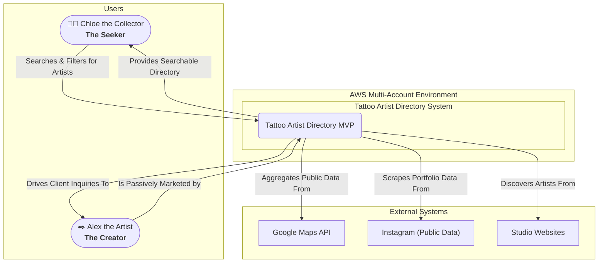

### **C4 Model: Level 1 \- System Context**

```mermaid
flowchart TD
 subgraph s1["External Systems"]
        GoogleMaps["Google Maps API"]
        Instagram["Instagram (Public Data)"]
        StudioWebsites["Studio Websites"]
  end
 subgraph Users["Users"]
        Client(["👩‍🎨 Chloe the Collector<br><b>The Seeker</b>"])
        Artist(["✒️ Alex the Artist<br><b>The Creator</b>"])
  end
 subgraph AWS["AWS Multi-Account Environment"]
        subgraph subGraph2["Tattoo Artist Directory System"]
            System("Tattoo Artist Directory MVP")
        end
  end
    Client -- "Searches & Filters for Artists" --> System
    System -- "Provides Searchable Directory" --> Client
    System -- "Aggregates Public Data From" --> GoogleMaps
    System -- "Scrapes Portfolio Data From" --> Instagram
    System -- "Discovers Artists From" --> StudioWebsites
    Artist -- "Is Passively Marketed by" --> System
    System -- "Drives Client Inquiries To" --> Artist
    GoogleMaps@{ shape: rect}
    Instagram@{ shape: rect}
    StudioWebsites@{ shape: rect}
```