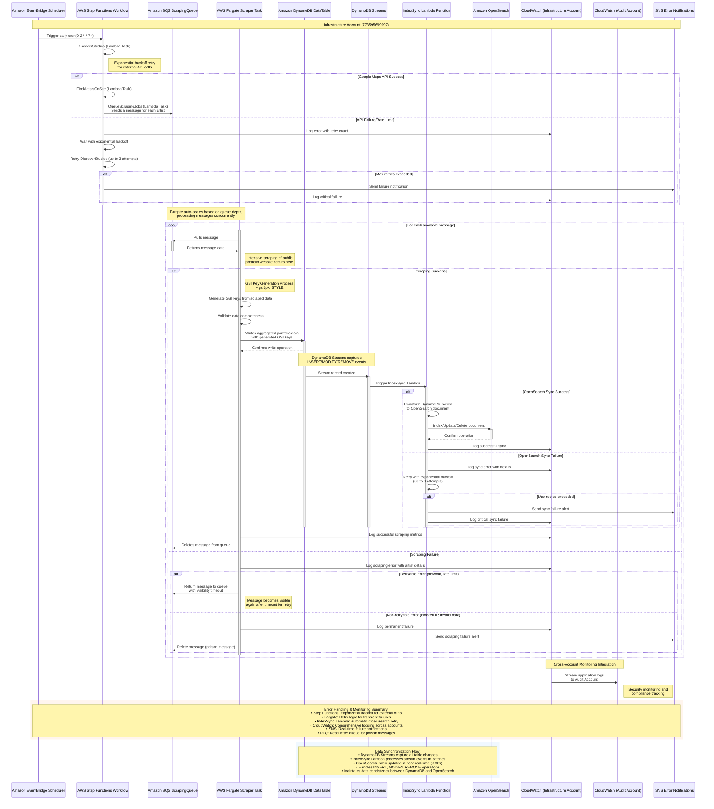

### **Data Aggregation Sequence Diagram**

This diagram shows the complete data aggregation pipeline including DynamoDB Streams synchronization, GSI key generation, error handling, retry logic, and cross-account monitoring integration.

## Enhanced Features

### DynamoDB Streams Integration
- **Stream Configuration**: DynamoDB table configured with streams to capture INSERT, MODIFY, and REMOVE events
- **Event Processing**: IndexSync Lambda function processes stream events in batches for efficiency
- **Real-time Synchronization**: OpenSearch index updated within 30 seconds of DynamoDB changes
- **Event Types Handling**: Different processing logic for INSERT (create document), MODIFY (update document), and REMOVE (delete document) operations

### GSI Key Generation Process
The Fargate scraper tasks generate Global Secondary Index keys to enable efficient search queries:

- **GSI1 (Style-based search)**:
  - `gsi1pk`: `STYLE#{style_name}` (e.g., `STYLE#traditional`)
  - `gsi1sk`: `LOCATION#{country}#{city}#{artistId}` (e.g., `LOCATION#UK#LONDON#artist-123`)
  
- **GSI2 (Instagram-based lookup)**:
  - `gsi2pk`: `INSTAGRAM#{handle}` (e.g., `INSTAGRAM#alextattoo`)

These keys are computed from scraped data including inferred styles, location information, and social media handles.

### Error Handling and Retry Logic

#### Step Functions Level
- **External API Calls**: Exponential backoff retry for Google Maps API calls
- **Rate Limiting**: Automatic retry with increasing delays when APIs return rate limit errors
- **Circuit Breaker**: Stops retrying after maximum attempts to prevent cascading failures

#### Fargate Scraper Level
- **Transient Failures**: Network timeouts and temporary site unavailability trigger message return to SQS with visibility timeout
- **Permanent Failures**: Blocked IPs or invalid data result in message deletion to prevent infinite retries
- **Dead Letter Queue**: Poison messages moved to DLQ after maximum retry attempts

#### IndexSync Lambda Level
- **OpenSearch Failures**: Automatic retry with exponential backoff for index operations
- **Batch Processing**: Processes multiple stream records in batches for efficiency
- **Error Isolation**: Individual record failures don't affect the entire batch

### Monitoring and Alerting Integration

#### Infrastructure Account Monitoring
- **CloudWatch Metrics**: Scraping success rates, processing times, queue depths
- **Application Logs**: Detailed logging of scraping activities and data processing
- **Performance Tracking**: Lambda execution times, Fargate task utilization

#### Cross-Account Security Monitoring
- **Audit Account Integration**: Application logs streamed to Audit Account for security analysis
- **Compliance Tracking**: Data processing activities monitored for compliance requirements
- **Incident Response**: Automated alerts for critical failures or security events

#### Real-time Notifications
- **SNS Integration**: Immediate notifications for critical failures
- **Dashboard Alerts**: CloudWatch alarms for key performance indicators
- **Escalation Procedures**: Automated escalation for unresolved issues

### Data Consistency and Quality

#### Validation Pipeline
- **Data Completeness**: Validation of required fields before DynamoDB write
- **Format Standardization**: Consistent data formatting across all records
- **Duplicate Detection**: GSI2 enables efficient duplicate detection by Instagram handle

#### Synchronization Guarantees
- **Eventually Consistent**: OpenSearch index eventually consistent with DynamoDB
- **Retry Mechanisms**: Automatic retry ensures synchronization completion
- **Monitoring**: Real-time monitoring of synchronization lag and failures

### Cross-Account Architecture Context

This data aggregation pipeline operates within the AWS Control Tower multi-account structure:

- **Infrastructure Account (773595699997)**: Hosts all data processing components
- **Audit Account (098819594789)**: Receives application logs for security monitoring
- **Log Archive Account (224425919836)**: Stores long-term logs and backup data

The pipeline respects account boundaries while enabling necessary cross-account data flows for monitoring and compliance.