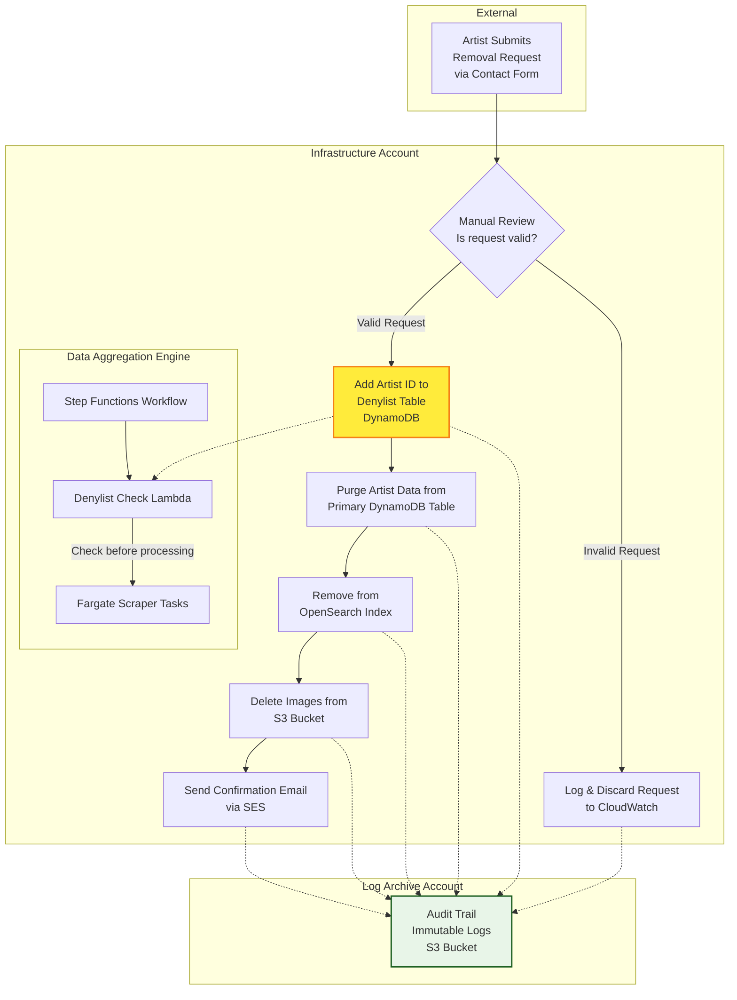

### **Data Governance & Takedown Process Diagram**

```mermaid
flowchart TD
    subgraph "External"
        A[Artist Submits<br>Removal Request<br>via Contact Form]
    end
    
    subgraph "Infrastructure Account"
        B{Manual Review<br>Is request valid?}
        C[Add Artist ID to<br>Denylist Table<br>DynamoDB]
        D[Purge Artist Data from<br>Primary DynamoDB Table]
        E[Remove from<br>OpenSearch Index]
        F[Delete Images from<br>S3 Bucket]
        G[Send Confirmation Email<br>via SES]
        H[Log & Discard Request<br>to CloudWatch]
        
        subgraph "Data Aggregation Engine"
            I[Step Functions Workflow]
            J[Fargate Scraper Tasks]
            K[Denylist Check Lambda]
        end
    end
    
    subgraph "Log Archive Account"
        L[Audit Trail<br>Immutable Logs<br>S3 Bucket]
    end
    
    A --> B
    B -- "Valid Request" --> C
    B -- "Invalid Request" --> H
    C --> D
    D --> E
    E --> F
    F --> G
    
    %% Denylist integration with scraping
    C -.-> K
    I --> K
    K -- "Check before processing" --> J
    
    %% Audit logging
    C -.-> L
    D -.-> L
    E -.-> L
    F -.-> L
    G -.-> L
    H -.-> L
    
    style C fill:#ffeb3b,stroke:#f57f17,stroke-width:2px
    style L fill:#e8f5e8,stroke:#1b5e20,stroke-width:2px
```