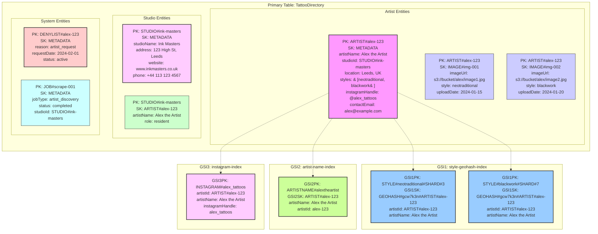

### **Data Model Diagram (DynamoDB Single-Table Design)**

```mermaid
graph TD
    subgraph "Primary Table: TattooDirectory"
        direction TB
        
        subgraph "Artist Entities"
            A1[PK: ARTIST#alex-123<br>SK: METADATA<br>artistName: Alex the Artist<br>studioId: STUDIO#ink-masters<br>location: Leeds, UK<br>styles: & #91;neotraditional, blackwork& #93;<br>instagramHandle: @alex_tattoos<br>contactEmail: alex@example.com]
            A2[PK: ARTIST#alex-123<br>SK: IMAGE#img-001<br>imageUrl: s3://bucket/alex/image1.jpg<br>style: neotraditional<br>uploadDate: 2024-01-15]
            A3[PK: ARTIST#alex-123<br>SK: IMAGE#img-002<br>imageUrl: s3://bucket/alex/image2.jpg<br>style: blackwork<br>uploadDate: 2024-01-20]
        end
        
        subgraph "Studio Entities"
            S1[PK: STUDIO#ink-masters<br>SK: METADATA<br>studioName: Ink Masters<br>address: 123 High St, Leeds<br>website: www.inkmasters.co.uk<br>phone: +44 113 123 4567]
            S2[PK: STUDIO#ink-masters<br>SK: ARTIST#alex-123<br>artistName: Alex the Artist<br>role: resident]
        end
        
        subgraph "System Entities"
            D1[PK: DENYLIST#alex-123<br>SK: METADATA<br>reason: artist_request<br>requestDate: 2024-02-01<br>status: active]
            J1[PK: JOB#scrape-001<br>SK: METADATA<br>jobType: artist_discovery<br>status: completed<br>studioId: STUDIO#ink-masters]
        end
    end

    subgraph "GSI1: style-geohash-index"
        direction TB
        G1[GSI1PK: STYLE#neotraditional#SHARD#3<br>GSI1SK: GEOHASH#gcw7k3n#ARTIST#alex-123<br>artistId: ARTIST#alex-123<br>artistName: Alex the Artist]
        G2[GSI1PK: STYLE#blackwork#SHARD#7<br>GSI1SK: GEOHASH#gcw7k3n#ARTIST#alex-123<br>artistId: ARTIST#alex-123<br>artistName: Alex the Artist]
    end
    
    subgraph "GSI2: artist-name-index"
        direction TB
        G3[GSI2PK: ARTISTNAME#alextheartist<br>GSI2SK: ARTIST#alex-123<br>artistName: Alex the Artist<br>artistId: alex-123]
    end
    
    subgraph "GSI3: instagram-index"
        direction TB
        G4[GSI3PK: INSTAGRAM#alex_tattoos<br>artistId: ARTIST#alex-123<br>artistName: Alex the Artist<br>instagramHandle: alex_tattoos]
    end

    %% Relationships
    A1 -.-> G1
    A1 -.-> G2
    A1 -.-> G3
    A1 -.-> G4
    
    style A1 fill:#f9f,stroke:#333,stroke-width:2px
    style A2 fill:#ccf,stroke:#333
    style A3 fill:#ccf,stroke:#333
    style S1 fill:#fcf,stroke:#333,stroke-width:2px
    style S2 fill:#cfc,stroke:#333
    style D1 fill:#fcc,stroke:#333,stroke-width:2px
    style J1 fill:#cff,stroke:#333
    style G1 fill:#9cf,stroke:#333,stroke-width:2px
    style G2 fill:#9cf,stroke:#333,stroke-width:2px
    style G3 fill:#cf9,stroke:#333,stroke-width:2px
    style G4 fill:#fcf,stroke:#333,stroke-width:2px
```