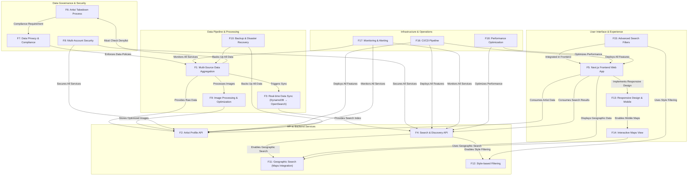

### **Feature Dependency Map**

```mermaid
flowchart TD
 subgraph subGraph0["Data Governance & Security"]
        F6["F6: Artist Takedown Process"]
        F7["F7: Data Privacy & Compliance"]
        F8["F8: Multi-Account Security"]
  end
 subgraph subGraph1["Data Pipeline & Processing"]
        F1["F1: Multi-Source Data Aggregation"]
        F3["F3: Real-time Data Sync (DynamoDB → OpenSearch)"]
        F9["F9: Image Processing & Optimization"]
        F10["F10: Backup & Disaster Recovery"]
  end
 subgraph subGraph2["API & Backend Services"]
        F2["F2: Artist Profile API"]
        F4["F4: Search & Discovery API"]
        F11["F11: Geographic Search (Maps Integration)"]
        F12["F12: Style-based Filtering"]
  end
 subgraph subGraph3["User Interface & Experience"]
        F5["F5: Next.js Frontend Web App"]
        F13["F13: Responsive Design & Mobile"]
        F14["F14: Interactive Maps View"]
        F15["F15: Advanced Search Filters"]
  end
 subgraph subGraph4["Infrastructure & Operations"]
        F16["F16: CI/CD Pipeline"]
        F17["F17: Monitoring & Alerting"]
        F18["F18: Performance Optimization"]
  end
  
    %% Data Pipeline Dependencies
    F1 -- "Must Check Denylist" --> F6
    F1 -- "Provides Raw Data" --> F2
    F1 -- "Triggers Sync" --> F3
    F1 -- "Processes Images" --> F9
    F9 -- "Stores Optimized Images" --> F2
    
    %% Search Dependencies
    F3 -- "Provides Search Index" --> F4
    F4 -- "Enables Geographic Search" --> F11
    F4 -- "Enables Style Filtering" --> F12
    
    %% Frontend Dependencies
    F5 -- "Consumes Artist Data" --> F2
    F5 -- "Consumes Search Results" --> F4
    F5 -- "Displays Geographic Data" --> F11
    F5 -- "Implements Responsive Design" --> F13
    F13 -- "Enables Mobile Maps" --> F14
    F14 -- "Uses Geographic Search" --> F11
    F15 -- "Uses Style Filtering" --> F12
    F15 -- "Integrated in Frontend" --> F5
    
    %% Security & Governance
    F7 -- "Enforces Data Policies" --> F1
    F8 -- "Secures All Services" --> F2
    F8 -- "Secures All Services" --> F4
    F6 -- "Compliance Requirement" --> F7
    
    %% Infrastructure Dependencies
    F16 -- "Deploys All Features" --> F5
    F16 -- "Deploys All Features" --> F2
    F16 -- "Deploys All Features" --> F4
    F17 -- "Monitors All Services" --> F1
    F17 -- "Monitors All Services" --> F2
    F17 -- "Monitors All Services" --> F4
    F18 -- "Optimizes Performance" --> F5
    F18 -- "Optimizes Performance" --> F4
    F10 -- "Backs Up All Data" --> F1
    F10 -- "Backs Up All Data" --> F2
```