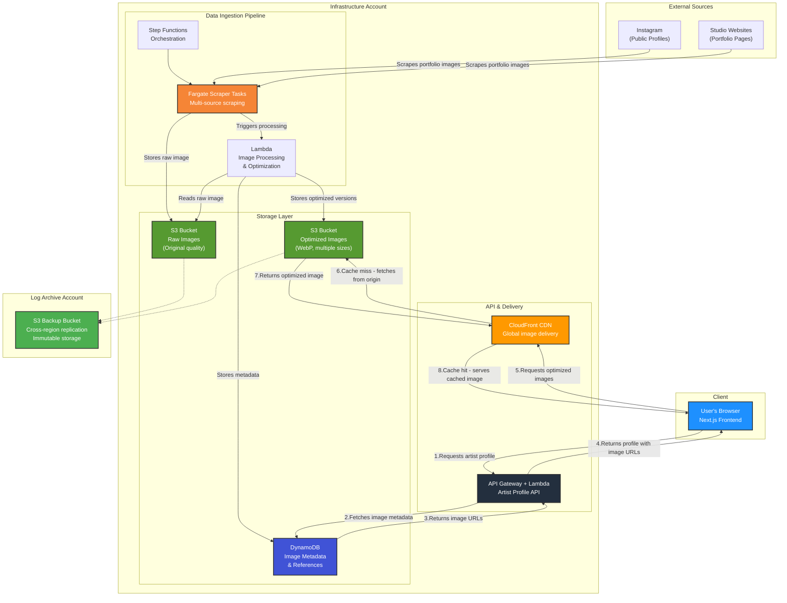

### **Image Ingestion and Display**

```mermaid
    flowchart TD
    subgraph "External Sources"
        Instagram["Instagram<br>(Public Profiles)"]
        StudioWebsites["Studio Websites<br>(Portfolio Pages)"]
    end
    
    subgraph "Infrastructure Account"
        subgraph "Data Ingestion Pipeline"
            StepFunctions["Step Functions<br>Orchestration"]
            Fargate["Fargate Scraper Tasks<br>Multi-source scraping"]
            ImageProcessor["Lambda<br>Image Processing<br>& Optimization"]
        end
        
        subgraph "Storage Layer"
            S3Raw["S3 Bucket<br>Raw Images<br>(Original quality)"]
            S3Optimized["S3 Bucket<br>Optimized Images<br>(WebP, multiple sizes)"]
            DynamoDB["DynamoDB<br>Image Metadata<br>& References"]
        end
        
        subgraph "API & Delivery"
            API["API Gateway + Lambda<br>Artist Profile API"]
            CloudFront["CloudFront CDN<br>Global image delivery"]
        end
    end
    
    subgraph "Log Archive Account"
        BackupS3["S3 Backup Bucket<br>Cross-region replication<br>Immutable storage"]
    end
    
    subgraph "Client"
        UserBrowser["User's Browser<br>Next.js Frontend"]
    end
    
    %% Ingestion Flow
    StepFunctions --> Fargate
    Instagram -- "Scrapes portfolio images" --> Fargate
    StudioWebsites -- "Scrapes portfolio images" --> Fargate
    Fargate -- "Stores raw image" --> S3Raw
    Fargate -- "Triggers processing" --> ImageProcessor
    ImageProcessor -- "Reads raw image" --> S3Raw
    ImageProcessor -- "Stores optimized versions" --> S3Optimized
    ImageProcessor -- "Stores metadata" --> DynamoDB
    
    %% Display Flow
    UserBrowser -- "1.Requests artist profile" --> API
    API -- "2.Fetches image metadata" --> DynamoDB
    DynamoDB -- "3.Returns image URLs" --> API
    API -- "4.Returns profile with image URLs" --> UserBrowser
    UserBrowser -- "5.Requests optimized images" --> CloudFront
    CloudFront -- "6.Cache miss - fetches from origin" --> S3Optimized
    S3Optimized -- "7.Returns optimized image" --> CloudFront
    CloudFront -- "8.Cache hit - serves cached image" --> UserBrowser
    
    %% Backup Flow
    S3Raw -.-> BackupS3
    S3Optimized -.-> BackupS3
    
    %% Styling
    Fargate:::fargate
    S3Raw:::s3
    S3Optimized:::s3
    DynamoDB:::dynamodb
    UserBrowser:::browser
    API:::api
    CloudFront:::cloudfront
    BackupS3:::backup
    
    classDef fargate fill:#F58536,stroke:#333,stroke-width:2px,color:#fff
    classDef s3 fill:#569A31,stroke:#333,stroke-width:2px,color:#fff
    classDef dynamodb fill:#4053D6,stroke:#333,stroke-width:2px,color:#fff
    classDef cloudfront fill:#FF9900,stroke:#333,stroke-width:2px,color:#fff
    classDef api fill:#232F3E,stroke:#333,stroke-width:2px,color:#fff
    classDef browser fill:#1E90FF,stroke:#333,stroke-width:2px,color:#fff
    classDef backup fill:#4CAF50,stroke:#333,stroke-width:2px,color:#fff
```