# Logging Architecture

This diagram shows the comprehensive logging pipeline across all AWS accounts in the multi-account architecture, including log sources, cross-account delivery mechanisms, storage locations, and lifecycle policies.

## Architecture Overview

The logging architecture implements a centralized logging strategy with the following key components:

- **Infrastructure Account**: Application logs, VPC Flow Logs, API Gateway logs
- **Audit Account**: Security monitoring logs, Kinesis Firehose for WAF log streaming
- **Log Archive Account**: Centralized log storage with S3 buckets for different log types
- **Cross-Account Delivery**: IAM roles and policies enabling secure log delivery across accounts

## Diagram

```mermaid
graph TB
    %% Account boundaries
    subgraph Management_Account["🏢 Management Account"]
        IAM_IC["IAM Identity Center"]
        Organizations["AWS Organizations"]
    end

    subgraph Infrastructure_Account["🏗️ Infrastructure Account (App-Dev)"]
        %% Application Services
        API_GW["API Gateway"]
        Lambda_Funcs["Lambda Functions"]
        ECS_Fargate["ECS Fargate Tasks"]
        Step_Functions["Step Functions"]
        
        %% Infrastructure Logs
        CW_App_Logs["CloudWatch Logs<br/>(Application)"]
        CW_API_Logs["CloudWatch Logs<br/>(API Gateway)"]
        
        %% VPC and Network
        VPC["VPC"]
        VPC_Flow_Logs["VPC Flow Logs"]
        
        %% Monitoring
        CW_Metrics["CloudWatch Metrics"]
    end

    subgraph Audit_Account["🔒 Audit Account (Security)"]
        %% Security Services
        WAF["AWS WAF"]
        GuardDuty["GuardDuty"]
        Config_Audit["AWS Config"]
        Security_Hub["Security Hub"]
        
        %% Security Logs
        CW_Security_Logs["CloudWatch Logs<br/>(Security Tools)"]
        CW_Incident_Logs["CloudWatch Logs<br/>(Incident Response)"]
        
        %% Kinesis Firehose
        Firehose["Kinesis Data Firehose<br/>(WAF Logs)"]
        Firehose_Errors["CloudWatch Logs<br/>(Firehose Errors)"]
        
        %% IAM Role for Firehose
        Firehose_Role["IAM Role<br/>(Firehose S3 Access)"]
    end

    subgraph Log_Archive_Account["📋 Log Archive Account"]
        %% S3 Buckets for different log types
        S3_CloudTrail["S3 Bucket<br/>(CloudTrail Logs)"]
        S3_Config["S3 Bucket<br/>(Config Logs)"]
        S3_VPC_Flow["S3 Bucket<br/>(VPC Flow Logs)"]
        S3_WAF["S3 Bucket<br/>(WAF Logs)"]
        S3_Access_Logs["S3 Bucket<br/>(Access Logs)"]
        
        %% KMS Key
        KMS_Log_Archive["KMS Key<br/>(Log Archive)"]
        
        %% Cross-Region Replication (Production)
        subgraph Replica_Region["Replica Region (Production)"]
            S3_CloudTrail_Replica["S3 Bucket<br/>(CloudTrail Replica)"]
            S3_Config_Replica["S3 Bucket<br/>(Config Replica)"]
            S3_VPC_Flow_Replica["S3 Bucket<br/>(VPC Flow Replica)"]
            S3_WAF_Replica["S3 Bucket<br/>(WAF Replica)"]
            KMS_Replica["KMS Key<br/>(Replica)"]
        end
        
        %% S3 Replication Role
        S3_Replication_Role["IAM Role<br/>(S3 Replication)"]
    end

    %% Log Flow Connections - Infrastructure Account
    API_GW --> CW_API_Logs
    Lambda_Funcs --> CW_App_Logs
    ECS_Fargate --> CW_App_Logs
    Step_Functions --> CW_App_Logs
    VPC --> VPC_Flow_Logs
    
    %% Log Flow Connections - Audit Account
    WAF --> Firehose
    GuardDuty --> CW_Security_Logs
    Config_Audit --> CW_Security_Logs
    Security_Hub --> CW_Security_Logs
    
    %% Cross-Account Log Delivery
    VPC_Flow_Logs -.->|"Direct S3 Delivery<br/>(Cross-Account)"| S3_VPC_Flow
    CW_API_Logs -.->|"Cross-Account<br/>Log Delivery"| S3_Access_Logs
    
    %% Firehose Delivery
    Firehose -->|"Compressed GZIP<br/>Partitioned by Date"| S3_WAF
    Firehose --> Firehose_Errors
    Firehose_Role -.->|"Assumes Role"| Firehose
    
    %% Config and CloudTrail Cross-Account Delivery
    Config_Audit -.->|"Cross-Account<br/>Config Delivery"| S3_Config
    
    %% CloudTrail from both accounts
    Infrastructure_Account -.->|"CloudTrail Logs<br/>(Cross-Account)"| S3_CloudTrail
    Audit_Account -.->|"CloudTrail Logs<br/>(Cross-Account)"| S3_CloudTrail
    
    %% Access Logs Collection
    S3_CloudTrail --> S3_Access_Logs
    S3_Config --> S3_Access_Logs
    S3_VPC_Flow --> S3_Access_Logs
    S3_WAF --> S3_Access_Logs
    
    %% Encryption
    KMS_Log_Archive -.->|"Encrypts"| S3_CloudTrail
    KMS_Log_Archive -.->|"Encrypts"| S3_Config
    KMS_Log_Archive -.->|"Encrypts"| S3_VPC_Flow
    KMS_Log_Archive -.->|"Encrypts"| S3_WAF
    KMS_Log_Archive -.->|"Encrypts"| S3_Access_Logs
    
    %% Cross-Region Replication (Production Only)
    S3_Replication_Role -.->|"Replicates (Prod)"| S3_CloudTrail_Replica
    S3_Replication_Role -.->|"Replicates (Prod)"| S3_Config_Replica
    S3_Replication_Role -.->|"Replicates (Prod)"| S3_VPC_Flow_Replica
    S3_Replication_Role -.->|"Replicates (Prod)"| S3_WAF_Replica
    
    S3_CloudTrail -.->|"Cross-Region<br/>Replication"| S3_CloudTrail_Replica
    S3_Config -.->|"Cross-Region<br/>Replication"| S3_Config_Replica
    S3_VPC_Flow -.->|"Cross-Region<br/>Replication"| S3_VPC_Flow_Replica
    S3_WAF -.->|"Cross-Region<br/>Replication"| S3_WAF_Replica
    
    %% Replica Encryption
    KMS_Replica -.->|"Encrypts"| S3_CloudTrail_Replica
    KMS_Replica -.->|"Encrypts"| S3_Config_Replica
    KMS_Replica -.->|"Encrypts"| S3_VPC_Flow_Replica
    KMS_Replica -.->|"Encrypts"| S3_WAF_Replica

    %% Styling
    classDef accountBox fill:#e1f5fe,stroke:#01579b,stroke-width:2px
    classDef s3Bucket fill:#fff3e0,stroke:#e65100,stroke-width:2px
    classDef logSource fill:#f3e5f5,stroke:#4a148c,stroke-width:2px
    classDef firehose fill:#e8f5e8,stroke:#1b5e20,stroke-width:2px
    classDef kms fill:#fff8e1,stroke:#f57f17,stroke-width:2px
    classDef replica fill:#fce4ec,stroke:#880e4f,stroke-width:2px
    
    class Management_Account,Infrastructure_Account,Audit_Account,Log_Archive_Account accountBox
    class S3_CloudTrail,S3_Config,S3_VPC_Flow,S3_WAF,S3_Access_Logs s3Bucket
    class CW_App_Logs,CW_API_Logs,CW_Security_Logs,CW_Incident_Logs,VPC_Flow_Logs logSource
    class Firehose,Firehose_Errors firehose
    class KMS_Log_Archive,KMS_Replica kms
    class S3_CloudTrail_Replica,S3_Config_Replica,S3_VPC_Flow_Replica,S3_WAF_Replica replica
```

## Log Types and Retention Policies

### CloudTrail Logs
- **Source**: All AWS accounts (Management, Infrastructure, Audit)
- **Destination**: S3 bucket in Log Archive Account
- **Retention**: 10 years (production), 90 days (development)
- **Lifecycle**: Standard → Standard-IA (90 days) → Glacier (365 days)
- **Cross-Region Replication**: Enabled for production environments

### AWS Config Logs
- **Source**: Infrastructure and Audit Accounts
- **Destination**: S3 bucket in Log Archive Account
- **Retention**: 7 years (production), 90 days (development)
- **Lifecycle**: Standard → Standard-IA (90 days) → Glacier (365 days)
- **Cross-Region Replication**: Enabled for production environments

### VPC Flow Logs
- **Source**: VPC in Infrastructure Account
- **Destination**: S3 bucket in Log Archive Account (direct delivery)
- **Retention**: 1 year (production), 30 days (development)
- **Lifecycle**: Standard → Standard-IA (30 days)
- **Cross-Region Replication**: Enabled for production environments

### WAF Logs
- **Source**: AWS WAF in Audit Account
- **Delivery**: Kinesis Data Firehose → S3 bucket in Log Archive Account
- **Format**: Compressed GZIP, partitioned by year/month/day/hour
- **Retention**: 1 year (production), 30 days (development)
- **Lifecycle**: Standard → Standard-IA (30 days)
- **Cross-Region Replication**: Enabled for production environments

### Access Logs
- **Source**: S3 bucket access logs, CloudFront access logs
- **Destination**: S3 bucket in Log Archive Account
- **Retention**: 90 days (production), 30 days (development)
- **Lifecycle**: Standard → Standard-IA (30 days)

### Application Logs
- **Source**: Lambda functions, ECS Fargate tasks, API Gateway
- **Destination**: CloudWatch Logs in Infrastructure Account
- **Retention**: 365 days (production), 90 days (development)
- **Cross-Account Access**: Audit Account has read access for security monitoring

## Security and Compliance Features

### Encryption
- All S3 buckets encrypted with customer-managed KMS keys
- Separate KMS keys for primary and replica regions
- CloudWatch Logs encrypted with KMS keys
- Kinesis Firehose encrypted in transit and at rest

### Cross-Account Access
- IAM roles with least-privilege permissions for cross-account log delivery
- S3 bucket policies restricting access to specific AWS services and accounts
- KMS key policies allowing cross-account decryption for audit purposes

### Monitoring and Alerting
- CloudWatch alarms for Kinesis Firehose delivery failures
- Security monitoring for unauthorized access attempts
- Compliance monitoring for log delivery failures

### Immutable Audit Trail
- S3 Object Lock (where applicable) for compliance requirements
- Cross-region replication for disaster recovery
- Versioning enabled on all log storage buckets