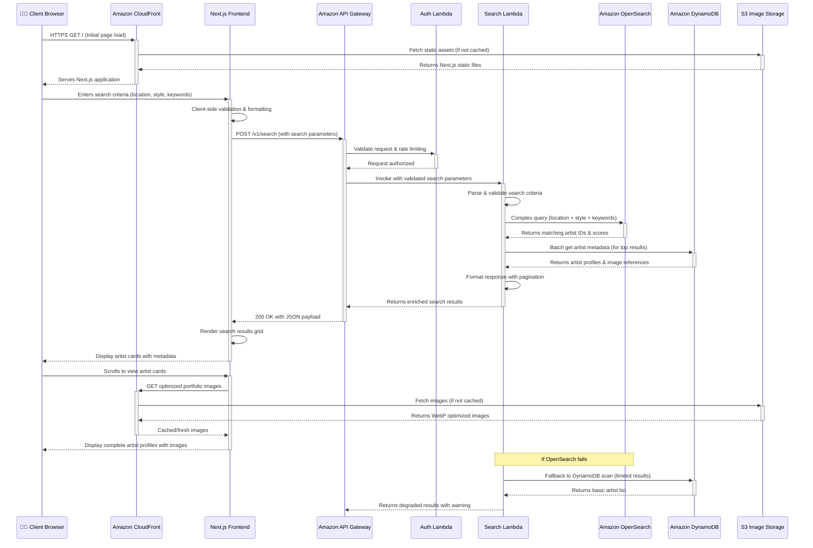

### **User Interaction Sequence Diagram (Search)**

```mermaid
sequenceDiagram
    participant User as 👩‍🎨 Client Browser
    participant CloudFront as Amazon CloudFront
    participant NextJS as Next.js Frontend
    participant APIGW as Amazon API Gateway
    participant AuthLambda as Auth Lambda
    participant SearchLambda as Search Lambda
    participant OpenSearch as Amazon OpenSearch
    participant DynamoDB as Amazon DynamoDB
    participant S3 as S3 Image Storage

    %% Initial page load
    User->>+CloudFront: HTTPS GET / (Initial page load)
    CloudFront->>+S3: Fetch static assets (if not cached)
    S3-->>-CloudFront: Returns Next.js static files
    CloudFront-->>-User: Serves Next.js application
    
    %% User interaction and search
    User->>+NextJS: Enters search criteria (location, style, keywords)
    NextJS->>NextJS: Client-side validation & formatting
    
    %% API authentication and search request
    NextJS->>+APIGW: POST /v1/search (with search parameters)
    APIGW->>+AuthLambda: Validate request & rate limiting
    AuthLambda-->>-APIGW: Request authorized
    APIGW->>+SearchLambda: Invoke with validated search parameters
    
    %% Search execution
    SearchLambda->>SearchLambda: Parse & validate search criteria
    SearchLambda->>+OpenSearch: Complex query (location + style + keywords)
    OpenSearch-->>-SearchLambda: Returns matching artist IDs & scores
    
    %% Enrich results with full artist data
    SearchLambda->>+DynamoDB: Batch get artist metadata (for top results)
    DynamoDB-->>-SearchLambda: Returns artist profiles & image references
    
    %% Return search results
    SearchLambda->>SearchLambda: Format response with pagination
    SearchLambda-->>-APIGW: Returns enriched search results
    APIGW-->>-NextJS: 200 OK with JSON payload
    
    %% Display results and load images
    NextJS->>NextJS: Render search results grid
    NextJS-->>-User: Display artist cards with metadata
    
    %% Lazy load portfolio images
    User->>+NextJS: Scrolls to view artist cards
    NextJS->>+CloudFront: GET optimized portfolio images
    CloudFront->>+S3: Fetch images (if not cached)
    S3-->>-CloudFront: Returns WebP optimized images
    CloudFront-->>-NextJS: Cached/fresh images
    NextJS-->>-User: Display complete artist profiles with images
    
    %% Error handling example
    Note over SearchLambda,OpenSearch: If OpenSearch fails
    SearchLambda->>+DynamoDB: Fallback to DynamoDB scan (limited results)
    DynamoDB-->>-SearchLambda: Returns basic artist list
    SearchLambda-->>APIGW: Returns degraded results with warning
```