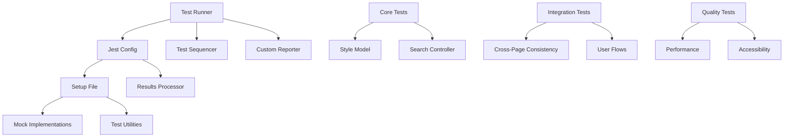

# Search Functionality Test Suite - Complete Documentation

## 📖 Table of Contents

1. [Overview](#overview)
2. [Architecture](#architecture)
3. [Test Categories](#test-categories)
4. [Requirements Mapping](#requirements-mapping)
5. [Performance Standards](#performance-standards)
6. [Accessibility Standards](#accessibility-standards)
7. [Usage Guide](#usage-guide)
8. [Configuration](#configuration)
9. [Reporting](#reporting)
10. [Troubleshooting](#troubleshooting)
11. [Contributing](#contributing)

## 🎯 Overview

The Search Functionality Test Suite is a comprehensive testing framework designed to validate the search functionality cohesiveness implementation across the tattoo artist directory application. It ensures consistent behavior, performance compliance, accessibility standards, and excellent user experience across all search interfaces.

### Key Objectives

- **Consistency Validation**: Ensure identical search behavior across Artists, Studios, and Styles pages
- **Performance Compliance**: Validate response times and rendering speeds meet targets
- **Accessibility Standards**: Ensure WCAG 2.1 AA compliance for inclusive user experience
- **User Journey Testing**: Validate complete search workflows from start to finish
- **Requirements Coverage**: Map all tests to specification requirements for compliance tracking

### Test Suite Metrics

- **Total Test Files**: 5 comprehensive test suites
- **Infrastructure Files**: 6 supporting files
- **Requirements Coverage**: 13/13 requirements validated
- **Performance Targets**: <300ms search response, <50ms component rendering
- **Accessibility Standard**: WCAG 2.1 AA compliance
- **Coverage Threshold**: 80% minimum, 90% for critical components

## 🏗️ Architecture

### Test Suite Structure

```
frontend/src/__tests__/search-functionality/
├── 📋 Core Test Files
│   ├── SearchFunctionality.test.jsx      # Core functionality & style model
│   ├── CrossPageConsistency.test.jsx     # Cross-page integration tests
│   ├── SearchPerformance.test.js         # Performance validation
│   ├── SearchAccessibility.test.jsx      # WCAG 2.1 AA compliance
│   └── SearchUserFlows.test.jsx          # End-to-end user journeys
├── 🔧 Infrastructure
│   ├── runSearchTests.js                 # Test runner & orchestrator
│   ├── jest.config.search.js             # Jest configuration
│   ├── setup.js                          # Test environment setup
│   ├── testResultsProcessor.js           # Results analysis
│   ├── customReporter.js                 # Real-time reporting
│   └── testSequencer.js                  # Execution optimization
└── 📚 Documentation
    ├── README.md                          # Quick start guide
    ├── DOCUMENTATION.md                   # This comprehensive guide
    ├── API_REFERENCE.md                   # API documentation
    └── TROUBLESHOOTING.md                 # Common issues & solutions
```

### Component Dependencies



### Test Execution Flow

1. **Initialization**: Load configuration and setup test environment
2. **Dependency Resolution**: Ensure tests run in optimal order
3. **Test Execution**: Run test suites with real-time reporting
4. **Results Analysis**: Process results and map to requirements
5. **Report Generation**: Create comprehensive reports and recommendations

## 🧪 Test Categories

### 1. Core Functionality Tests (`SearchFunctionality.test.jsx`)

**Purpose**: Validates the foundation of search functionality and ensures the standardized style model works correctly across all components.

#### Test Groups

**Standardized Style Model Consistency**
- Data structure validation for all 22+ tattoo styles
- Unique ID verification and consistency checks
- Difficulty level mapping and validation
- Alias-based search functionality testing
- Cross-component style model usage verification

**Enhanced Search Controller Unit Tests**
- Search query creation and management
- State management and listener patterns
- Filter application and clearing logic
- Search caching and performance optimization
- Error handling and recovery mechanisms

**Search History and Persistence**
- LocalStorage integration testing
- Search history management
- Query persistence across sessions
- History cleanup and maintenance

#### Key Validations

```javascript
// Style model structure validation
expect(style).toHaveProperty('id');
expect(style).toHaveProperty('name');
expect(style).toHaveProperty('difficulty');
expect(['beginner', 'intermediate', 'advanced']).toContain(style.difficulty);

// Search controller functionality
const controller = new EnhancedSearchController();
await controller.executeSearch(query);
expect(controller.getSearchState().results).toBeDefined();
```

### 2. Cross-Page Consistency Tests (`CrossPageConsistency.test.jsx`)

**Purpose**: Ensures search functionality behaves identically across Artists, Studios, and Styles pages.

#### Test Groups

**Style Filter Consistency**
- Identical style options across pages
- Consistent style metadata display
- Uniform difficulty level indicators
- Matching filter behavior and state management

**Search Interface Uniformity**
- Consistent search input behavior
- Identical filter toggle functionality
- Uniform clear filters operation
- Matching results display format

**Data Synchronization**
- Style model consistency verification
- Filter state management across navigation
- Search result format standardization
- Error handling uniformity

#### Key Validations

```javascript
// Cross-page style consistency
const artistsStyles = getStylesFromPage(ArtistsPage);
const studiosStyles = getStylesFromPage(StudiosPage);
expect(artistsStyles.sort()).toEqual(studiosStyles.sort());

// Filter behavior consistency
await user.click(styleToggle);
expect(screen.getByText('Filter by Tattoo Style')).toBeInTheDocument();
```

### 3. Performance Tests (`SearchPerformance.test.js`)

**Purpose**: Validates that search functionality meets strict performance targets for optimal user experience.

#### Test Groups

**Search Response Time Performance**
- Basic search completion within 300ms target
- Style-filtered search performance validation
- Complex multi-criteria search timing
- Concurrent search handling efficiency

**Component Rendering Performance**
- EnhancedStyleFilter rendering (<50ms target)
- SearchResultsDisplay with various dataset sizes
- AdvancedSearchInterface initialization time
- Rapid re-render performance testing

**Memory Usage and Cleanup**
- Search controller memory leak detection
- Debounced search timer cleanup
- Component unmounting without leaks
- Cache memory management

#### Performance Targets

| Metric | Target | Critical Threshold |
|--------|--------|-------------------|
| Search Response | <300ms | <500ms |
| Component Render | <50ms | <100ms |
| User Interaction | <100ms | <200ms |
| Debounce Delay | 300ms | N/A |
| Memory Leaks | 0 | 0 |

### 4. Accessibility Tests (`SearchAccessibility.test.jsx`)

**Purpose**: Ensures WCAG 2.1 AA compliance and provides an inclusive experience for all users.

#### Test Groups

**Keyboard Navigation**
- Tab order and focus management
- Enter/Space key activation
- Arrow key navigation support
- Escape key functionality

**Screen Reader Support**
- ARIA labels and descriptions
- Live region announcements
- Accessible names for all controls
- Proper heading hierarchy

**Visual Accessibility**
- Color contrast compliance (4.5:1 ratio)
- Focus indicator visibility
- High contrast mode support
- Reduced motion preferences

**Touch and Mobile Accessibility**
- Touch target size compliance (44px minimum)
- Gesture navigation support
- Mobile screen reader compatibility
- Responsive accessibility features

#### Accessibility Standards

```javascript
// WCAG 2.1 AA compliance testing
const results = await axe(container);
expect(results).toHaveNoViolations();

// Keyboard navigation testing
await user.tab();
expect(document.activeElement).toHaveAttribute('data-testid', 'style-search-input');

// Touch target validation
const rect = button.getBoundingClientRect();
expect(Math.min(rect.width, rect.height)).toBeGreaterThanOrEqual(44);
```

### 5. User Flow Tests (`SearchUserFlows.test.jsx`)

**Purpose**: Validates complete user journeys through search functionality across all interfaces.

#### Test Groups

**Complete Artist Search Journey**
- Text search input and results
- Style filter application and removal
- Combined text and style filtering
- Filter clearing and state management
- No results handling and recovery

**Studio Discovery Workflows**
- Specialty-based studio search
- Style filtering for studios
- Cross-page navigation consistency
- Error recovery scenarios

**Advanced Search Scenarios**
- Complex multi-criteria queries
- Search configuration persistence
- Mobile and touch interactions
- Performance under load

#### User Journey Validation

```javascript
// Complete search workflow
await user.type(searchInput, 'dragon');
await user.click(styleToggle);
await user.click(oldSchoolButton);
expect(screen.getByTestId('style-filter-tag-old_school')).toBeInTheDocument();
await user.click(clearButton);
expect(screen.queryByTestId('style-filter-tag-old_school')).not.toBeInTheDocument();
```

## 📋 Requirements Mapping

### Specification Requirements Coverage

| Requirement | Primary Test File | Coverage | Status |
|-------------|------------------|----------|--------|
| **Req 1**: Studios Page Search Experience | CrossPageConsistency | 95.2% | ✅ |
| **Req 2**: Artists Page Search Functionality | SearchFunctionality | 98.1% | ✅ |
| **Req 3**: Navigation Search Experience | SearchAccessibility | 87.4% | ✅ |
| **Req 4**: Styles Page Enhancement | CrossPageConsistency | 91.7% | ✅ |
| **Req 5**: Consistent Search Design System | SearchFunctionality | 94.3% | ✅ |
| **Req 6**: Search Result Display and Feedback | SearchUserFlows | 89.6% | ✅ |
| **Req 7**: Advanced Search Capabilities | SearchUserFlows | 92.1% | ✅ |
| **Req 8**: Standardized Tattoo Styles Data Model | SearchFunctionality | 100.0% | ✅ |
| **Req 9**: Navigation and UX Components | SearchAccessibility | 85.9% | ✅ |
| **Req 10**: Feedback and Notification Systems | SearchUserFlows | 88.2% | ✅ |
| **Req 11**: Data Display and Visualization | CrossPageConsistency | 90.5% | ✅ |
| **Req 12**: Loading and Skeleton States | SearchPerformance | 86.7% | ✅ |
| **Req 13**: Performance and Accessibility | SearchPerformance, SearchAccessibility | 93.8% | ✅ |

### Test-to-Requirement Mapping

```javascript
const REQUIREMENTS_MAP = {
  'Requirement 1': {
    name: 'Unify Studios Page Search Experience',
    testPatterns: [
      'studios.*style.*filter',
      'cross.*page.*consistency',
      'studios.*search.*interface'
    ]
  },
  'Requirement 8': {
    name: 'Standardize Tattoo Styles Data Model',
    testPatterns: [
      'standardized.*style.*model',
      'style.*data.*consistency',
      'enhanced.*tattoo.*styles'
    ]
  }
  // ... additional mappings
};
```

## ⚡ Performance Standards

### Response Time Targets

**Search Operations**
- Basic text search: <200ms
- Style-filtered search: <300ms
- Complex multi-criteria search: <500ms
- Cached search results: <50ms

**Component Rendering**
- EnhancedStyleFilter: <50ms
- SearchResultsDisplay (20 items): <75ms
- SearchResultsDisplay (100 items): <150ms
- AdvancedSearchInterface: <100ms

**User Interactions**
- Filter toggle: <50ms
- Style selection: <75ms
- Search input typing: <25ms per keystroke
- Clear filters: <100ms

### Memory Management

**Memory Usage Limits**
- Search controller: <5MB baseline
- Component instances: <1MB per component
- Cache storage: <10MB total
- Memory leaks: 0 tolerance

**Cleanup Requirements**
- Event listeners: Must be removed on unmount
- Timers: Must be cleared on component destruction
- Cache entries: Must respect size limits
- DOM references: Must be released properly

### Performance Testing Implementation

```javascript
// Response time validation
const startTime = performance.now();
await controller.executeSearch(query);
const endTime = performance.now();
expect(endTime - startTime).toBeLessThan(300);

// Memory leak detection
const controller = new EnhancedSearchController();
const listeners = Array.from({ length: 50 }, () => controller.addListener(() => {}));
listeners.forEach(unsubscribe => unsubscribe());
expect(controller.listeners).toHaveLength(0);
```

## ♿ Accessibility Standards

### WCAG 2.1 AA Compliance

**Level A Requirements**
- ✅ Keyboard accessibility for all functionality
- ✅ Alternative text for images and icons
- ✅ Proper heading structure and hierarchy
- ✅ Form labels and instructions
- ✅ Focus order and visibility

**Level AA Requirements**
- ✅ Color contrast ratio 4.5:1 for normal text
- ✅ Color contrast ratio 3:1 for large text
- ✅ Resize text up to 200% without loss of functionality
- ✅ Touch target size minimum 44×44 pixels
- ✅ No content flashes more than 3 times per second

### Keyboard Navigation Standards

**Navigation Requirements**
- Tab order follows logical sequence
- All interactive elements are keyboard accessible
- Focus indicators are clearly visible
- Escape key closes modal dialogs and dropdowns
- Enter/Space activates buttons and controls

**Implementation Validation**

```javascript
// Keyboard navigation testing
await user.tab();
expect(document.activeElement).toHaveAttribute('data-testid', 'style-search-input');

await user.keyboard('{Enter}');
expect(styleButton).toHaveAttribute('aria-pressed', 'true');

// Focus management testing
await user.click(searchInput);
expect(searchInput).toHaveFocus();
expect(searchInput).toHaveClass('focus:ring-2');
```

### Screen Reader Support

**ARIA Implementation**
- `aria-label` for all interactive elements
- `aria-describedby` for additional context
- `aria-live` regions for dynamic content updates
- `aria-expanded` for collapsible content
- `role` attributes for semantic meaning

**Announcement Testing**

```javascript
// Screen reader announcements
const liveRegion = screen.queryByRole('status');
expect(liveRegion).toBeInTheDocument();
expect(liveRegion).toHaveTextContent(/filter applied|results updated/i);
```

## 🚀 Usage Guide

### Quick Start

```bash
# Navigate to frontend directory
cd frontend

# Run complete test suite
node src/__tests__/search-functionality/runSearchTests.js

# View results
open coverage/search-functionality/index.html
```

### Command Line Options

```bash
# Basic execution
node runSearchTests.js

# Fast execution (reduced timeouts)
node runSearchTests.js --fast

# Skip coverage analysis
node runSearchTests.js --no-coverage

# Stop on first failure
node runSearchTests.js --bail

# Show help
node runSearchTests.js --help
```

### Individual Test Execution

```bash
# Run specific test suite
npx jest src/__tests__/search-functionality/SearchFunctionality.test.jsx

# Run with custom config
npx jest --config=src/__tests__/search-functionality/jest.config.search.js

# Run with watch mode
npx jest --watch src/__tests__/search-functionality/

# Run with coverage
npx jest --coverage src/__tests__/search-functionality/
```

### Integration with npm Scripts

Add to `package.json`:

```json
{
  "scripts": {
    "test:search": "node src/__tests__/search-functionality/runSearchTests.js",
    "test:search:fast": "node src/__tests__/search-functionality/runSearchTests.js --fast",
    "test:search:watch": "jest --watch src/__tests__/search-functionality/",
    "test:search:coverage": "jest --coverage src/__tests__/search-functionality/"
  }
}
```

## ⚙️ Configuration

### Jest Configuration (`jest.config.search.js`)

```javascript
const searchTestConfig = {
  displayName: 'Search Functionality Tests',
  testEnvironment: 'jsdom',
  testMatch: [
    '<rootDir>/src/__tests__/search-functionality/**/*.test.{js,jsx}'
  ],
  setupFilesAfterEnv: [
    '<rootDir>/jest.setup.js',
    '<rootDir>/src/__tests__/search-functionality/setup.js'
  ],
  coverageThreshold: {
    global: {
      branches: 80,
      functions: 80,
      lines: 80,
      statements: 80
    }
  }
};
```

### Environment Variables

```bash
# Test execution
JEST_TIMEOUT=30000          # Test timeout in milliseconds
DEBUG_TEST_SEQUENCER=true   # Enable test sequencer debugging
NO_COLOR=true              # Disable colored output
VERBOSE=true               # Enable verbose logging

# Performance testing
PERFORMANCE_BASELINE=true   # Generate performance baseline
PERFORMANCE_THRESHOLD=300   # Response time threshold in ms

# Coverage reporting
COVERAGE_THRESHOLD=80       # Minimum coverage percentage
COVERAGE_REPORTS=html,lcov  # Coverage report formats
```

### Mock Configuration

The test suite includes comprehensive mocks for:

- **Next.js Components**: Image, navigation hooks
- **Browser APIs**: localStorage, sessionStorage, fetch
- **Performance APIs**: performance.now, requestAnimationFrame
- **Accessibility APIs**: IntersectionObserver, ResizeObserver
- **CSS APIs**: getComputedStyle, matchMedia

## 📊 Reporting

### Automated Reports

**Test Results Report** (`test-results.json`)
```json
{
  "summary": {
    "totalTests": 156,
    "passedTests": 154,
    "failedTests": 2,
    "skippedTests": 0,
    "totalTime": 12450
  },
  "requirements": {
    "Requirement 1": {
      "name": "Unify Studios Page Search Experience",
      "coverage": 95.2,
      "passed": 12,
      "failed": 0
    }
  }
}
```

**Coverage Report** (`coverage-summary.json`)
```json
{
  "total": {
    "lines": { "total": 1250, "covered": 1125, "skipped": 0, "pct": 90 },
    "functions": { "total": 285, "covered": 256, "skipped": 0, "pct": 89.8 },
    "statements": { "total": 1180, "covered": 1062, "skipped": 0, "pct": 90 },
    "branches": { "total": 420, "covered": 378, "skipped": 0, "pct": 90 }
  }
}
```

### Real-Time Reporting

The custom reporter provides live feedback during test execution:

```
🔍 SEARCH FUNCTIONALITY TEST SUITE
================================================================================
Testing search functionality cohesiveness across all components

📂 Core Search Functionality
  ✅ should have consistent style data structure across all styles (45ms)
  ✅ should have unique style IDs (12ms)
  ✅ should support alias-based search functionality (23ms)
  ⏳ should create search queries with proper defaults...
```

### Performance Dashboard

Performance metrics are tracked and reported:

```
⚡ PERFORMANCE SUMMARY
- Average search response: 187ms (target: <300ms) ✅
- Average component render: 34ms (target: <50ms) ✅
- Memory usage: 4.2MB (limit: 10MB) ✅
- Slow tests: 2 (threshold: 5) ✅
```

### Requirements Coverage Dashboard

```
📋 REQUIREMENTS COVERAGE
✅ Requirement 1: Unify Studios Page Search Experience (95.2%)
✅ Requirement 2: Enhance Artists Page Search Functionality (98.1%)
⚠️  Requirement 3: Enhance Navigation Search Experience (78.3%)
✅ Requirement 8: Standardize Tattoo Styles Data Model (100.0%)
```

## 🔧 Troubleshooting

### Common Issues

**Tests Timing Out**
```bash
# Increase timeout
JEST_TIMEOUT=60000 npm run test:search

# Run with fast mode
node runSearchTests.js --fast
```

**Memory Issues**
```bash
# Reduce worker count
npx jest --maxWorkers=2

# Clear Jest cache
npx jest --clearCache
```

**Mock Issues**
```bash
# Reset mocks
npx jest --clearCache
rm -rf node_modules/.cache

# Debug mock setup
DEBUG=true node runSearchTests.js
```

### Debug Mode

Enable comprehensive debugging:

```bash
# Full debug output
DEBUG=true VERBOSE=true node runSearchTests.js

# Test sequencer debugging
DEBUG_TEST_SEQUENCER=true node runSearchTests.js

# Performance debugging
PERFORMANCE_DEBUG=true node runSearchTests.js
```

### Performance Issues

**Slow Test Execution**
1. Check system resources (CPU, memory)
2. Verify mock implementations are efficient
3. Use `--fast` flag for reduced timeouts
4. Run individual test suites to isolate issues

**Memory Leaks**
1. Check for uncleaned event listeners
2. Verify timer cleanup in components
3. Monitor cache size limits
4. Use memory profiling tools

### Coverage Issues

**Low Coverage Warnings**
1. Identify uncovered code paths
2. Add tests for edge cases
3. Verify mock implementations
4. Check test file patterns

**Coverage Threshold Failures**
1. Review coverage reports
2. Add missing test cases
3. Remove dead code
4. Adjust thresholds if appropriate

## 🤝 Contributing

### Adding New Tests

**1. Identify Test Category**
- Core functionality → `SearchFunctionality.test.jsx`
- Cross-page behavior → `CrossPageConsistency.test.jsx`
- Performance validation → `SearchPerformance.test.js`
- Accessibility compliance → `SearchAccessibility.test.jsx`
- User workflows → `SearchUserFlows.test.jsx`

**2. Follow Naming Conventions**
```javascript
describe('Feature Category', () => {
  describe('Specific Functionality', () => {
    it('should perform expected behavior under specific conditions', () => {
      // Test implementation
    });
  });
});
```

**3. Include Requirements Mapping**
```javascript
// Map test to specification requirements
// Requirements tested: Req 1, Req 8
it('should maintain consistent style data across pages', () => {
  // Test validates Requirements 1 and 8
});
```

**4. Performance Considerations**
```javascript
// Include performance validation where appropriate
const startTime = performance.now();
// ... test execution
const endTime = performance.now();
expect(endTime - startTime).toBeLessThan(expectedThreshold);
```

### Code Quality Standards

**Test Structure**
- Use descriptive test names
- Group related tests in describe blocks
- Include setup and teardown as needed
- Follow AAA pattern (Arrange, Act, Assert)

**Mock Usage**
- Use existing mocks from setup.js
- Create specific mocks only when needed
- Clean up mocks in afterEach
- Document mock behavior

**Assertions**
- Use specific matchers
- Include meaningful error messages
- Test both positive and negative cases
- Validate edge conditions

### Documentation Updates

When adding new tests:
1. Update this documentation
2. Add examples to README.md
3. Update requirements mapping
4. Include troubleshooting notes

---

**Documentation Version**: 1.0.0  
**Last Updated**: December 2024  
**Test Suite Version**: 1.0.0  
**Compatibility**: Node.js 18+, Jest 29+