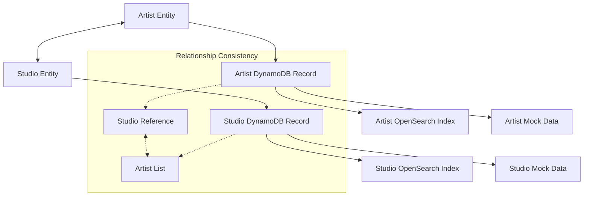
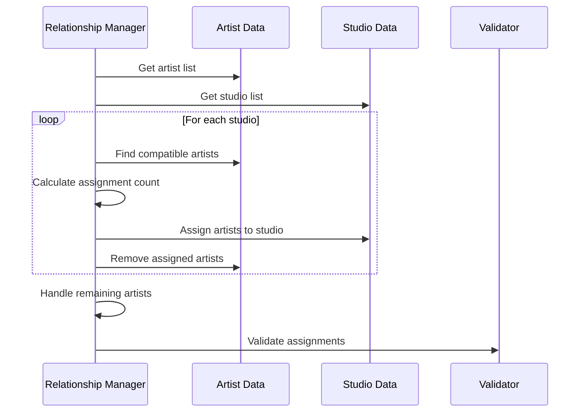
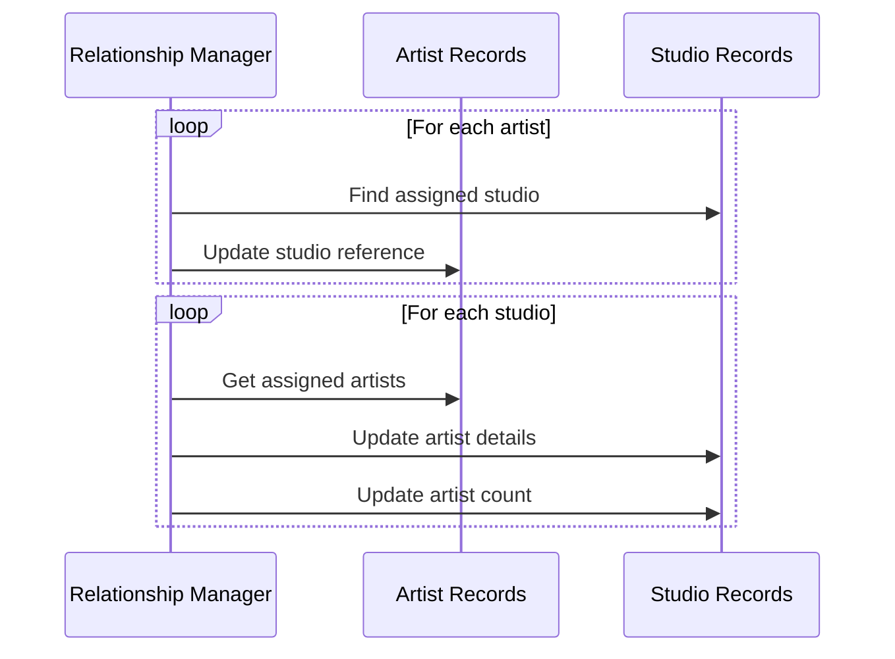
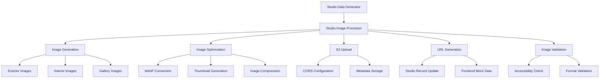

# Studio-Artist Relationship Management

## Overview

The Studio-Artist Relationship Management system maintains bidirectional relationships between artists and studios throughout the data pipeline. This system ensures data consistency, handles relationship creation and updates, and provides validation and repair mechanisms for relationship integrity.

## Relationship Architecture

### Bidirectional Relationship Model



### Relationship Data Structure

#### Artist Side (Studio Reference)

```javascript
// Artist record with studio relationship
{
  artistId: "artist-001",
  artistName: "Sarah Mitchell",
  // ... other artist fields ...

  // Studio relationship
  tattooStudio: {
    studioId: "studio-001",
    studioName: "Ink & Steel Studio",
    address: {
      street: "123 Brick Lane, Shoreditch, London E1 6SB",
      city: "London",
      postcode: "E1 6SB",
      latitude: 51.5225,
      longitude: -0.0786
    }
  }
}
```

#### Studio Side (Artist References)

```javascript
// Studio record with artist relationships
{
  studioId: "studio-001",
  studioName: "Ink & Steel Studio",
  // ... other studio fields ...

  // Artist relationships
  artists: ["artist-001", "artist-002", "artist-003"],
  artistCount: 3,
  artistDetails: [
    {
      artistId: "artist-001",
      artistName: "Sarah Mitchell",
      styles: ["traditional", "neo_traditional"],
      rating: 4.8
    },
    {
      artistId: "artist-002",
      artistName: "James Wilson",
      styles: ["realism", "portrait"],
      rating: 4.6
    }
  ]
}
```

## Relationship Management Components

### 1. Artist-Studio Relationship Manager

```javascript
class ArtistStudioRelationshipManager {
  constructor(config) {
    this.config = config;
    this.validator = new RelationshipValidator();
  }

  /**
   * Create bidirectional relationships between artists and studios
   */
  async createBidirectionalRelationships(artists, studios) {
    console.log("🔗 Creating bidirectional artist-studio relationships...");

    const updatedArtists = [...artists];
    const updatedStudios = [...studios];

    // Phase 1: Assign artists to studios
    await this.assignArtistsToStudios(updatedArtists, updatedStudios);

    // Phase 2: Update artist records with studio information
    await this.updateArtistStudioReferences(updatedArtists, updatedStudios);

    // Phase 3: Update studio records with artist information
    await this.updateStudioArtistReferences(updatedStudios, updatedArtists);

    // Phase 4: Validate relationship consistency
    await this.validateRelationships(updatedArtists, updatedStudios);

    console.log("✅ Bidirectional relationships created and validated");
    return { artists: updatedArtists, studios: updatedStudios };
  }

  /**
   * Assign artists to studios based on compatibility
   */
  async assignArtistsToStudios(artists, studios) {
    const unassignedArtists = [...artists];

    for (const studio of studios) {
      // Find compatible artists for this studio
      const compatibleArtists = this.findCompatibleArtists(
        studio,
        unassignedArtists
      );

      // Determine how many artists to assign
      const targetCount = this.calculateArtistCount(
        studio,
        compatibleArtists.length
      );
      const artistsToAssign = compatibleArtists.slice(0, targetCount);

      // Assign artists to studio
      studio.artists = artistsToAssign.map((artist) => artist.artistId);
      studio.artistCount = artistsToAssign.length;

      // Update studio specialties based on assigned artists
      studio.specialties = this.calculateStudioSpecialties(artistsToAssign);

      // Remove assigned artists from unassigned list
      artistsToAssign.forEach((artist) => {
        const index = unassignedArtists.findIndex(
          (a) => a.artistId === artist.artistId
        );
        if (index > -1) unassignedArtists.splice(index, 1);
      });
    }

    // Handle remaining unassigned artists
    await this.assignRemainingArtists(studios, unassignedArtists);
  }

  /**
   * Find artists compatible with a studio
   */
  findCompatibleArtists(studio, availableArtists) {
    return availableArtists.filter((artist) => {
      // Geographic compatibility
      const geographicMatch = this.checkGeographicCompatibility(artist, studio);

      // Style compatibility
      const styleMatch = this.checkStyleCompatibility(artist, studio);

      // Rating compatibility
      const ratingMatch = this.checkRatingCompatibility(artist, studio);

      return geographicMatch && (styleMatch || ratingMatch);
    });
  }

  /**
   * Check geographic compatibility between artist and studio
   */
  checkGeographicCompatibility(artist, studio) {
    // Extract city from location strings
    const artistCity = this.extractCity(artist.location);
    const studioCity = this.extractCity(studio.locationDisplay);

    // Same city is highly compatible
    if (artistCity === studioCity) return true;

    // Major UK cities are compatible with each other
    const majorCities = [
      "London",
      "Manchester",
      "Birmingham",
      "Liverpool",
      "Leeds",
    ];
    if (majorCities.includes(artistCity) && majorCities.includes(studioCity)) {
      return true;
    }

    return false;
  }

  /**
   * Check style compatibility between artist and studio
   */
  checkStyleCompatibility(artist, studio) {
    if (!artist.styles || !studio.specialties) return true;

    // Check for overlapping styles
    const artistStyles = Array.isArray(artist.styles)
      ? artist.styles
      : [artist.styles];
    const studioSpecialties = Array.isArray(studio.specialties)
      ? studio.specialties
      : [studio.specialties];

    return artistStyles.some((style) => studioSpecialties.includes(style));
  }

  /**
   * Update artist records with studio references
   */
  async updateArtistStudioReferences(artists, studios) {
    for (const artist of artists) {
      // Find the studio this artist is assigned to
      const studio = studios.find((s) => s.artists.includes(artist.artistId));

      if (studio) {
        artist.tattooStudio = {
          studioId: studio.studioId,
          studioName: studio.studioName,
          address: {
            street: studio.address,
            city: studio.locationDisplay.split(",")[0].trim(),
            postcode: studio.postcode,
            latitude: studio.latitude,
            longitude: studio.longitude,
          },
        };
      }
    }
  }

  /**
   * Update studio records with artist details
   */
  async updateStudioArtistReferences(studios, artists) {
    for (const studio of studios) {
      const studioArtists = artists.filter((a) =>
        studio.artists.includes(a.artistId)
      );

      studio.artistDetails = studioArtists.map((artist) => ({
        artistId: artist.artistId,
        artistName: artist.artistName,
        styles: artist.styles || [],
        rating: artist.rating || 4.0,
      }));

      // Update artist count
      studio.artistCount = studioArtists.length;
    }
  }
}
```

### 2. Relationship Validator

```javascript
class RelationshipValidator {
  /**
   * Validate bidirectional relationship consistency
   */
  async validateRelationships(artists, studios) {
    const errors = [];
    const warnings = [];

    // Validate artist → studio references
    for (const artist of artists) {
      if (artist.tattooStudio) {
        const studio = studios.find(
          (s) => s.studioId === artist.tattooStudio.studioId
        );

        if (!studio) {
          errors.push(
            `Artist ${artist.artistId} references non-existent studio ${artist.tattooStudio.studioId}`
          );
        } else if (!studio.artists.includes(artist.artistId)) {
          errors.push(
            `Studio ${studio.studioId} doesn't list artist ${artist.artistId} in its artists array`
          );
        } else {
          // Validate studio information consistency
          if (artist.tattooStudio.studioName !== studio.studioName) {
            warnings.push(
              `Artist ${artist.artistId} has outdated studio name reference`
            );
          }
        }
      }
    }

    // Validate studio → artist references
    for (const studio of studios) {
      for (const artistId of studio.artists) {
        const artist = artists.find((a) => a.artistId === artistId);

        if (!artist) {
          errors.push(
            `Studio ${studio.studioId} references non-existent artist ${artistId}`
          );
        } else if (
          !artist.tattooStudio ||
          artist.tattooStudio.studioId !== studio.studioId
        ) {
          errors.push(
            `Artist ${artistId} doesn't reference studio ${studio.studioId} correctly`
          );
        }
      }

      // Validate artist count consistency
      if (studio.artistCount !== studio.artists.length) {
        warnings.push(
          `Studio ${studio.studioId} artist count mismatch: ${studio.artistCount} vs ${studio.artists.length}`
        );
      }
    }

    if (errors.length > 0) {
      throw new Error(`Relationship validation failed: ${errors.join("; ")}`);
    }

    if (warnings.length > 0) {
      console.warn(`⚠️  Relationship warnings: ${warnings.join("; ")}`);
    }

    return { valid: true, errors, warnings };
  }

  /**
   * Validate relationship data integrity
   */
  async validateRelationshipIntegrity(artists, studios) {
    const issues = {
      orphanedArtists: [],
      emptyStudios: [],
      duplicateAssignments: [],
      missingReferences: [],
    };

    // Find orphaned artists (not assigned to any studio)
    const assignedArtistIds = new Set();
    studios.forEach((studio) => {
      studio.artists.forEach((artistId) => assignedArtistIds.add(artistId));
    });

    artists.forEach((artist) => {
      if (!assignedArtistIds.has(artist.artistId)) {
        issues.orphanedArtists.push(artist.artistId);
      }
    });

    // Find empty studios (no artists assigned)
    studios.forEach((studio) => {
      if (!studio.artists || studio.artists.length === 0) {
        issues.emptyStudios.push(studio.studioId);
      }
    });

    // Find duplicate assignments
    const allAssignments = [];
    studios.forEach((studio) => {
      studio.artists.forEach((artistId) => {
        if (allAssignments.includes(artistId)) {
          issues.duplicateAssignments.push(artistId);
        } else {
          allAssignments.push(artistId);
        }
      });
    });

    return issues;
  }
}
```

### 3. Relationship Repair System

```javascript
class RelationshipRepairSystem {
  constructor(relationshipManager) {
    this.relationshipManager = relationshipManager;
    this.validator = new RelationshipValidator();
  }

  /**
   * Repair broken or inconsistent relationships
   */
  async repairRelationships(artists, studios) {
    console.log("🔧 Repairing artist-studio relationships...");

    const repairResults = {
      repaired: 0,
      orphansAssigned: 0,
      emptyStudiosPopulated: 0,
      duplicatesResolved: 0,
    };

    // Step 1: Identify issues
    const issues = await this.validator.validateRelationshipIntegrity(
      artists,
      studios
    );

    // Step 2: Repair orphaned artists
    if (issues.orphanedArtists.length > 0) {
      await this.assignOrphanedArtists(
        artists,
        studios,
        issues.orphanedArtists
      );
      repairResults.orphansAssigned = issues.orphanedArtists.length;
    }

    // Step 3: Populate empty studios
    if (issues.emptyStudios.length > 0) {
      await this.populateEmptyStudios(artists, studios, issues.emptyStudios);
      repairResults.emptyStudiosPopulated = issues.emptyStudios.length;
    }

    // Step 4: Resolve duplicate assignments
    if (issues.duplicateAssignments.length > 0) {
      await this.resolveDuplicateAssignments(
        artists,
        studios,
        issues.duplicateAssignments
      );
      repairResults.duplicatesResolved = issues.duplicateAssignments.length;
    }

    // Step 5: Update references
    await this.relationshipManager.updateArtistStudioReferences(
      artists,
      studios
    );
    await this.relationshipManager.updateStudioArtistReferences(
      studios,
      artists
    );

    // Step 6: Validate repairs
    await this.validator.validateRelationships(artists, studios);

    console.log("✅ Relationship repairs completed:", repairResults);
    return repairResults;
  }

  /**
   * Assign orphaned artists to compatible studios
   */
  async assignOrphanedArtists(artists, studios, orphanedArtistIds) {
    const orphanedArtists = artists.filter((a) =>
      orphanedArtistIds.includes(a.artistId)
    );

    for (const artist of orphanedArtists) {
      // Find the most compatible studio
      const compatibleStudios = studios.filter((studio) => {
        return (
          this.relationshipManager.checkGeographicCompatibility(
            artist,
            studio
          ) &&
          studio.artists.length <
            this.relationshipManager.config.studio.generation
              .maxArtistsPerStudio
        );
      });

      if (compatibleStudios.length > 0) {
        // Choose studio with fewest artists
        const targetStudio = compatibleStudios.reduce((min, studio) =>
          studio.artists.length < min.artists.length ? studio : min
        );

        // Assign artist to studio
        targetStudio.artists.push(artist.artistId);
        targetStudio.artistCount = targetStudio.artists.length;
      }
    }
  }

  /**
   * Populate empty studios with compatible artists
   */
  async populateEmptyStudios(artists, studios, emptyStudioIds) {
    const emptyStudios = studios.filter((s) =>
      emptyStudioIds.includes(s.studioId)
    );

    for (const studio of emptyStudios) {
      // Find unassigned or lightly assigned artists
      const availableArtists = artists.filter((artist) => {
        const currentStudio = studios.find((s) =>
          s.artists.includes(artist.artistId)
        );
        return !currentStudio || currentStudio.artists.length > 2;
      });

      // Find compatible artists
      const compatibleArtists = this.relationshipManager.findCompatibleArtists(
        studio,
        availableArtists
      );

      if (compatibleArtists.length > 0) {
        // Assign at least one artist
        const artistToAssign = compatibleArtists[0];

        // Remove from previous studio if necessary
        const previousStudio = studios.find((s) =>
          s.artists.includes(artistToAssign.artistId)
        );
        if (previousStudio) {
          previousStudio.artists = previousStudio.artists.filter(
            (id) => id !== artistToAssign.artistId
          );
          previousStudio.artistCount = previousStudio.artists.length;
        }

        // Assign to empty studio
        studio.artists.push(artistToAssign.artistId);
        studio.artistCount = 1;
      }
    }
  }
}
```

## Relationship Creation Workflow

### 1. Initial Assignment Phase



### 2. Reference Update Phase



## Compatibility Algorithms

### Geographic Compatibility

```javascript
class GeographicCompatibility {
  static checkCompatibility(artist, studio) {
    const artistLocation = this.parseLocation(artist.location);
    const studioLocation = this.parseLocation(studio.locationDisplay);

    // Same city - highest compatibility
    if (artistLocation.city === studioLocation.city) {
      return { compatible: true, score: 1.0, reason: "same_city" };
    }

    // Same region - medium compatibility
    if (artistLocation.region === studioLocation.region) {
      return { compatible: true, score: 0.7, reason: "same_region" };
    }

    // Major cities - low compatibility
    const majorCities = [
      "London",
      "Manchester",
      "Birmingham",
      "Liverpool",
      "Leeds",
    ];
    if (
      majorCities.includes(artistLocation.city) &&
      majorCities.includes(studioLocation.city)
    ) {
      return { compatible: true, score: 0.4, reason: "major_cities" };
    }

    return { compatible: false, score: 0.0, reason: "incompatible_location" };
  }

  static parseLocation(locationString) {
    // Parse "Shoreditch, London, UK" format
    const parts = locationString.split(",").map((s) => s.trim());
    return {
      area: parts[0] || "",
      city: parts[1] || "",
      country: parts[2] || "",
      region: this.getRegion(parts[1] || ""),
    };
  }

  static getRegion(city) {
    const regions = {
      London: "South East",
      Manchester: "North West",
      Birmingham: "West Midlands",
      Liverpool: "North West",
      Leeds: "Yorkshire",
    };
    return regions[city] || "Unknown";
  }
}
```

### Style Compatibility

```javascript
class StyleCompatibility {
  static checkCompatibility(artist, studio) {
    const artistStyles = Array.isArray(artist.styles)
      ? artist.styles
      : [artist.styles];
    const studioSpecialties = Array.isArray(studio.specialties)
      ? studio.specialties
      : [studio.specialties];

    // Calculate overlap
    const overlap = artistStyles.filter((style) =>
      studioSpecialties.includes(style)
    );
    const overlapRatio = overlap.length / Math.max(artistStyles.length, 1);

    // Style compatibility matrix
    const compatibilityMatrix = {
      traditional: ["neo_traditional", "american_traditional"],
      realism: ["portrait", "black_and_grey"],
      geometric: ["dotwork", "linework"],
      watercolour: ["abstract", "artistic"],
    };

    // Check for related styles
    let relatedMatches = 0;
    artistStyles.forEach((artistStyle) => {
      const relatedStyles = compatibilityMatrix[artistStyle] || [];
      relatedMatches += studioSpecialties.filter((specialty) =>
        relatedStyles.includes(specialty)
      ).length;
    });

    const relatedRatio = relatedMatches / Math.max(artistStyles.length, 1);
    const totalScore = overlapRatio + relatedRatio * 0.5;

    return {
      compatible: totalScore > 0.3,
      score: Math.min(totalScore, 1.0),
      exactMatches: overlap.length,
      relatedMatches: relatedMatches,
      reason:
        totalScore > 0.7
          ? "high_compatibility"
          : totalScore > 0.3
          ? "medium_compatibility"
          : "low_compatibility",
    };
  }
}
```

## Relationship Validation Rules

### Consistency Rules

1. **Bidirectional Reference**: Every artist-studio reference must be bidirectional
2. **Unique Assignment**: Each artist can only be assigned to one studio
3. **Valid References**: All references must point to existing entities
4. **Count Consistency**: Studio artist counts must match artist list lengths
5. **Data Consistency**: Studio information in artist records must be current

### Validation Implementation

```javascript
class RelationshipValidationRules {
  static async validateBidirectionalConsistency(artists, studios) {
    const errors = [];

    // Rule 1: Artist → Studio references must be valid
    artists.forEach((artist) => {
      if (artist.tattooStudio) {
        const studio = studios.find(
          (s) => s.studioId === artist.tattooStudio.studioId
        );
        if (!studio) {
          errors.push(
            `INVALID_STUDIO_REFERENCE: Artist ${artist.artistId} → Studio ${artist.tattooStudio.studioId}`
          );
        } else if (!studio.artists.includes(artist.artistId)) {
          errors.push(
            `MISSING_REVERSE_REFERENCE: Studio ${studio.studioId} missing artist ${artist.artistId}`
          );
        }
      }
    });

    // Rule 2: Studio → Artist references must be valid
    studios.forEach((studio) => {
      studio.artists.forEach((artistId) => {
        const artist = artists.find((a) => a.artistId === artistId);
        if (!artist) {
          errors.push(
            `INVALID_ARTIST_REFERENCE: Studio ${studio.studioId} → Artist ${artistId}`
          );
        } else if (
          !artist.tattooStudio ||
          artist.tattooStudio.studioId !== studio.studioId
        ) {
          errors.push(
            `MISSING_REVERSE_REFERENCE: Artist ${artistId} missing studio ${studio.studioId}`
          );
        }
      });
    });

    return errors;
  }

  static async validateDataConsistency(artists, studios) {
    const warnings = [];

    artists.forEach((artist) => {
      if (artist.tattooStudio) {
        const studio = studios.find(
          (s) => s.studioId === artist.tattooStudio.studioId
        );
        if (studio) {
          // Check name consistency
          if (artist.tattooStudio.studioName !== studio.studioName) {
            warnings.push(
              `OUTDATED_STUDIO_NAME: Artist ${artist.artistId} has outdated studio name`
            );
          }

          // Check address consistency
          if (artist.tattooStudio.address.postcode !== studio.postcode) {
            warnings.push(
              `OUTDATED_STUDIO_ADDRESS: Artist ${artist.artistId} has outdated studio address`
            );
          }
        }
      }
    });

    return warnings;
  }
}
```

## CLI Integration

### Relationship Management Commands

```bash
# Validate all relationships
npm run manage-studio-relationships validate

# Repair broken relationships
npm run manage-studio-relationships repair

# Rebuild relationships from scratch
npm run manage-studio-relationships rebuild

# Generate relationship report
npm run manage-studio-relationships report
```

### Command Implementation

```javascript
// In data-cli.js
async function manageStudioRelationships(action) {
  const relationshipManager = new ArtistStudioRelationshipManager(config);

  switch (action) {
    case "validate":
      return await relationshipManager.validateAllRelationships();

    case "repair":
      return await relationshipManager.repairRelationships();

    case "rebuild":
      return await relationshipManager.rebuildRelationships();

    case "report":
      return await relationshipManager.generateRelationshipReport();

    default:
      throw new Error(`Unknown relationship action: ${action}`);
  }
}
```

## Performance Considerations

### Optimization Strategies

1. **Batch Processing**: Process relationships in batches to avoid memory issues
2. **Caching**: Cache compatibility calculations for repeated operations
3. **Indexing**: Use efficient data structures for lookups
4. **Lazy Loading**: Load relationship data only when needed

### Performance Monitoring

```javascript
class RelationshipPerformanceMonitor {
  static async measureRelationshipCreation(artists, studios) {
    const startTime = Date.now();
    const startMemory = process.memoryUsage();

    // Perform relationship creation
    const result = await relationshipManager.createBidirectionalRelationships(
      artists,
      studios
    );

    const endTime = Date.now();
    const endMemory = process.memoryUsage();

    return {
      duration: endTime - startTime,
      memoryUsed: endMemory.heapUsed - startMemory.heapUsed,
      artistCount: artists.length,
      studioCount: studios.length,
      relationshipsCreated: result.artists.filter((a) => a.tattooStudio).length,
    };
  }
}
```

## Testing and Validation

### Relationship Testing

```javascript
describe("Studio-Artist Relationships", () => {
  describe("Relationship Creation", () => {
    test("creates bidirectional relationships");
    test("assigns artists based on compatibility");
    test("handles geographic constraints");
    test("respects studio capacity limits");
  });

  describe("Relationship Validation", () => {
    test("validates bidirectional consistency");
    test("detects orphaned artists");
    test("identifies empty studios");
    test("finds duplicate assignments");
  });

  describe("Relationship Repair", () => {
    test("repairs broken references");
    test("assigns orphaned artists");
    test("populates empty studios");
    test("resolves duplicate assignments");
  });
});
```

### Manual Testing Procedures

```bash
# Test relationship creation
npm run seed-studios --scenario studio-diverse
npm run validate-studios relationships

# Test relationship repair
npm run manage-studio-relationships validate
npm run manage-studio-relationships repair
npm run validate-studios relationships

# Test relationship rebuild
npm run manage-studio-relationships rebuild
npm run validate-studios all
```

This comprehensive relationship management system ensures data integrity and consistency across all artist-studio relationships while providing tools for validation, repair, and monitoring.

# Studio Data Schema

## Overview

This document describes the complete data schema for studio entities in the Tattoo Artist Directory MVP. Studios are first-class entities with bidirectional relationships to artists, comprehensive location data, and full integration across all system components.

## Studio Data Model

### Primary Studio Entity

```typescript
interface Studio {
  // Primary identifiers
  studioId: string; // "studio-001", "studio-002", etc.
  studioName: string; // "Ink & Steel Studio"

  // Location information
  address: string; // "123 Brick Lane, Shoreditch, London E1 6SB"
  postcode: string; // "E1 6SB"
  locationDisplay: string; // "Shoreditch, London, UK"
  latitude: number; // 51.5225
  longitude: number; // -0.0786
  geohash: string; // "gcpvj0u" (for geographic indexing)

  // Contact information
  contactInfo: {
    phone: string; // "+44 20 7946 0958"
    email: string; // "info@inkandsteel.com"
    website: string; // "https://inkandsteel.com"
    instagram: string; // "@inkandsteelstudio"
  };

  // Business information
  openingHours: {
    monday: string; // "10:00-18:00" or "closed"
    tuesday: string;
    wednesday: string;
    thursday: string;
    friday: string;
    saturday: string;
    sunday: string;
  };

  // Artist relationships
  artists: string[]; // ["artist-001", "artist-002"]
  artistCount: number; // 2
  artistDetails: {
    // Denormalized for quick access
    artistId: string;
    artistName: string;
    styles: string[];
    rating: number;
  }[];

  // Studio characteristics
  rating: number; // 4.7
  reviewCount: number; // 89
  established: number; // 2015
  specialties: string[]; // ["traditional", "neo_traditional"]

  // Media
  images: {
    type: string; // "exterior", "interior", "gallery"
    url: string; // S3 URL
    description: string;
    isPrimary: boolean;
  }[];

  // System fields
  createdAt: Date;
  updatedAt: Date;
  opted_out: boolean; // Privacy control
}
```

### Enhanced Artist Model (Studio Integration)

```typescript
interface Artist {
  // Existing artist fields...

  // Enhanced studio relationship
  tattooStudio?: {
    studioId: string; // "studio-001"
    studioName: string; // "Ink & Steel Studio"
    address: {
      street: string; // "123 Brick Lane, Shoreditch, London E1 6SB"
      city: string; // "London"
      postcode: string; // "E1 6SB"
      latitude: number; // 51.5225
      longitude: number; // -0.0786
    };
  };
}
```

## Database Storage Schemas

### DynamoDB Schema

#### Studio Records

```javascript
// Primary studio record
{
  pk: "STUDIO#studio-001",
  sk: "PROFILE",
  studioId: "studio-001",
  studioName: "Ink & Steel Studio",
  address: "123 Brick Lane, Shoreditch, London E1 6SB",
  postcode: "E1 6SB",
  locationDisplay: "Shoreditch, London, UK",
  latitude: 51.5225,
  longitude: -0.0786,
  geohash: "gcpvj0u",
  contactInfo: {
    phone: "+44 20 7946 0958",
    email: "info@inkandsteel.com",
    website: "https://inkandsteel.com",
    instagram: "@inkandsteelstudio"
  },
  openingHours: {
    monday: "10:00-18:00",
    tuesday: "10:00-18:00",
    wednesday: "10:00-18:00",
    thursday: "10:00-18:00",
    friday: "10:00-20:00",
    saturday: "10:00-20:00",
    sunday: "closed"
  },
  artists: ["artist-001", "artist-002"],
  artistCount: 2,
  artistDetails: [
    {
      artistId: "artist-001",
      artistName: "Sarah Mitchell",
      styles: ["traditional", "neo_traditional"],
      rating: 4.8
    }
  ],
  rating: 4.7,
  reviewCount: 89,
  established: 2015,
  specialties: ["traditional", "neo_traditional"],
  images: [
    {
      type: "exterior",
      url: "https://s3.amazonaws.com/tattoo-images/studios/studio-001/exterior-1.webp",
      description: "Studio front entrance",
      isPrimary: true
    }
  ],
  createdAt: "2024-01-15T10:30:00Z",
  updatedAt: "2024-01-15T10:30:00Z",
  opted_out: false
}
```

#### Artist Records (Enhanced)

```javascript
// Enhanced artist record with studio information
{
  pk: "ARTIST#artist-001",
  sk: "PROFILE",
  artistId: "artist-001",
  artistName: "Sarah Mitchell",
  // ... existing artist fields ...
  tattooStudio: {
    studioId: "studio-001",
    studioName: "Ink & Steel Studio",
    address: {
      street: "123 Brick Lane, Shoreditch, London E1 6SB",
      city: "London",
      postcode: "E1 6SB",
      latitude: 51.5225,
      longitude: -0.0786
    }
  }
}
```

### OpenSearch Index Schema

```javascript
// Studio index mapping
{
  "mappings": {
    "properties": {
      "studioId": { "type": "keyword" },
      "studioName": {
        "type": "text",
        "analyzer": "standard",
        "fields": {
          "keyword": { "type": "keyword" }
        }
      },
      "location": {
        "type": "geo_point"
      },
      "locationDisplay": {
        "type": "text",
        "analyzer": "standard"
      },
      "address": {
        "type": "text",
        "analyzer": "standard"
      },
      "postcode": { "type": "keyword" },
      "specialties": { "type": "keyword" },
      "rating": { "type": "float" },
      "reviewCount": { "type": "integer" },
      "established": { "type": "integer" },
      "artistCount": { "type": "integer" },
      "artists": { "type": "keyword" },
      "contactInfo": {
        "properties": {
          "phone": { "type": "keyword" },
          "email": { "type": "keyword" },
          "website": { "type": "keyword" },
          "instagram": { "type": "keyword" }
        }
      },
      "openingHours": {
        "properties": {
          "monday": { "type": "keyword" },
          "tuesday": { "type": "keyword" },
          "wednesday": { "type": "keyword" },
          "thursday": { "type": "keyword" },
          "friday": { "type": "keyword" },
          "saturday": { "type": "keyword" },
          "sunday": { "type": "keyword" }
        }
      }
    }
  }
}
```

## Frontend Mock Data Schema

### Studio Mock Data Structure

```javascript
// mockStudioData.js
export const mockStudios = [
  {
    studioId: "studio-001",
    studioName: "Ink & Steel Studio",
    locationDisplay: "Shoreditch, London, UK",
    address: {
      street: "123 Brick Lane, Shoreditch, London E1 6SB",
      city: "London",
      postcode: "E1 6SB",
      latitude: 51.5225,
      longitude: -0.0786,
    },
    contactInfo: {
      phone: "+44 20 7946 0958",
      email: "info@inkandsteel.com",
      website: "https://inkandsteel.com",
      instagram: "@inkandsteelstudio",
    },
    openingHours: {
      monday: "10:00-18:00",
      tuesday: "10:00-18:00",
      wednesday: "10:00-18:00",
      thursday: "10:00-18:00",
      friday: "10:00-20:00",
      saturday: "10:00-20:00",
      sunday: "closed",
    },
    artists: ["artist-001", "artist-002"],
    artistCount: 2,
    rating: 4.7,
    reviewCount: 89,
    established: 2015,
    specialties: ["traditional", "neo_traditional"],
    images: [
      {
        type: "exterior",
        url: "/images/studios/studio-001/exterior-1.webp",
        description: "Studio front entrance",
        isPrimary: true,
      },
    ],
    geohash: "gcpvj0u",
  },
];
```

## Data Relationships

### Artist-Studio Relationships

#### Bidirectional Consistency Rules

1. **Artist → Studio Reference**: Every artist with a `tattooStudio` field must reference a valid studio
2. **Studio → Artist Reference**: Every studio's `artists` array must contain valid artist IDs
3. **Consistency Validation**: Artist's studio reference must match the studio's artist list
4. **Specialty Alignment**: Studio specialties should reflect the styles of assigned artists

#### Relationship Management

```javascript
// Example relationship validation
function validateArtistStudioRelationship(artist, studios) {
  if (artist.tattooStudio) {
    const studio = studios.find(
      (s) => s.studioId === artist.tattooStudio.studioId
    );

    // Validate studio exists
    if (!studio) {
      throw new Error(
        `Artist ${artist.artistId} references non-existent studio ${artist.tattooStudio.studioId}`
      );
    }

    // Validate bidirectional reference
    if (!studio.artists.includes(artist.artistId)) {
      throw new Error(
        `Studio ${studio.studioId} doesn't list artist ${artist.artistId}`
      );
    }

    // Validate address consistency
    if (artist.tattooStudio.studioName !== studio.studioName) {
      throw new Error(
        `Artist ${artist.artistId} has outdated studio name reference`
      );
    }
  }
}
```

## Data Generation Rules

### Studio Count Calculation

```javascript
// Studio count based on artist count
function calculateStudioCount(artistCount, scenario) {
  if (scenario && SCENARIOS[scenario]?.studioCount) {
    return SCENARIOS[scenario].studioCount;
  }

  // Default: 1 studio per 2-3 artists, with min/max bounds
  const calculatedCount = Math.ceil(artistCount / 2.5);
  return Math.max(3, Math.min(10, calculatedCount));
}
```

### Artist Assignment Rules

1. **Geographic Compatibility**: Artists assigned to studios in same/nearby cities
2. **Style Compatibility**: Studio specialties should align with artist styles
3. **Capacity Limits**: 1-5 artists per studio (configurable)
4. **Distribution**: Ensure no studio is left without artists

### Data Quality Rules

#### Required Fields Validation

```javascript
const REQUIRED_STUDIO_FIELDS = [
  "studioId",
  "studioName",
  "address",
  "postcode",
  "locationDisplay",
  "latitude",
  "longitude",
  "contactInfo.phone",
  "contactInfo.email",
  "openingHours",
  "artists",
  "artistCount",
  "rating",
  "reviewCount",
  "established",
  "specialties",
];
```

#### Format Validation Rules

- **Postcode**: UK postcode format validation
- **Coordinates**: Valid latitude (-90 to 90) and longitude (-180 to 180)
- **Phone**: UK phone number format
- **Email**: Valid email format
- **Instagram**: Valid Instagram handle format
- **Opening Hours**: "HH:MM-HH:MM" or "closed" format

## Image Schema

### Studio Image Types

```javascript
const STUDIO_IMAGE_TYPES = {
  EXTERIOR: "exterior", // Studio front/building exterior
  INTERIOR: "interior", // Studio interior/workspace
  GALLERY: "gallery", // Portfolio/gallery wall images
};
```

### Image Storage Structure

```
S3 Bucket: tattoo-images/
├── studios/
│   ├── studio-001/
│   │   ├── exterior-1.webp
│   │   ├── exterior-1-thumb.webp
│   │   ├── interior-1.webp
│   │   ├── interior-1-thumb.webp
│   │   ├── gallery-1.webp
│   │   └── gallery-1-thumb.webp
│   └── studio-002/
│       └── ...
```

### Image Metadata

```javascript
{
  type: "exterior",                    // Image category
  url: "https://s3.../exterior-1.webp", // Full-size image URL
  thumbnailUrl: "https://s3.../exterior-1-thumb.webp", // Thumbnail URL
  description: "Studio front entrance", // Alt text/description
  isPrimary: true,                     // Primary image for this type
  width: 1200,                         // Image dimensions
  height: 800,
  fileSize: 245760,                    // File size in bytes
  format: "webp"                       // Image format
}
```

## Validation and Constraints

### Business Rules

1. **Geographic Scope**: UK-only studios (validate postcodes)
2. **Minimum Data Quality**: All required fields must be present
3. **Relationship Integrity**: Bidirectional artist-studio references
4. **Image Requirements**: Minimum 1 exterior image per studio
5. **Contact Validation**: At least phone or email required

### System Constraints

1. **Performance**: Studio queries must complete within 300ms
2. **Scalability**: Support up to 1000 studios in initial deployment
3. **Consistency**: Cross-service data consistency validation
4. **Availability**: 99.9% uptime for studio data access

## Migration Considerations

### Existing Data Integration

When integrating with existing artist data:

1. **Preserve Artist Data**: Existing artist records remain unchanged
2. **Add Studio References**: Enhance artists with `tattooStudio` field
3. **Create Studio Records**: Generate new studio entities
4. **Validate Relationships**: Ensure bidirectional consistency
5. **Update Indexes**: Refresh OpenSearch indices with studio data

### Backward Compatibility

- All existing API endpoints continue to work
- Artist data includes optional studio information
- Frontend components gracefully handle missing studio data
- Search functionality enhanced but not breaking

This schema documentation provides the complete data model for studio integration while maintaining system consistency and performance requirements.

# Studio Image Processing Workflow

## Overview

The Studio Image Processing workflow handles the generation, optimization, and storage of studio images across three categories: exterior, interior, and gallery images. This system integrates with the existing image processing pipeline while providing studio-specific functionality for realistic test data generation.

## Image Processing Architecture

### Workflow Overview



### Component Integration

```javascript
// Studio Image Processor Integration
class StudioDataProcessor {
  async processStudioImages(studios) {
    console.log('🖼️ Processing studio images...');
    
    const processedStudios = [];
    
    for (const studio of studios) {
      const studioWithImages = await this.imageProcessor.processStudioImages(studio);
      processedStudios.push(studioWithImages);
    }
    
    console.log(`✅ Processed images for ${processedStudios.length} studios`);
    return processedStudios;
  }
}
```

## Studio Image Types

### 1. Exterior Images

**Purpose**: Studio building exterior and storefront images
**Usage**: Studio profile headers, map view markers, location verification

**Characteristics**:
- Building facades, storefronts, signage
- Street view perspectives
- Architectural details
- Branding and signage visibility

**Generation Rules**:
```javascript
const EXTERIOR_IMAGE_CONFIG = {
  count: 1,                    // 1 primary exterior image
  dimensions: {
    width: 1200,
    height: 800,
    aspectRatio: '3:2'
  },
  styles: [
    'modern-storefront',
    'traditional-shopfront', 
    'converted-building',
    'industrial-space'
  ],
  features: [
    'clear-signage',
    'street-visibility',
    'architectural-character',
    'professional-appearance'
  ]
};
```

### 2. Interior Images

**Purpose**: Studio workspace and interior environment
**Usage**: Studio profile galleries, workspace showcases, atmosphere display

**Characteristics**:
- Tattoo stations and equipment
- Waiting areas and reception
- Artwork displays and portfolios
- Clean, professional environments

**Generation Rules**:
```javascript
const INTERIOR_IMAGE_CONFIG = {
  count: 2,                    // 2 interior images
  dimensions: {
    width: 1200,
    height: 900,
    aspectRatio: '4:3'
  },
  styles: [
    'modern-clean',
    'industrial-chic',
    'traditional-parlor',
    'artistic-creative'
  ],
  features: [
    'tattoo-stations',
    'sterilization-equipment',
    'artwork-displays',
    'comfortable-seating',
    'professional-lighting'
  ]
};
```

### 3. Gallery Images

**Purpose**: Portfolio wall displays and artwork showcases
**Usage**: Studio portfolio sections, artistic style demonstrations

**Characteristics**:
- Flash sheets and artwork displays
- Portfolio walls and galleries
- Artist work showcases
- Style demonstrations

**Generation Rules**:
```javascript
const GALLERY_IMAGE_CONFIG = {
  count: 1,                    // 1 gallery/portfolio image
  dimensions: {
    width: 1000,
    height: 1000,
    aspectRatio: '1:1'
  },
  styles: [
    'flash-sheet-wall',
    'portfolio-display',
    'artwork-gallery',
    'style-showcase'
  ],
  features: [
    'diverse-artwork',
    'professional-display',
    'style-variety',
    'quality-examples'
  ]
};
```

## Image Processing Pipeline

### 1. Image Generation Phase

```javascript
class StudioImageProcessor {
  async generateStudioImages(studio) {
    const images = [];
    
    // Generate exterior image
    const exteriorImage = await this.generateExteriorImage(studio);
    images.push(exteriorImage);
    
    // Generate interior images
    const interiorImages = await this.generateInteriorImages(studio, 2);
    images.push(...interiorImages);
    
    // Generate gallery image
    const galleryImage = await this.generateGalleryImage(studio);
    images.push(galleryImage);
    
    return images;
  }

  async generateExteriorImage(studio) {
    const imageConfig = {
      type: 'exterior',
      style: this.selectExteriorStyle(studio),
      location: studio.locationDisplay,
      studioName: studio.studioName,
      dimensions: EXTERIOR_IMAGE_CONFIG.dimensions
    };
    
    return await this.createStudioImage(imageConfig);
  }

  async generateInteriorImages(studio, count) {
    const images = [];
    
    for (let i = 0; i < count; i++) {
      const imageConfig = {
        type: 'interior',
        style: this.selectInteriorStyle(studio, i),
        specialties: studio.specialties,
        artistCount: studio.artistCount,
        dimensions: INTERIOR_IMAGE_CONFIG.dimensions
      };
      
      const image = await this.createStudioImage(imageConfig);
      images.push(image);
    }
    
    return images;
  }
}
```

### 2. Image Optimization Phase

```javascript
class ImageOptimizer {
  async optimizeStudioImage(imageBuffer, config) {
    // Convert to WebP format
    const webpImage = await sharp(imageBuffer)
      .webp({ quality: 85, effort: 6 })
      .toBuffer();
    
    // Generate thumbnail
    const thumbnail = await sharp(imageBuffer)
      .resize(400, 300, { fit: 'cover' })
      .webp({ quality: 80 })
      .toBuffer();
    
    return {
      fullSize: webpImage,
      thumbnail: thumbnail,
      metadata: {
        format: 'webp',
        quality: 85,
        dimensions: config.dimensions
      }
    };
  }
}
```

### 3. S3 Upload Phase

```javascript
class S3StudioUploader {
  async uploadStudioImages(studioId, images) {
    const uploadedImages = [];
    
    for (const image of images) {
      // Upload full-size image
      const fullSizeKey = `studios/${studioId}/${image.type}-${image.index}.webp`;
      const fullSizeUrl = await this.uploadToS3(image.fullSize, fullSizeKey);
      
      // Upload thumbnail
      const thumbnailKey = `studios/${studioId}/${image.type}-${image.index}-thumb.webp`;
      const thumbnailUrl = await this.uploadToS3(image.thumbnail, thumbnailKey);
      
      uploadedImages.push({
        type: image.type,
        url: fullSizeUrl,
        thumbnailUrl: thumbnailUrl,
        description: image.description,
        isPrimary: image.isPrimary,
        metadata: image.metadata
      });
    }
    
    return uploadedImages;
  }

  async uploadToS3(imageBuffer, key) {
    const params = {
      Bucket: this.bucketName,
      Key: key,
      Body: imageBuffer,
      ContentType: 'image/webp',
      CacheControl: 'public, max-age=31536000', // 1 year cache
      Metadata: {
        'generated-by': 'studio-image-processor',
        'created-at': new Date().toISOString()
      }
    };
    
    const result = await this.s3Client.upload(params).promise();
    return result.Location;
  }
}
```

## Image Storage Structure

### S3 Bucket Organization

```
tattoo-images/
├── studios/
│   ├── studio-001/
│   │   ├── exterior-1.webp              # Primary exterior image
│   │   ├── exterior-1-thumb.webp        # Exterior thumbnail
│   │   ├── interior-1.webp              # First interior image
│   │   ├── interior-1-thumb.webp        # Interior thumbnail
│   │   ├── interior-2.webp              # Second interior image
│   │   ├── interior-2-thumb.webp        # Interior thumbnail
│   │   ├── gallery-1.webp               # Gallery/portfolio image
│   │   └── gallery-1-thumb.webp         # Gallery thumbnail
│   ├── studio-002/
│   │   └── ... (same structure)
│   └── studio-XXX/
│       └── ... (same structure)
```

### Naming Conventions

```javascript
const IMAGE_NAMING_PATTERNS = {
  fullSize: '{type}-{index}.webp',           // exterior-1.webp
  thumbnail: '{type}-{index}-thumb.webp',    // exterior-1-thumb.webp
  s3Key: 'studios/{studioId}/{filename}',   // studios/studio-001/exterior-1.webp
  
  // URL patterns
  localstack: 'http://localhost:4566/tattoo-images/{s3Key}',
  production: 'https://d1234567890.cloudfront.net/{s3Key}'
};
```

## Image Metadata and Validation

### Image Metadata Structure

```javascript
const StudioImageMetadata = {
  // Basic information
  type: 'exterior',                    // exterior, interior, gallery
  studioId: 'studio-001',             // Associated studio
  filename: 'exterior-1.webp',        // Original filename
  
  // Technical details
  format: 'webp',                     // Image format
  dimensions: {
    width: 1200,
    height: 800,
    aspectRatio: '3:2'
  },
  fileSize: 245760,                   // Size in bytes
  quality: 85,                        // Compression quality
  
  // URLs
  url: 'https://s3.../exterior-1.webp',      // Full-size URL
  thumbnailUrl: 'https://s3.../exterior-1-thumb.webp', // Thumbnail URL
  
  // Content information
  description: 'Studio front entrance',       // Alt text
  isPrimary: true,                            // Primary image for type
  tags: ['storefront', 'signage', 'modern'], // Content tags
  
  // System information
  createdAt: '2024-01-15T10:30:00Z',
  processedAt: '2024-01-15T10:31:00Z',
  uploadedAt: '2024-01-15T10:32:00Z'
};
```

### Image Validation Rules

```javascript
class StudioImageValidator {
  async validateStudioImages(studio) {
    const validationResults = {
      valid: true,
      errors: [],
      warnings: []
    };
    
    // Validate required image types
    const requiredTypes = ['exterior'];
    const availableTypes = studio.images.map(img => img.type);
    
    for (const requiredType of requiredTypes) {
      if (!availableTypes.includes(requiredType)) {
        validationResults.errors.push(`Missing required image type: ${requiredType}`);
        validationResults.valid = false;
      }
    }
    
    // Validate image accessibility
    for (const image of studio.images) {
      const accessible = await this.checkImageAccessibility(image.url);
      if (!accessible) {
        validationResults.errors.push(`Image not accessible: ${image.url}`);
        validationResults.valid = false;
      }
    }
    
    // Validate image formats
    for (const image of studio.images) {
      if (!this.isValidImageFormat(image.url)) {
        validationResults.warnings.push(`Non-optimal image format: ${image.url}`);
      }
    }
    
    return validationResults;
  }

  async checkImageAccessibility(url) {
    try {
      const response = await fetch(url, { method: 'HEAD' });
      return response.ok;
    } catch (error) {
      return false;
    }
  }

  isValidImageFormat(url) {
    return url.endsWith('.webp') || url.endsWith('.jpg') || url.endsWith('.jpeg');
  }
}
```

## CORS Configuration

### S3 CORS Settings

```json
{
  "CORSRules": [
    {
      "AllowedOrigins": [
        "http://localhost:3000",
        "https://*.tattoo-directory.com"
      ],
      "AllowedMethods": ["GET", "HEAD"],
      "AllowedHeaders": ["*"],
      "MaxAgeSeconds": 3600,
      "ExposeHeaders": ["ETag"]
    }
  ]
}
```

### CORS Setup in LocalStack

```javascript
async function configureCORS() {
  const corsConfiguration = {
    CORSRules: [
      {
        AllowedOrigins: ['http://localhost:3000'],
        AllowedMethods: ['GET', 'HEAD'],
        AllowedHeaders: ['*'],
        MaxAgeSeconds: 3600
      }
    ]
  };
  
  await s3Client.putBucketCors({
    Bucket: 'tattoo-images',
    CORSConfiguration: corsConfiguration
  }).promise();
}
```

## Integration with Frontend

### Mock Data Generation

```javascript
class FrontendStudioImageSync {
  convertStudioImagesToMockFormat(studio) {
    return {
      studioId: studio.studioId,
      images: studio.images.map(image => ({
        type: image.type,
        url: this.convertToMockUrl(image.url),
        thumbnailUrl: this.convertToMockUrl(image.thumbnailUrl),
        description: image.description,
        isPrimary: image.isPrimary
      }))
    };
  }

  convertToMockUrl(s3Url) {
    // Convert S3 URL to local development URL
    return s3Url.replace(
      'http://localhost:4566/tattoo-images/',
      '/images/'
    );
  }
}
```

### Frontend Image Component Integration

```javascript
// Example frontend usage
const StudioImageGallery = ({ studio }) => {
  const exteriorImage = studio.images.find(img => img.type === 'exterior');
  const interiorImages = studio.images.filter(img => img.type === 'interior');
  const galleryImage = studio.images.find(img => img.type === 'gallery');
  
  return (
    <div className="studio-images">
      {exteriorImage && (
        <div className="exterior-image">
          <Image
            src={exteriorImage.url}
            alt={exteriorImage.description}
            width={1200}
            height={800}
            priority
          />
        </div>
      )}
      
      <div className="interior-images">
        {interiorImages.map((image, index) => (
          <Image
            key={index}
            src={image.url}
            alt={image.description}
            width={600}
            height={450}
          />
        ))}
      </div>
      
      {galleryImage && (
        <div className="gallery-image">
          <Image
            src={galleryImage.url}
            alt={galleryImage.description}
            width={500}
            height={500}
          />
        </div>
      )}
    </div>
  );
};
```

## Performance Optimization

### Image Loading Strategies

```javascript
const IMAGE_LOADING_CONFIG = {
  // Lazy loading for non-critical images
  lazyLoad: ['interior', 'gallery'],
  
  // Priority loading for critical images
  priority: ['exterior'],
  
  // Preload thumbnails for better UX
  preloadThumbnails: true,
  
  // Progressive loading
  progressive: true,
  
  // Responsive images
  responsive: {
    mobile: { width: 400, quality: 75 },
    tablet: { width: 800, quality: 80 },
    desktop: { width: 1200, quality: 85 }
  }
};
```

### Caching Strategy

```javascript
const CACHE_CONFIG = {
  // CloudFront cache settings
  cloudfront: {
    ttl: 31536000,              // 1 year for images
    compress: true,
    viewerProtocolPolicy: 'redirect-to-https'
  },
  
  // Browser cache settings
  browser: {
    cacheControl: 'public, max-age=31536000, immutable',
    etag: true
  },
  
  // CDN optimization
  optimization: {
    webp: true,
    progressive: true,
    quality: 85
  }
};
```

## Error Handling and Recovery

### Image Processing Errors

```javascript
class StudioImageErrorHandler {
  async handleImageProcessingError(error, studio, imageType) {
    console.error(`Image processing failed for ${studio.studioId} (${imageType}):`, error);
    
    switch (error.type) {
      case 'GENERATION_FAILED':
        return await this.retryImageGeneration(studio, imageType);
      
      case 'UPLOAD_FAILED':
        return await this.retryImageUpload(studio, imageType);
      
      case 'OPTIMIZATION_FAILED':
        return await this.useUnoptimizedImage(studio, imageType);
      
      default:
        return await this.usePlaceholderImage(studio, imageType);
    }
  }

  async retryImageGeneration(studio, imageType, maxRetries = 3) {
    for (let attempt = 1; attempt <= maxRetries; attempt++) {
      try {
        return await this.generateStudioImage(studio, imageType);
      } catch (error) {
        if (attempt === maxRetries) {
          return await this.usePlaceholderImage(studio, imageType);
        }
        await this.delay(1000 * attempt); // Exponential backoff
      }
    }
  }

  async usePlaceholderImage(studio, imageType) {
    const placeholderUrl = `/images/placeholders/studio-${imageType}-placeholder.webp`;
    
    return {
      type: imageType,
      url: placeholderUrl,
      thumbnailUrl: placeholderUrl,
      description: `${studio.studioName} ${imageType} (placeholder)`,
      isPrimary: imageType === 'exterior',
      isPlaceholder: true
    };
  }
}
```

## Testing and Validation

### Image Processing Tests

```javascript
describe('Studio Image Processing', () => {
  describe('Image Generation', () => {
    test('generates all required image types');
    test('creates proper image dimensions');
    test('applies correct optimization settings');
    test('handles generation failures gracefully');
  });

  describe('S3 Upload', () => {
    test('uploads images with correct naming');
    test('sets proper CORS configuration');
    test('generates accessible URLs');
    test('handles upload failures');
  });

  describe('Image Validation', () => {
    test('validates image accessibility');
    test('checks required image types');
    test('validates image formats');
    test('reports validation errors');
  });
});
```

### Manual Testing Workflow

```bash
# Test studio image processing
npm run process-studio-images --studio-id studio-001

# Validate image accessibility
npm run validate-studios images

# Test image generation with different scenarios
npm run seed-studios --scenario studio-diverse
npm run validate-studios images

# Test error handling
npm run process-studio-images --force --validate
```

## Monitoring and Metrics

### Image Processing Metrics

```javascript
const IMAGE_PROCESSING_METRICS = {
  // Performance metrics
  processingTime: 'Average time per studio image processing',
  uploadTime: 'Average S3 upload time per image',
  optimizationRatio: 'File size reduction from optimization',
  
  // Quality metrics
  successRate: 'Percentage of successful image processing',
  accessibilityRate: 'Percentage of accessible uploaded images',
  formatOptimization: 'Percentage of images in WebP format',
  
  // Error metrics
  generationFailures: 'Number of image generation failures',
  uploadFailures: 'Number of S3 upload failures',
  validationFailures: 'Number of image validation failures'
};
```

This comprehensive workflow documentation covers all aspects of studio image processing, from generation through validation, providing developers with the complete understanding needed to work with studio images in the system.