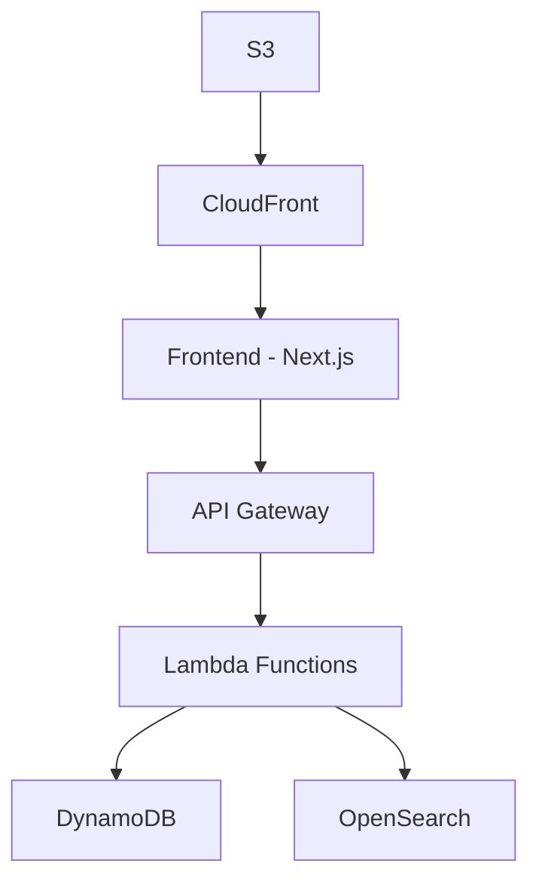

# Development Guide

## Quick Start

```bash
# Start local development environment
npm run local:start

# Check system health
npm run local:health

# View logs
npm run local:logs
```

## Development Workflow

1. **Setup Data**: `npm run setup-data`
2. **Start Services**: `npm run local:start`
3. **Run Tests**: `npm run test:integration:integration`
4. **Monitor Health**: `npm run local:health`

## Key Commands

- `npm run local:start` - Start all services
- `npm run local:stop` - Stop all services  
- `npm run setup-data` - Initialize test data
- `npm run local:reset` - Reset all data

For complete command reference, see [Commands](../reference/command-reference.md).

# tattoo-directory-mvp

Tattoo Artist Directory MVP - Local Development Environment

## 🚀 Quick Start

Get up and running in 5 minutes with our [Quick Start Guide](../QUICK_START.md).

## 📋 Table of Contents

- [Overview](#overview)
- [Features](#features)
- [Architecture](#architecture)
- [Getting Started](#getting-started)
- [Documentation](#documentation)
- [Contributing](#contributing)
- [Support](#support)

## Overview

A serverless tattoo artist directory built with Next.js, AWS Lambda, and DynamoDB. This MVP provides a comprehensive platform for discovering tattoo artists and studios across the UK.

### Key Features

- **Artist Search**: Location-based search with style filtering and keyword matching
- **Studio Profiles**: Comprehensive studio information with portfolio galleries
- **Performance Optimized**: Sub-500ms API responses with 90+ Lighthouse scores
- **Mobile First**: Responsive design optimized for mobile devices

### Technology Stack

- **Frontend**: Next.js 14+, shadcn/ui, Tailwind CSS, React Query
- **Backend**: AWS Lambda, API Gateway, DynamoDB, OpenSearch
- **Infrastructure**: Terraform, AWS CloudFront, S3, Step Functions
- **Development**: Docker, LocalStack, Jest, Playwright

## Architecture

The system follows a serverless architecture pattern with clear separation between frontend (Next.js), backend (AWS Lambda), and infrastructure (Terraform). All components are designed for scalability and performance.



## Getting Started

### Installation

For detailed setup instructions, see our [Development Guide](./DEVELOPMENT_GUIDE.md).


### First Steps

1. **Setup Environment**: Follow the [Quick Start Guide](../QUICK_START.md)
2. **Explore Components**: Check out the [component documentation](../components/)
3. **Run Tests**: See our [testing strategies](./testing-strategies.md)
4. **Deploy**: Follow the [deployment process](./deployment-process.md)

## Documentation

### 📚 Core Documentation

- [Quick Start Guide](../QUICK_START.md) - Get running in 5 minutes
- [Development Guide](./DEVELOPMENT_GUIDE.md) - Comprehensive development setup
- [API Reference](docs/reference/api_reference.md) - Complete API documentation
- [Troubleshooting](../troubleshooting/TROUBLESHOOTING_GUIDE.md) - Common issues and solutions

### 🔧 Setup & Configuration

- [Local Development](docs/setup/local-development.md) - Full development environment
- [Frontend Only](.setup/frontend-only.md) - Frontend-only development
- [Docker Setup](docs/setup/docker-setup.md) - Docker configuration
- [Dependencies](docs/setup/dependencies.md) - Project dependencies

### 🏗️ Components

- [Frontend](.components/frontend/) - React/Next.js components
- [Backend](.components/backend/) - API handlers and services
- [Infrastructure](.components/infrastructure/) - Terraform modules
- [Scripts](.components/scripts/) - Utility scripts

### 🔄 Workflows

- [Data Management](docs/workflows/data-management.md) - Data operations
- [Testing Strategies](./testing-strategies.md) - Testing approaches
- [Deployment Process](./deployment-process.md) - Deployment workflows
- [Monitoring](docs/workflows/monitoring.md) - System monitoring

### 📖 Reference

- [Command Reference](../reference/command-reference.md) - All available commands
- [Configuration](.reference/configuration.md) - Configuration options
- [Environment Variables](.reference/environment-variables.md) - Environment setup
- [npm Scripts](.reference/npm-scripts.md) - Package.json scripts

### 🏛️ Architecture

- [System Overview](../architecture/system-overview.md) - High-level architecture
- [Data Models](../architecture/data-models.md) - Data structure documentation
- [API Design](../architecture/api-design.md) - API architecture patterns

## Contributing

Please read our contributing guidelines before submitting pull requests.

### Development Workflow

1. Fork the repository
2. Create a feature branch
3. Make your changes
4. Run tests: `npm run test:integration:integration`
5. Submit a pull request

### Code Standards

We use ESLint and Prettier for code formatting. TypeScript strict mode is enabled.

## Support

### Getting Help

- 📖 Check the [Troubleshooting Guide](../troubleshooting/TROUBLESHOOTING_GUIDE.md)
- 🔍 Search existing [issues](https://github.com/your-org/tattoo-directory-mvp/issues)
- 💬 Start a [discussion](https://github.com/your-org/tattoo-directory-mvp/discussions)
- 🐛 Report a [bug](https://github.com/your-org/tattoo-directory-mvp/issues/new?template=bug_report.md)

### Community

Join our community discussions for support and feature requests.

## License

This project is licensed under the MIT License.

---

**Last Updated**: 2025-09-28
**Version**: 1.0.0

# Frontend-Only Development Setup

For UI/UX work without backend dependencies.

## Quick Setup

```bash
# Install dependencies
npm install

# Start frontend only
npm run dev:frontend

# Setup frontend data
npm run setup-data:frontend-only
```

## Access

- Frontend: http://localhost:3000
- Uses mock data for development

## Development Workflow

1. Make UI changes
2. Test with mock data
3. Run frontend tests: `npm run test:integration --workspace=frontend`

For full development setup, see [Local Setup](../setup/local-development.md).
