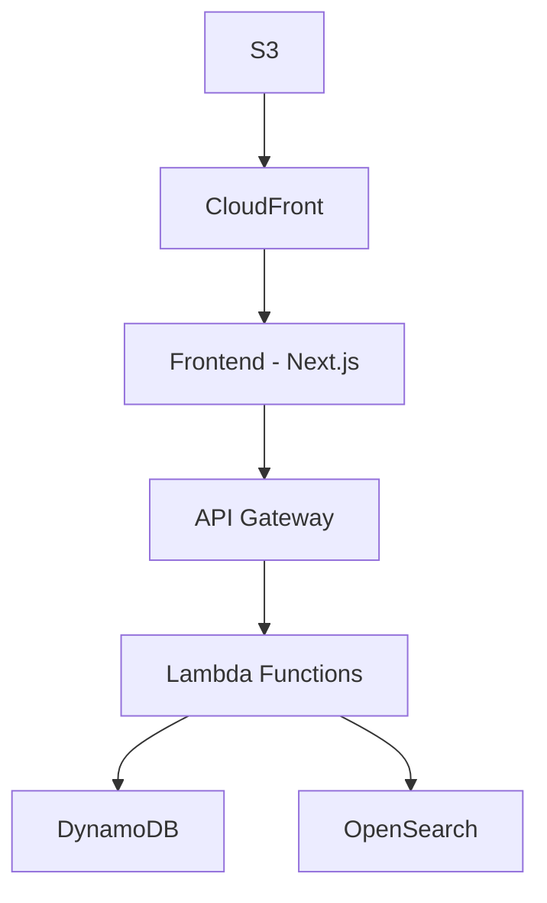

# Development Guide

## Quick Start

### Complete Setup (First Time)

```bash
# Clone and install dependencies
git clone <repository-url>
cd tattoo-artist-directory
npm install

# Set up test data (first time only)
cd scripts
npm install
npm run setup
cd ..

# Start local environment
npm run local:start

# Verify everything is working
npm run local:health
```

### 1. Start the Full Environment

```bash
# Start all services (LocalStack, backend, frontend, etc.)
npm run local:start

# Start the API proxy (for contract tests)
npm run local:proxy:start

# Or start everything together
npm run local:start-with-proxy
```

### 2. Run Contract Tests

```bash
# Run contract tests (uses default API_BASE_URL=http://localhost:9001)
npm run test:cli:contracts

# Or run with explicit environment variable
API_BASE_URL=http://localhost:9001 npm run test:cli -- run contracts
```

### 3. Stop Everything

```bash
# Stop all services including proxy
npm run local:stop-all

# Or stop individually
npm run local:proxy:stop
npm run local:stop
```

## Development Workflow

### 1. Daily Development

```bash
# Start development environment
npm run local:start-with-proxy

# Make code changes...

# Run tests
npm run test:cli:contracts

# View logs if needed
npm run local:logs:backend

# Stop when done
npm run local:stop-all
```

### 2. Contract Test Development

```bash
# Ensure services are running
npm run local:status
npm run local:proxy:status

# Run specific test categories
npm run test:cli:contracts

# Debug failing tests
npm run local:logs:backend
```

### 3. Troubleshooting

```bash
# Check service health
npm run local:health

# Restart everything
npm run local:restart
npm run local:proxy:restart

# Clean restart (removes volumes)
npm run local:clean
npm run local:start-with-proxy
```

## Available Commands

### Environment Management

```bash
# Start/stop core services
npm run local:start          # Start all Docker services
npm run local:stop           # Stop all Docker services
npm run local:restart        # Restart all services
npm run local:clean          # Stop and remove volumes
npm run local:reset          # Clean and restart

# Status and monitoring
npm run local:status         # Check service status
npm run local:health         # Run health checks
npm run local:logs           # View all logs
npm run local:logs:backend   # View backend logs only
npm run local:logs:frontend  # View frontend logs only
```

### API Proxy Management

```bash
# Proxy lifecycle
npm run local:proxy:start    # Start API proxy
npm run local:proxy:stop     # Stop API proxy
npm run local:proxy:restart  # Restart API proxy
npm run local:proxy:status   # Check proxy status

# Combined operations
npm run local:start-with-proxy  # Start services + proxy
npm run local:stop-all          # Stop services + proxy
```

### Data Management

```bash
# Data seeding and management
npm run seed                    # Seed test data
npm run seed:clean             # Clean existing data
npm run setup-data             # Initialize test data (first time)

# Data operations
npm run local:reset            # Reset to clean state
```

### Testing

```bash
# Contract tests (with default API_BASE_URL)
npm run test:cli:contracts      # Run all contract tests
npm run test:cli:contracts:direct  # Run without default URL

# Other test suites
npm run test:cli:frontend       # Frontend unit tests
npm run test:cli:backend        # Backend unit tests
npm run test:cli:integration    # Integration tests
npm run test:cli:e2e           # End-to-end tests

# Legacy test commands
npm run test:integration:integration  # Run integration tests
npm run test:integration:e2e         # Run end-to-end tests
```

For complete command reference, see [Commands](../reference/command-reference.md).

# tattoo-directory-mvp

Tattoo Artist Directory MVP - Local Development Environment

## 🚀 Quick Start

Get up and running in 5 minutes with our [Quick Start Guide](../QUICK_START.md).

## 📋 Table of Contents

- [Overview](#overview)
- [Features](#features)
- [Architecture](#architecture)
- [Getting Started](#getting-started)
- [Documentation](#documentation)
- [Contributing](#contributing)
- [Support](#support)

## Overview

A serverless tattoo artist directory built with Next.js, AWS Lambda, and DynamoDB. This MVP provides a comprehensive platform for discovering tattoo artists and studios across the UK.

### Key Features

- **Artist Search**: Location-based search with style filtering and keyword matching
- **Studio Profiles**: Comprehensive studio information with portfolio galleries
- **Performance Optimized**: Sub-500ms API responses with 90+ Lighthouse scores
- **Mobile First**: Responsive design optimized for mobile devices

### Technology Stack

- **Frontend**: Next.js 14+, shadcn/ui, Tailwind CSS, React Query
- **Backend**: AWS Lambda, API Gateway, DynamoDB, OpenSearch
- **Infrastructure**: Terraform, AWS CloudFront, S3, Step Functions
- **Development**: Docker, LocalStack, Jest, Playwright

## Architecture

The system follows a serverless architecture pattern with clear separation between frontend (Next.js), backend (AWS Lambda), and infrastructure (Terraform). All components are designed for scalability and performance.



## Services Overview

### Core Services (Docker Compose)

- **LocalStack**: AWS services emulation (port 4566)
- **Backend**: Lambda Runtime Interface Emulator (port 9000)
- **Frontend**: Next.js development server (port 3000)
- **OpenSearch**: Search engine (port 4571)
- **Swagger UI**: API documentation (port 8080)

### API Proxy Service

- **API Proxy**: HTTP-to-Lambda translator (port 9001)
- Translates REST API calls to Lambda Runtime Interface Emulator format
- Required for contract tests and external API testing

## Service Access Points

Once running, access these services:

| Service              | Port     | URL                       | Purpose                           |
| -------------------- | -------- | ------------------------- | --------------------------------- |
| Frontend             | 3000     | http://localhost:3000     | Next.js development server        |
| Backend (Lambda RIE) | 9000     | http://localhost:9000     | Direct Lambda access              |
| **API Proxy**        | **9001** | **http://localhost:9001** | **REST API access (recommended)** |
| LocalStack           | 4566     | http://localhost:4566     | AWS services emulation            |
| LocalStack Dashboard | 4566     | http://localhost:4566     | AWS services simulation           |
| OpenSearch           | 4571     | http://localhost:4571     | Search engine                     |
| API Documentation    | 8080     | http://localhost:8080     | Swagger UI for API testing        |

## API Endpoints

### Direct Lambda Access (Port 9000)

```bash
# Health check via Lambda RIE
curl -X POST http://localhost:9000/2015-03-31/functions/function/invocations \
  -H "Content-Type: application/json" \
  -d '{"httpMethod":"GET","path":"/health","requestContext":{"requestId":"test"}}'
```

### API Proxy Access (Port 9001) - Recommended

```bash
# Health check via proxy
curl http://localhost:9001/health

# Search artists
curl "http://localhost:9001/v1/artists?query=test"

# Get artist by ID
curl http://localhost:9001/v1/artists/artist-123

# Get styles
curl http://localhost:9001/v1/styles
```

## API Proxy Benefits

### Why Use the API Proxy?

1. **REST API Interface**: Standard HTTP REST calls instead of Lambda invocation format
2. **Contract Testing**: Required for OpenAPI schema validation and contract tests
3. **Development Convenience**: Easier to test with curl, Postman, etc.
4. **Fallback Support**: Automatically falls back to mock responses if backend is unavailable

### Proxy vs Direct Lambda Access

#### API Proxy (Recommended)

```bash
# Simple REST calls
curl "http://localhost:9001/v1/artists?query=test"
```

#### Direct Lambda Access

```bash
# Complex Lambda invocation format
curl -X POST http://localhost:9000/2015-03-31/functions/function/invocations \
  -H "Content-Type: application/json" \
  -d '{"httpMethod":"GET","path":"/v1/artists","queryStringParameters":{"query":"test"},"requestContext":{"requestId":"test"}}'
```

## Environment Variables

### Default Configuration

The following environment variables are automatically set for contract tests:

- `API_BASE_URL=http://localhost:9001` (uses API proxy)

### Manual Override

You can override the default API URL:

```bash
# Use direct Lambda access
API_BASE_URL=http://localhost:9000/2015-03-31/functions/function/invocations npm run test:cli -- run contracts

# Use different proxy port
API_BASE_URL=http://localhost:9002 npm run test:cli -- run contracts
```

### Environment Files

- `devtools/.env.local` - Main environment configuration
- Service-specific environment variables are loaded automatically

## Prerequisites

- **Node.js 18+** - [Download here](https://nodejs.org/)
- **Docker Desktop** - [Download here](https://www.docker.com/products/docker-desktop/)
- **Git** - [Download here](https://git-scm.com/)

## System Requirements

- **RAM**: 8GB minimum (16GB recommended)
- **Storage**: 10GB free space
- **Network**: Internet connection for initial setup

## Getting Started

### Installation

For comprehensive setup instructions including platform-specific guidance, see:

- [SETUP_MASTER.md](../getting-started/SETUP_MASTER.md) - Complete setup guide
- [Docker Setup](docs/setup/docker-setup.md) - Docker configuration
- [Dependencies](docs/setup/dependencies.md) - Project dependencies

### First Steps

1. **Setup Environment**: Follow the [Quick Start Guide](../QUICK_START.md)
2. **Explore the API**: Use Swagger UI to understand available endpoints
3. **Run Tests**: Execute integration and E2E tests to verify functionality
4. **Make Changes**: Start developing features using the hot-reload capabilities
5. **Debug Issues**: Use the debugging tools and guides provided

## Documentation

### 📚 Core Documentation

- [Quick Start Guide](../QUICK_START.md) - Get running in 5 minutes
- [Development Guide](./DEVELOPMENT_GUIDE.md) - Comprehensive development setup
- [API Reference](docs/reference/api_reference.md) - Complete API documentation
- [Troubleshooting](../troubleshooting/TROUBLESHOOTING_GUIDE.md) - Common issues and solutions

### 🔧 Setup & Configuration

- [Local Development](docs/setup/local-development.md) - Full development environment
- [Frontend Only](.setup/frontend-only.md) - Frontend-only development
- [Docker Setup](docs/setup/docker-setup.md) - Docker configuration
- [Dependencies](docs/setup/dependencies.md) - Project dependencies

### 🏗️ Components

- [Frontend](.components/frontend/) - React/Next.js components
- [Backend](.components/backend/) - API handlers and services
- [Infrastructure](.components/infrastructure/) - Terraform modules
- [Scripts](.components/scripts/) - Utility scripts

### 🔄 Workflows

- [Data Management](docs/workflows/data-management.md) - Data operations
- [Testing Strategies](./testing-strategies.md) - Testing approaches
- [Deployment Process](./deployment-process.md) - Deployment workflows
- [Monitoring](docs/workflows/monitoring.md) - System monitoring

### 📖 Reference

- [Command Reference](../reference/command-reference.md) - All available commands
- [Configuration](.reference/configuration.md) - Configuration options
- [Environment Variables](.reference/environment-variables.md) - Environment setup
- [npm Scripts](.reference/npm-scripts.md) - Package.json scripts

### 🏛️ Architecture

- [System Overview](../architecture/system-overview.md) - High-level architecture
- [Data Models](../architecture/data-models.md) - Data structure documentation
- [API Design](../architecture/api-design.md) - API architecture patterns

## Contributing

Please read our contributing guidelines before submitting pull requests.

### Development Workflow

1. Fork the repository
2. Create a feature branch
3. Make your changes
4. Run tests: `npm run test:integration:integration`
5. Submit a pull request

### Code Standards

We use ESLint and Prettier for code formatting. TypeScript strict mode is enabled.

## Monitoring and Debugging

### Health Checks

```bash
# Overall system health
npm run local:health

# Individual service status
npm run local:status
npm run local:proxy:status

# Service-specific health
curl http://localhost:9001/health
curl http://localhost:4566/_localstack/health
```

### Log Monitoring

```bash
# All services
npm run local:logs

# Specific services
npm run local:logs:backend
npm run local:logs:frontend
npm run local:logs:localstack

# Follow logs in real-time
npm run local:logs -- -f
```

### Performance Monitoring

```bash
# Resource usage
npm run local:monitor
npm run local:resources

# Performance benchmarks
npm run performance:benchmark
```

## Common Issues and Solutions

### 1. Port Conflicts

```bash
# Check what's using ports
netstat -an | findstr :9001  # Windows
lsof -i :9001               # macOS/Linux

# Kill conflicting processes
npm run local:proxy:stop
```

### 2. Backend Not Responding

```bash
# Check backend logs
npm run local:logs:backend

# Restart backend
docker restart tattoo-directory-backend

# Full restart
npm run local:restart
```

### 3. Contract Tests Failing

```bash
# Ensure proxy is running
npm run local:proxy:status

# Check API connectivity
curl http://localhost:9001/health

# Run with verbose output
DEBUG=true npm run test:cli:contracts
```

### 4. Environment Variables Not Set

```bash
# Check current environment
echo $API_BASE_URL  # Unix
echo %API_BASE_URL% # Windows

# Use explicit environment
API_BASE_URL=http://localhost:9001 npm run test:cli -- run contracts
```

## Advanced Configuration

### Custom Proxy Port

Edit `scripts/api-proxy.js`:

```javascript
const PROXY_PORT = 9002; // Change from 9001
```

### Custom Backend Endpoint

Edit `scripts/api-proxy.js`:

```javascript
const LAMBDA_ENDPOINT =
  "http://localhost:9000/2015-03-31/functions/function/invocations";
```

### Environment-Specific Configuration

Create environment-specific files:

- `devtools/.env.development`
- `devtools/.env.testing`
- `devtools/.env.local` (current)

## Integration with CI/CD

### GitHub Actions

```yaml
- name: Start local environment
  run: npm run local:start-with-proxy

- name: Run contract tests
  run: npm run test:cli:contracts

- name: Stop environment
  run: npm run local:stop-all
```

### Docker Compose Profiles

```bash
# Start with specific profile
docker-compose --profile testing up -d

# Include proxy in compose (future enhancement)
docker-compose -f docker-compose.yml -f docker-compose.proxy.yml up -d
```

## Support

### Getting Help

- 📖 Check the [Troubleshooting Guide](../troubleshooting/TROUBLESHOOTING_GUIDE.md)
- 🔍 Search existing [issues](https://github.com/your-org/tattoo-directory-mvp/issues)
- 💬 Start a [discussion](https://github.com/your-org/tattoo-directory-mvp/discussions)
- 🐛 Report a [bug](https://github.com/your-org/tattoo-directory-mvp/issues/new?template=bug_report.md)

### Community

Join our community discussions for support and feature requests.

## License

This project is licensed under the MIT License.

## Next Steps

1. **Parameter Validation**: Implement backend validation logic (see `docs/contracts-test-fixes.md`)
2. **OpenAPI Schema**: Fix PortfolioImage reference issue
3. **Docker Integration**: Add API proxy to Docker Compose setup
4. **Monitoring**: Add health checks and metrics for proxy service
5. **Documentation**: Auto-generate API documentation from OpenAPI spec

---

**Last Updated**: 2025-10-06
**Version**: 1.0.0

# Frontend-Only Development Setup

For UI/UX work without backend dependencies.

## Quick Setup

```bash
# Install dependencies
npm install

# Start frontend only
npm run dev:frontend

# Setup frontend data
npm run setup-data:frontend-only
```

## Access

- Frontend: http://localhost:3000
- Uses mock data for development

## Development Workflow

1. Make UI changes
2. Test with mock data
3. Run frontend tests: `npm run test:integration --workspace=frontend`

For full development setup, see [Local Setup](../setup/local-development.md).
